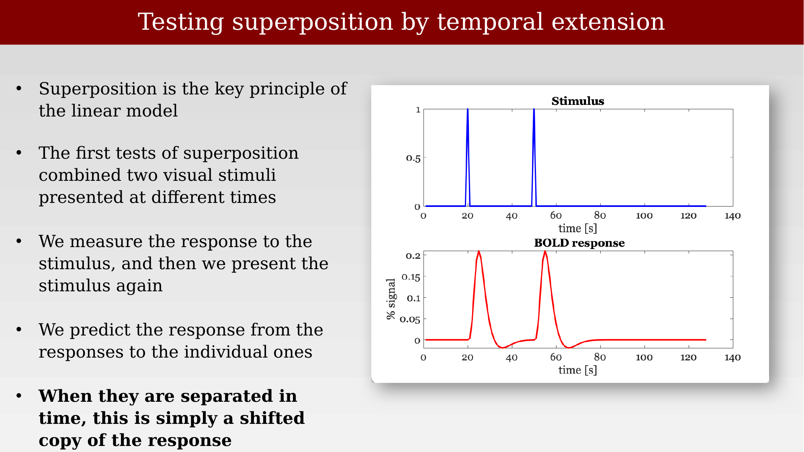
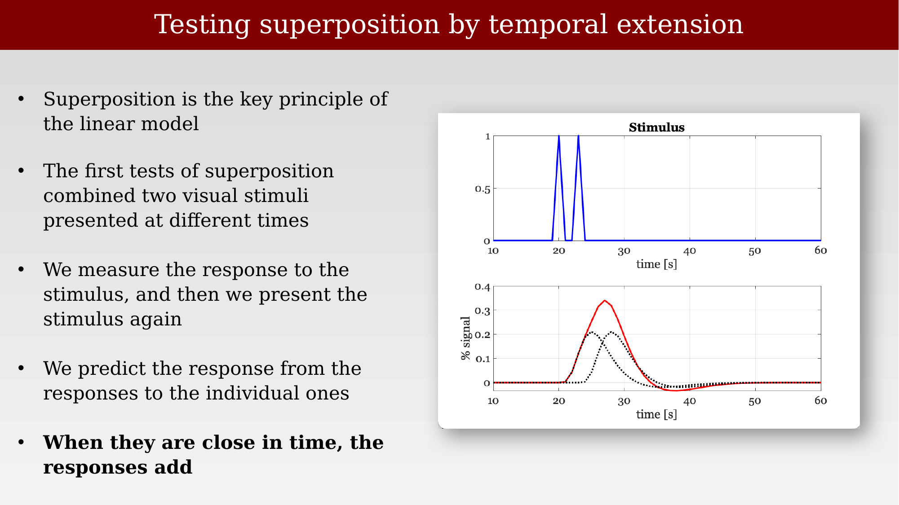
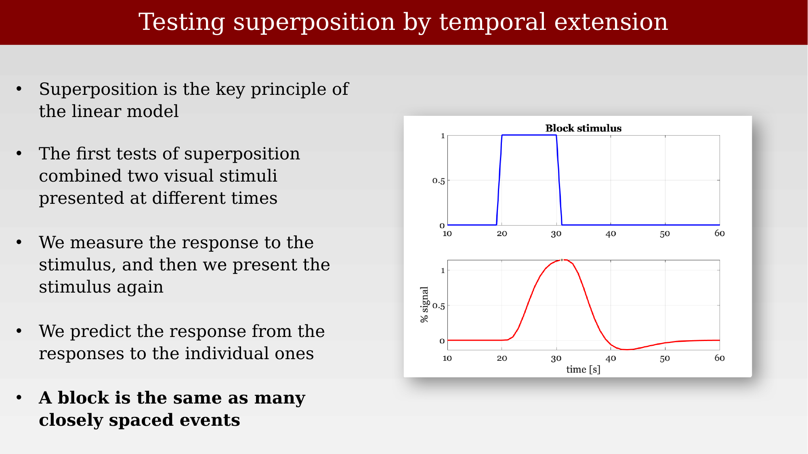
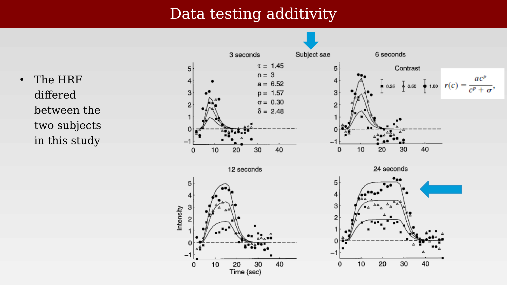
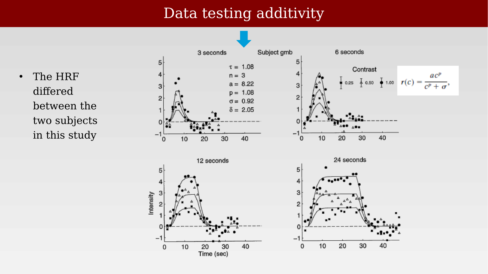

# Testing linearity: superposition and the subtraction method



---

The general linear model rests on superposition: the idea that the response to several events is the sum of the responses to each event on its own. This is the key principle of the linear model, and it can be tested directly. The classic test combines two stimuli presented at different times, measures the response to each individually, and then predicts the joint response by adding the individual responses together. If the two stimuli are well separated in time, the prediction is trivial — the joint response is simply a shifted copy of the two individual responses. The interesting test is what happens as the stimuli move closer together.

::: {.panel-tabset}
## Widely separated events
{#fig-ch43-superposition-temporal-extension-1 fig-alt="Two stacked plots: top shows two brief stimulus pulses widely spaced in time, bottom shows the corresponding BOLD percent signal response as two separate peaks."}

## Closely spaced events
{#fig-ch43-superposition-temporal-extension-2 fig-alt="Two stacked plots: top shows two brief stimulus pulses close together in time, bottom shows measured BOLD response in red overlaid on a dotted predicted-sum curve."}

## A block is many closely spaced events
{#fig-ch43-superposition-temporal-extension-3 fig-alt="Two stacked plots: top shows a rectangular block stimulus, bottom shows the corresponding smooth rising-and-falling BOLD response."}
:::

## Evidence for and against additivity

Boynton, Engel, Glover, and Heeger tested the superposition part of the general linear model directly in human V1, comparing responses to pulses of different durations and contrasts against a fitted model response [@boynton1996-linearsystems]. Model fits differed somewhat between subjects — the estimated hemodynamic response function is not identical across people — but the qualitative pattern of scaling with contrast and roughly additive summation across pulse durations held for both subjects shown here.

::: {.panel-tabset}
## Subject sae
{#fig-ch43-additivity-data-subject-sae fig-alt="Four scatter-and-line plots of BOLD intensity versus time for pulse durations of 3, 6, 12, and 24 seconds, subject sae, with model curves fit to three contrast levels."}

## Subject gmb
{#fig-ch43-additivity-data-subject-gmb fig-alt="Four scatter-and-line plots of BOLD intensity versus time for pulse durations of 3, 6, 12, and 24 seconds, subject gmb, with model curves fit to three contrast levels."}
:::

Redrawn in a slightly different format, the same logic appears as a matrix of predicted-versus-measured comparisons: the response predicted by summing shorter-pulse responses together is compared against the response actually measured for a longer pulse. The fit is good over a range of durations and a particular stimulus case, but the linear model is known to fail when it is pushed to different stimulus conditions or different parts of the brain.

{#fig-ch43-linearity-evidence-huettel729 fig-alt="Grid of line plots comparing predicted BOLD response (blue) to measured BOLD response (red) across combinations of predictor and target pulse durations of 3, 6, 12, and 24 seconds."}

## Scientific aim and the subtraction methodology

The general linear model provides a method for comparing the amplitude of the response evoked by two types of stimuli. It is important to be clear about what it is *not*: the GLM is not a model of the neural response, and it is not a model of the brain network — it says nothing about interactions between different anatomical locations. What it does provide is a way to ask whether the beta weight associated with stimulus A differs from the beta weight associated with a control condition or stimulus B. That comparison can be framed as a classification decision about the fMRI responses (is A greater than B?) or as a measurement of how different the two conditions are (A minus B). Typically, an fMRI analysis asks this question independently at many locations across the whole brain.

Comparing two beta weights — or comparing one beta weight against zero — is itself a decision made under uncertainty: the beta weights are noisy estimates, not the true underlying values. Deciding whether a difference is real, and how confident to be in that decision, is the subject of the next three chapters.
