# Signal detection theory and diagnostic examples



---

The beta-weights produced by the general linear model are numbers — but numbers alone don't answer questions. To decide whether a beta weight differs from zero, or whether one beta weight is larger than another, we need a theory of decisions under uncertainty. That theory is **signal detection theory (SDT)**, also called statistical decision theory.

## Block designs and the design matrix

In a block design, one compares the signal level averaged over different periods of time, rather than modeling each brief event separately. An alternating block design simply alternates between condition A and condition B; a controlled block design adds a third, unstimulated baseline condition C, interleaved with A and B, so that each condition can be compared against a common rest period as well as against each other. There are several statistical matters that must be accounted for when making these comparisons, particularly when many different conditions are compared.

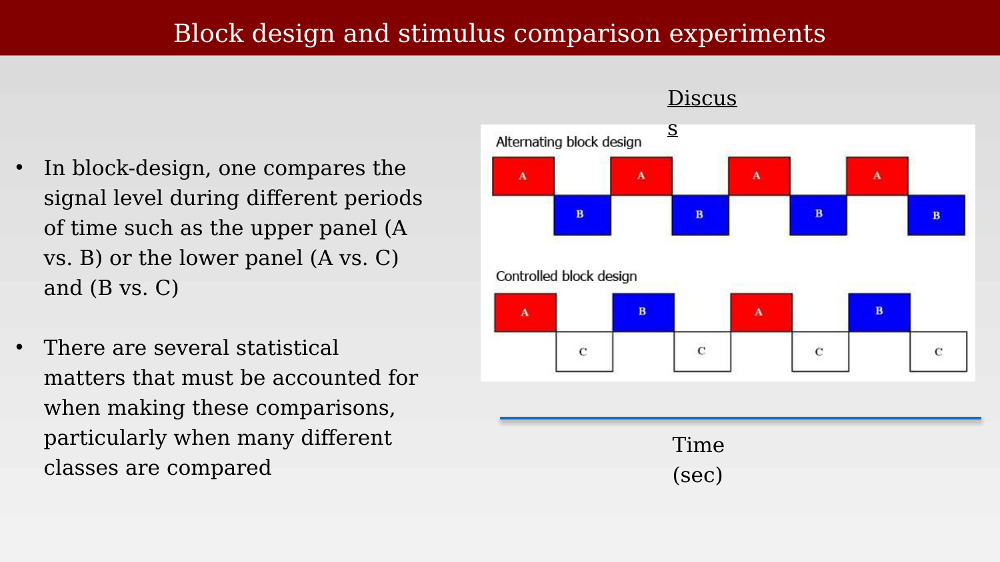{#fig-ch44-block-design-timeline fig-alt="Two rows of colored boxes along a time axis: the top row alternates red A and blue B blocks, the bottom row alternates red A and blue B blocks each followed by a white C block."}

The same block structure can be written as a design matrix, exactly as in the event-related case: each condition becomes a column of the matrix, and the model solves for a beta weight per condition at each voxel.

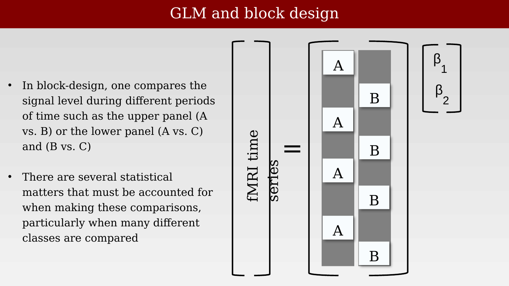{#fig-ch44-block-design-matrix-2cond fig-alt="Matrix equation diagram: an fMRI time series column equals a two-column block design matrix (labeled A and B) times a two-element beta vector."}

Extending the design to three conditions is a simple extension of the same matrix: one more column, one more beta weight.

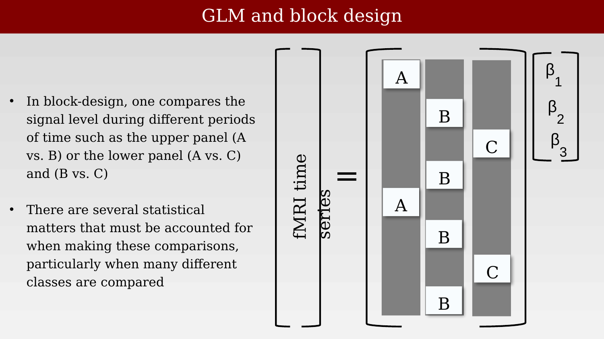{#fig-ch44-block-design-matrix-3cond fig-alt="Matrix equation diagram: an fMRI time series column equals a three-column block design matrix (labeled A, B, C) times a three-element beta vector."}

## Reasoning about the beta weights

Each voxel yields a beta weight per condition per trial. Each beta estimates the strength of response to a specific condition — these are measurement summaries, not direct readouts of neural mechanism. Repeating an experiment produces a table of beta weights that vary from trial to trial, reflecting measurement noise as well as any true underlying difference between conditions.

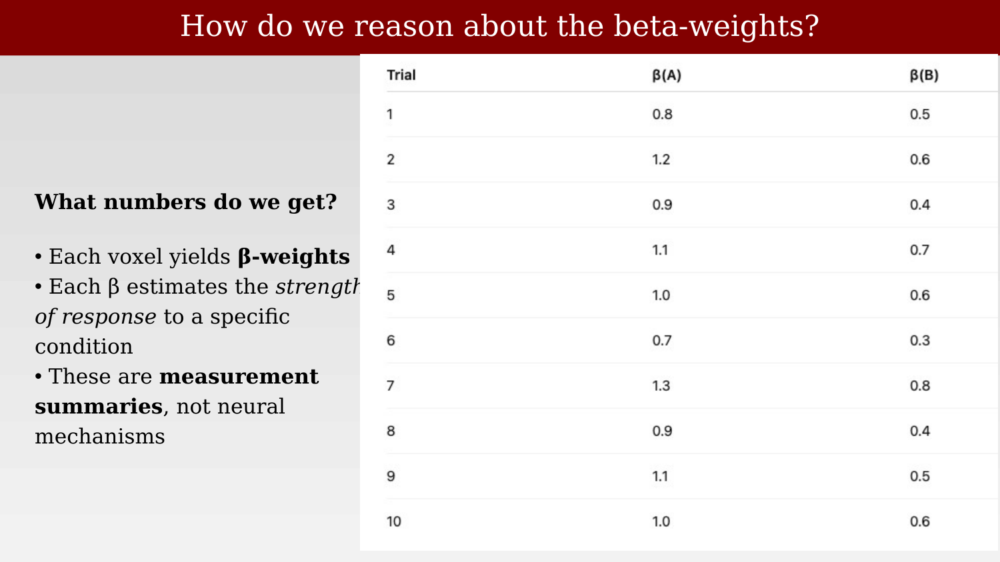{#fig-ch44-beta-weights-table fig-alt="Table with columns Trial, beta(A), and beta(B), listing ten trials with beta(A) values around 0.7-1.3 and beta(B) values around 0.3-0.8."}

In the case of these linear models, we would like to know which of the $\beta_i$ is non-zero: we say $\beta_i = 0$ is the value expected for pure noise, and a non-zero value indicates signal plus noise. Or we might want to know whether one weight is bigger than another: $\beta_i > \beta_j$, meaning the response to condition $i$ is bigger than the response to condition $j$. Answering either question requires a way to reason about noisy measurements — which is exactly what signal detection theory provides.

## How do we decide under uncertainty?

Signal detection theory treats beta values as noisy measurements and uses statistical decision theory to reason about hits, misses, and false alarms; about effect size (Cohen's $d$, or $d'$), not just statistical significance; and about the tradeoffs between sensitivity and specificity that come with any fixed decision rule.

Statistical decision theory analyzes the available information to decide between two possibilities. In the fMRI case, we decide whether $\beta_i = 0$ (noise alone) or $|\beta_i| > 0$ (signal plus noise). The approach is also called hypothesis testing — how much evidence do we have that a hypothesis is true or not.

Any such decision can be laid out in a two-by-two table, crossing the true state of the world (is a signal actually present?) against the decision that was made (did we decide a signal was present?). The four cells of this table are a hit (signal present, decision "signal"), a miss (signal present, decision "noise" — a false negative, traditionally called a Type II error), a false alarm (signal absent, decision "signal" — a false positive, traditionally called a Type I error), and a correct rejection (signal absent, decision "noise").

::: {.callout-note}
The slide image below (and its analogues later in this chapter) labels these cells with the Type I/Type II terms reversed relative to the standard usage above — it marks the miss as "Type I Error" and the false alarm as "Type II Error." A corrected version of this same diagram appears later in the course (@fig-ch46-sdt-matrix-corrected-labels). Worth fixing at the source before these slides are reused.
:::

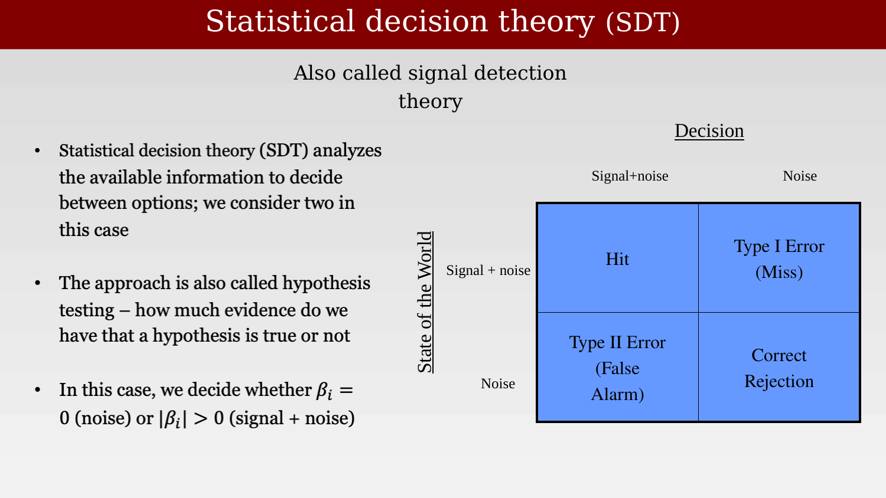{#fig-ch44-sdt-matrix-generic fig-alt="Two-by-two blue table with rows Signal+noise and Noise and columns Signal+noise decision and Noise decision, cells labeled Hit, Type I Error (Miss), Type II Error (False Alarm), and Correct Rejection."}

The same structure applies directly to an fMRI beta weight, replacing "signal present" with $|\beta_i| > 0$ and "signal absent" with $\beta_i = 0$.

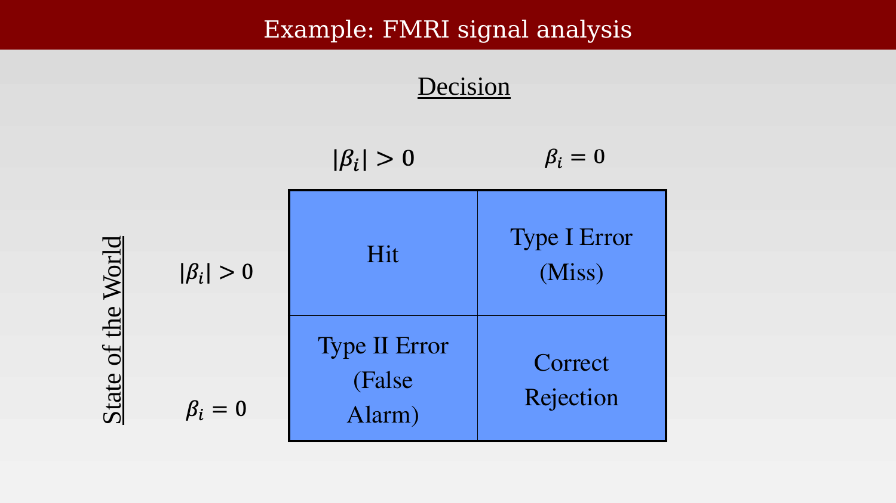{#fig-ch44-sdt-matrix-fmri-example fig-alt="Two-by-two blue table with rows and columns labeled by beta_i greater than 0 and beta_i equals 0, cells labeled Hit, Type I Error (Miss), Type II Error (False Alarm), Correct Rejection."}

The same decision structure recurs constantly outside of fMRI as well — a medical diagnostic test, for example, faces exactly the same four possibilities: disease present or absent, crossed against a positive or negative test result.

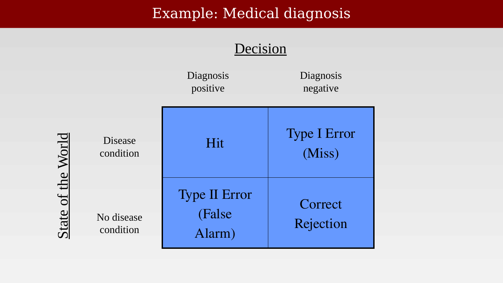{#fig-ch44-sdt-matrix-medical-example fig-alt="Two-by-two blue table with rows Disease condition and No disease condition and columns Diagnosis positive and Diagnosis negative, cells labeled Hit, Type I Error (Miss), Type II Error (False Alarm), Correct Rejection."}

## A worked example: how good is a diagnostic test?

Suppose we run 200 cases in an experiment, 100 with the disease and 100 without. A perfect test correctly diagnoses every case: all 100 disease cases test positive, and all 100 disease-free cases test negative. This is the excellent case.

{#fig-ch44-medical-diagnosis-perfect-test fig-alt="Two-by-two table with 100 and 0 in the top row and 0 and 100 in the bottom row, labeled Excellent, under the heading Example: Medical diagnosis."}

Now compare this against a test that always says "positive," regardless of the true disease state. It still catches all 100 true disease cases — so its hit rate looks perfect — but it also flags all 100 disease-free cases as positive. Without also checking the false-alarm rate, the test looks deceptively good.

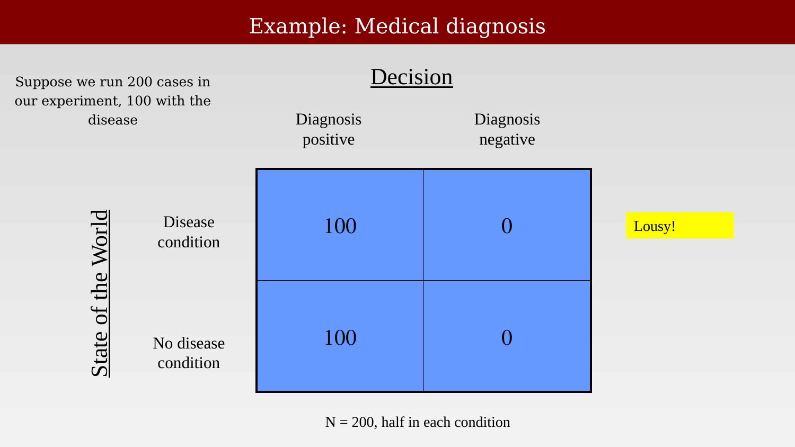{#fig-ch44-medical-diagnosis-always-positive fig-alt="Two-by-two table with 100 and 0 in the top row and 100 and 0 in the bottom row, labeled Lousy, under the heading Example: Medical diagnosis."}

The mirror-image failure is a test that always says "negative." It correctly clears every disease-free case — a perfect correct-rejection rate — but misses every true case of disease.

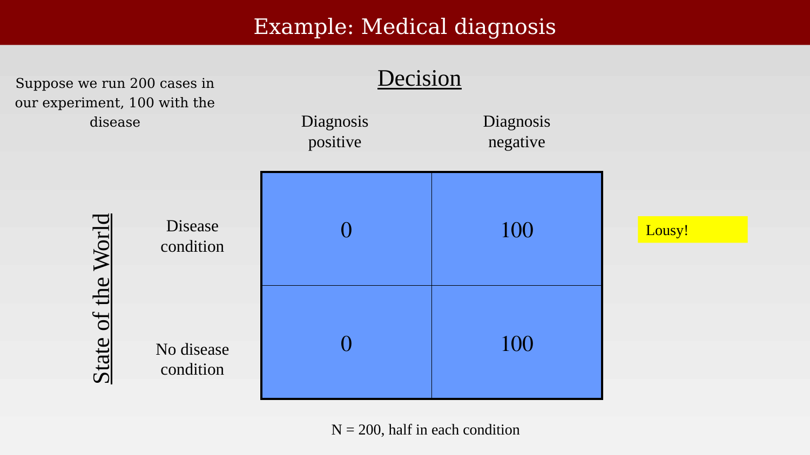{#fig-ch44-medical-diagnosis-always-negative fig-alt="Two-by-two table with 0 and 100 in the top row and 0 and 100 in the bottom row, labeled Lousy, under the heading Example: Medical diagnosis."}

## Both conditions must be measured

To make a decision, it is essential to measure both the test condition (disease present) and the control condition (disease absent). A hit rate or a false-alarm rate on its own says almost nothing about the quality of a test — only the pair of them, taken together, does. The same point applies directly to fMRI: reporting only how often a voxel crosses a statistical threshold when a stimulus is present says nothing useful unless it is compared against how often the same voxel crosses that threshold when nothing of interest is happening. The rest of this chapter works through this logic using several concrete diagnostic examples, including one very close to home.

## Diagnostic examples

The sections above introduced the logic of signal detection theory using an abstract, idealized medical example. Here we work through a real case in some depth — including a personal one — to show why checking the false-alarm rate is not an academic nicety but essential to interpreting any diagnostic test, imaging included.

### Example: back pain

Low-back pain is, and long has been, one of the most common reasons adults visit a physician: in a national survey of primary reasons for adult office visits, it ranked fifth, behind hypertension, pregnancy care, routine checkups, and upper respiratory infections.

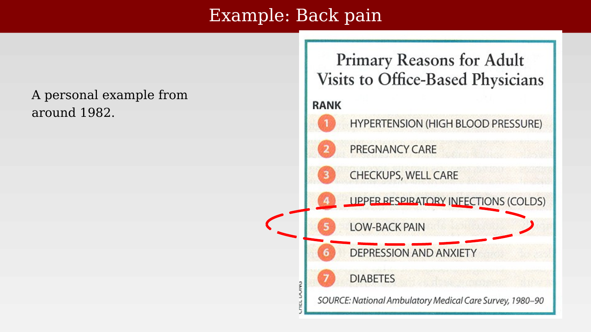{#fig-ch44-back-pain-visit-ranking fig-alt="Ranked list of seven reasons for adult physician visits, with low-back pain circled at rank 5, below hypertension, pregnancy care, checkups, and upper respiratory infections, and above depression/anxiety and diabetes."}

How back pain is treated, however, varies enormously across countries and cultures — evidence that the diagnostic and treatment decision is not simply read off from an unambiguous biological signal. Back-surgery rates in the United States, for the period 1988-89, were roughly five times higher than in Scotland or England, and substantially higher than most other developed countries, despite comparable underlying rates of back pain [@cherkin1994-backsurgery].

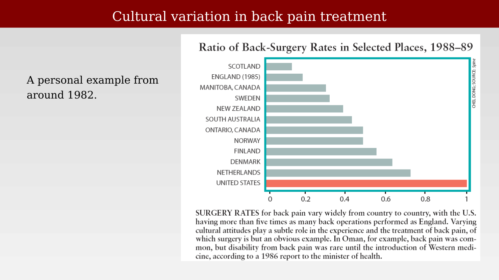{#fig-ch44-back-surgery-rates-by-country fig-alt="Horizontal bar chart ranking eleven countries and regions by back-surgery rate ratio, from Scotland (lowest) to the United States (highest, normalized to 1)."}

### A personal example

A personal example from around 1982 makes the diagnostic question concrete. A set of CT scans of the lumbar spine (Brian Wandell's own) raises the two separate questions that signal detection theory forces us to keep distinct: do we see something on the image that looks like a ruptured disk? And, independently, does the patient actually have pain? A herniated or ruptured disk is only one of several possible causes of back pain that imaging might reveal, alongside muscle strain, spinal stenosis, arthritis, and compression fracture.

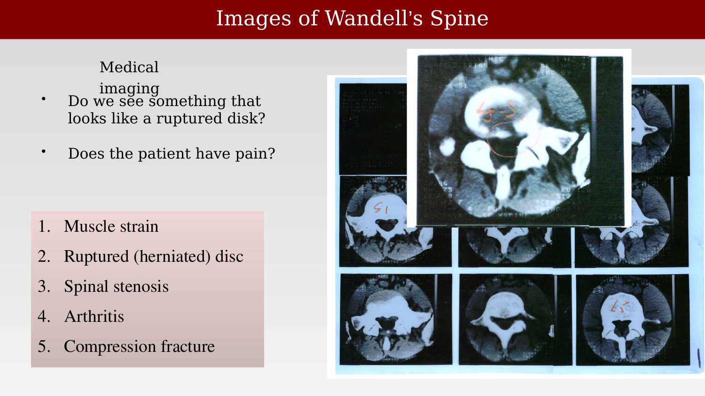{#fig-ch44-wandell-spine-ct fig-alt="Grid of grayscale CT cross-sections of a lumbar spine, with one slice enlarged above the grid and a disk region circled in orange."}

Does the herniation shown on the scan provide a good diagnosis of the pain? Framed as a signal-detection matrix, the scan finding ("herniation present" or "herniation absent") is the decision, and whether the patient actually has pain is the true state of the world. A single case — "my status" — only fills in one cell of that table.

{#fig-ch44-back-pain-sdt-matrix-n100 fig-alt="Two-by-two blue table with rows Pain (N=100) and No Pain and columns Herniation present and Herniation absent, cells labeled Hit, Type I Error (Miss), Type II Error (False Alarm), Correct Rejection."}

A single case cannot answer the diagnostic question on its own — no matter how the one filled-in cell comes out, we learn nothing about the test's overall accuracy without also measuring the other row of the table: people who do *not* have pain. If a study only ever scans people who already have pain, that row of the table has zero cases in it by construction, and the false-alarm rate simply cannot be estimated.

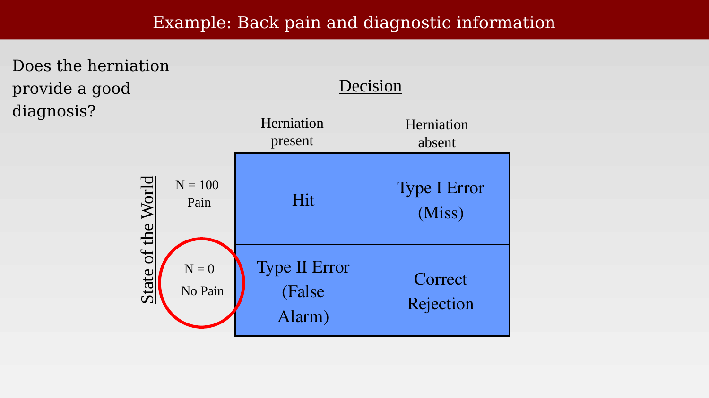{#fig-ch44-back-pain-sdt-matrix-n0 fig-alt="Same two-by-two table as before, now with N=100 Pain and N=0 No Pain labeled on the rows, and the No Pain row circled in red."}

### Checking for false alarms is essential

The reason this matters is not hypothetical. Numerous studies have shown that large numbers of asymptomatic people — people with no back pain at all — also have disk bulges or herniations on MRI. Jensen and colleagues scanned 98 people without back pain and found that most had at least one bulging or protruding disk somewhere in the lumbar spine, findings read blind by radiologists who did not know which scans came from symptomatic patients [@jensen1994-mri]. A disk abnormality, in other words, is a common finding in a pain-free population — a real false-alarm rate, not zero.

{#fig-ch44-false-alarm-mri-jarvik fig-alt="Sagittal MRI of a lumbar spine with two red arrows pointing to herniated disks, alongside a small two-by-two table showing 100 and 0 in the top row and 100 and 0 in the bottom row."}

Put in the language of the two-by-two table: a disk finding that shows up in 100 of 100 pain cases *and* 100 of 100 pain-free cases ("many others") is worthless as a diagnostic test — it is indistinguishable from the earlier "always says positive" worked example. Checking for false alarms, by scanning people who are not in pain, is what turns a suggestive-looking finding into a real diagnostic claim, and it is exactly the same logic that governs whether a "significant" voxel in an fMRI statistical map reflects a real effect or noise that happened to cross threshold.
