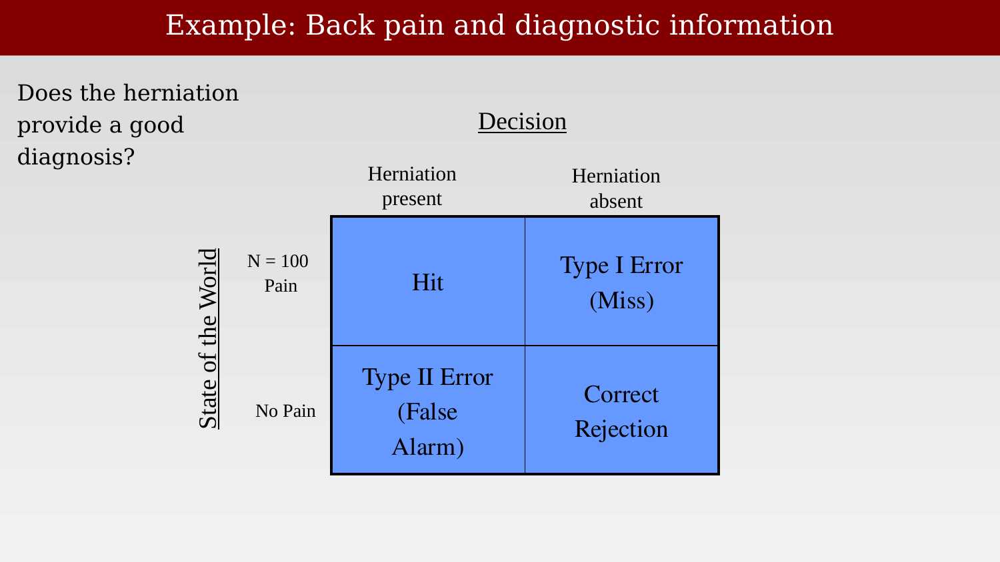

# Applying signal detection theory: diagnostic examples



---

The previous chapter introduced the logic of signal detection theory using an abstract, idealized medical example. This chapter works through a real case in some depth — including a personal one — to show why checking the false-alarm rate is not an academic nicety but essential to interpreting any diagnostic test, imaging included.

## Example: back pain

Low-back pain is, and long has been, one of the most common reasons adults visit a physician: in a national survey of primary reasons for adult office visits, it ranked fifth, behind hypertension, pregnancy care, routine checkups, and upper respiratory infections.

{#fig-ch45-back-pain-visit-ranking fig-alt="Ranked list of seven reasons for adult physician visits, with low-back pain circled at rank 5, below hypertension, pregnancy care, checkups, and upper respiratory infections, and above depression/anxiety and diabetes."}

How back pain is treated, however, varies enormously across countries and cultures — evidence that the diagnostic and treatment decision is not simply read off from an unambiguous biological signal. Back-surgery rates in the United States, for the period 1988-89, were roughly five times higher than in Scotland or England, and substantially higher than most other developed countries, despite comparable underlying rates of back pain [@cherkin1994-backsurgery].

{#fig-ch45-back-surgery-rates-by-country fig-alt="Horizontal bar chart ranking eleven countries and regions by back-surgery rate ratio, from Scotland (lowest) to the United States (highest, normalized to 1)."}

## A personal example

A personal example from around 1982 makes the diagnostic question concrete. A set of CT scans of the lumbar spine (Brian Wandell's own) raises the two separate questions that signal detection theory forces us to keep distinct: do we see something on the image that looks like a ruptured disk? And, independently, does the patient actually have pain? A herniated or ruptured disk is only one of several possible causes of back pain that imaging might reveal, alongside muscle strain, spinal stenosis, arthritis, and compression fracture.

{#fig-ch45-wandell-spine-ct fig-alt="Grid of grayscale CT cross-sections of a lumbar spine, with one slice enlarged above the grid and a disk region circled in orange."}

Does the herniation shown on the scan provide a good diagnosis of the pain? Framed as a signal-detection matrix, the scan finding ("herniation present" or "herniation absent") is the decision, and whether the patient actually has pain is the true state of the world. A single case — "my status" — only fills in one cell of that table.

{#fig-ch45-back-pain-sdt-matrix-n100 fig-alt="Two-by-two blue table with rows Pain (N=100) and No Pain and columns Herniation present and Herniation absent, cells labeled Hit, Type I Error (Miss), Type II Error (False Alarm), Correct Rejection."}

A single case cannot answer the diagnostic question on its own — no matter how the one filled-in cell comes out, we learn nothing about the test's overall accuracy without also measuring the other row of the table: people who do *not* have pain. If a study only ever scans people who already have pain, that row of the table has zero cases in it by construction, and the false-alarm rate simply cannot be estimated.

{#fig-ch45-back-pain-sdt-matrix-n0 fig-alt="Same two-by-two table as before, now with N=100 Pain and N=0 No Pain labeled on the rows, and the No Pain row circled in red."}

## Checking for false alarms is essential

The reason this matters is not hypothetical. Numerous studies have shown that large numbers of asymptomatic people — people with no back pain at all — also have disk bulges or herniations on MRI. Jensen and colleagues scanned 98 people without back pain and found that most had at least one bulging or protruding disk somewhere in the lumbar spine, findings read blind by radiologists who did not know which scans came from symptomatic patients [@jensen1994-mri]. A disk abnormality, in other words, is a common finding in a pain-free population — a real false-alarm rate, not zero.

{#fig-ch45-false-alarm-mri-jarvik fig-alt="Sagittal MRI of a lumbar spine with two red arrows pointing to herniated disks, alongside a small two-by-two table showing 100 and 0 in the top row and 100 and 0 in the bottom row."}

Put in the language of the two-by-two table: a disk finding that shows up in 100 of 100 pain cases *and* 100 of 100 pain-free cases ("many others") is worthless as a diagnostic test — it is indistinguishable from the "always says positive" test from the previous chapter's worked example. Checking for false alarms, by scanning people who are not in pain, is what turns a suggestive-looking finding into a real diagnostic claim, and it is exactly the same logic that governs whether a "significant" voxel in an fMRI statistical map reflects a real effect or noise that happened to cross threshold.
