# The discriminability index and the receiver operating characteristic



---

The preceding chapters treated hit and false-alarm rates as if they were fixed properties of a test or a voxel. In fact, both depend on where the decision-maker sets the boundary between "respond signal" and "respond noise" — the **criterion**. This chapter separates two things that are easy to conflate: how good a measurement is at distinguishing signal from noise (its **discriminability**), and how the decision-maker chooses to trade off hits against false alarms at a given level of discriminability (the **criterion**). Together they give a way to quantify the size of a difference, not just decide whether it is "significant."

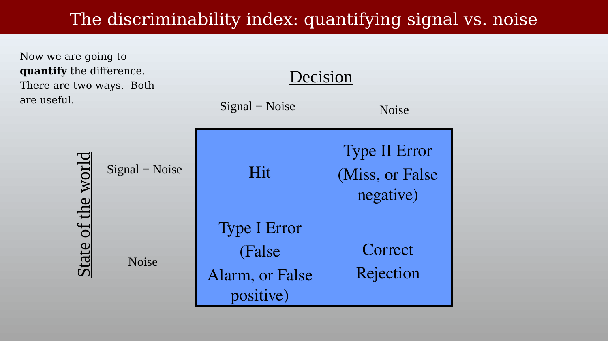{#fig-ch46-sdt-matrix-corrected-labels fig-alt="Two-by-two blue table with rows Signal+Noise and Noise and columns Signal+Noise and Noise, cells labeled Hit, Type II Error (Miss, or False negative), Type I Error (False Alarm, or False positive), Correct Rejection."}

## Quantifying signal versus noise

To quantify the difference between signal and noise conditions, it helps to have multiple measurements — and, ideally, to measure the noise distribution as well as the signal distribution, not just their averages. Modeling the experiment this way produces two overlapping probability distributions over the measured value $x$ (fMRI signal strength, or any other measurement): $p(x \mid \text{noise})$ and $p(x \mid \text{signal} + \text{noise})$.

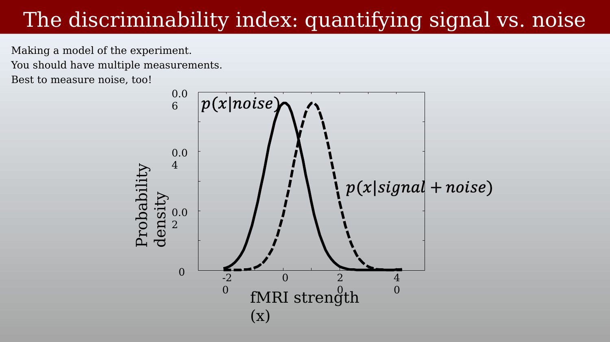{#fig-ch46-noise-signal-distributions fig-alt="Two overlapping bell-shaped probability density curves over fMRI signal strength, one solid labeled noise and one dashed labeled signal plus noise, shifted to the right of the noise curve."}

The separation between the two distributions, relative to their spread, defines the **discriminability index**, $d'$ — also called the effect size, or Cohen's $d$, after the statistician who did much to popularize effect-size measures alongside significance testing [@cohen1988-statisticalpower]. Formally, $d' = (\mu_s - \mu_n)/\sigma_n$: the difference between the signal and noise means, divided by the noise standard deviation. The experimental goal is to estimate this index from data.

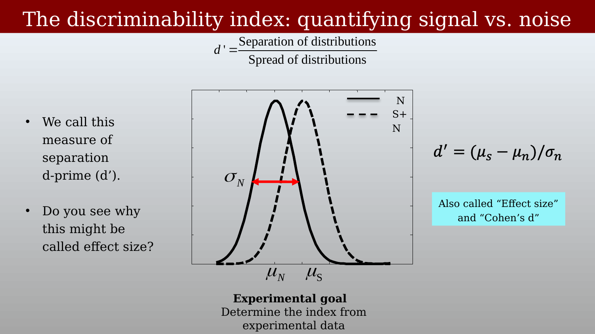{#fig-ch46-dprime-definition fig-alt="Two overlapping bell curves labeled N and S+N with means mu_N and mu_S marked on the horizontal axis and a double-headed arrow labeled sigma_N spanning part of the noise curve's width, with the formula d prime equals separation of distributions over spread of distributions."}

## The criterion

$d'$ describes how separable the two distributions are, but making an actual decision on a given trial requires picking a **criterion** — a cutoff value of $x$. Everything above the criterion is called "signal present"; everything below is called "noise."

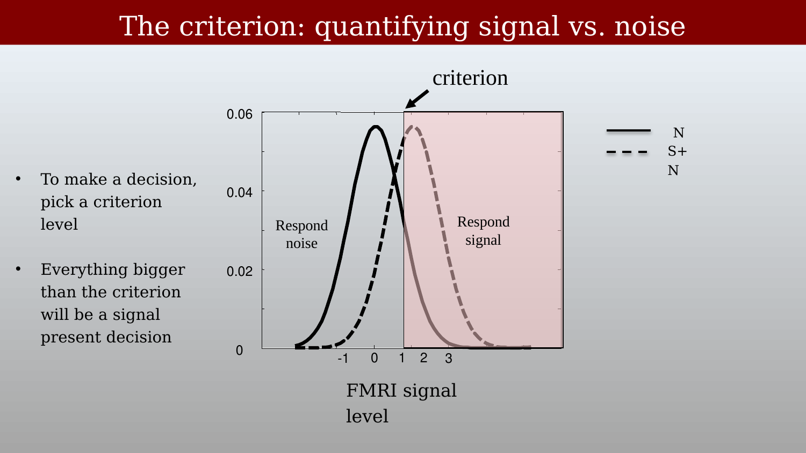{#fig-ch46-criterion-diagram fig-alt="Two overlapping bell curves (N and S+N) with a vertical criterion line; the region left of the line is shaded and labeled Respond noise, the region right of the line is shaded and labeled Respond signal."}

Any placement of the criterion produces all four outcomes from the two-by-two table, visible directly as the area under each curve on either side of the criterion: the area of the signal-plus-noise curve to the right of the criterion is the hit rate; the area of the noise curve to the right is the false-alarm rate; the area of the noise curve to the left is the correct-rejection rate; and the area of the signal-plus-noise curve to the left is the miss rate.

::: {.panel-tabset}
## Hit and false alarm
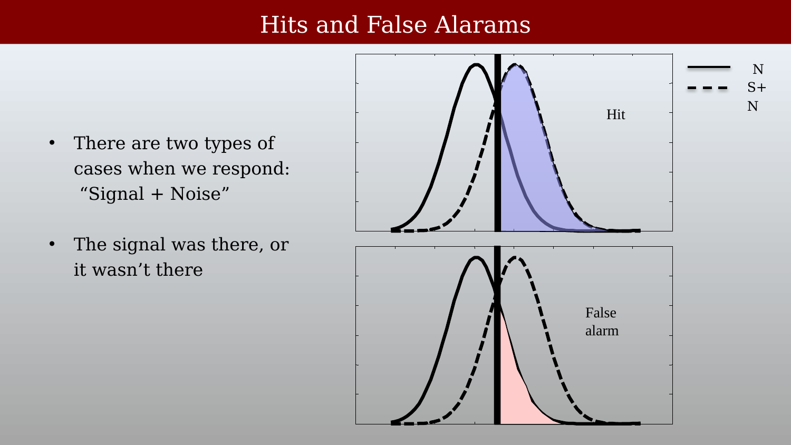{#fig-ch46-hit-false-alarm-regions fig-alt="Two stacked plots of the same two overlapping bell curves and criterion line; the top plot shades the signal-plus-noise curve's right tail blue and labels it Hit, the bottom plot shades the noise curve's right tail pink and labels it False alarm."}

## Correct rejection and miss
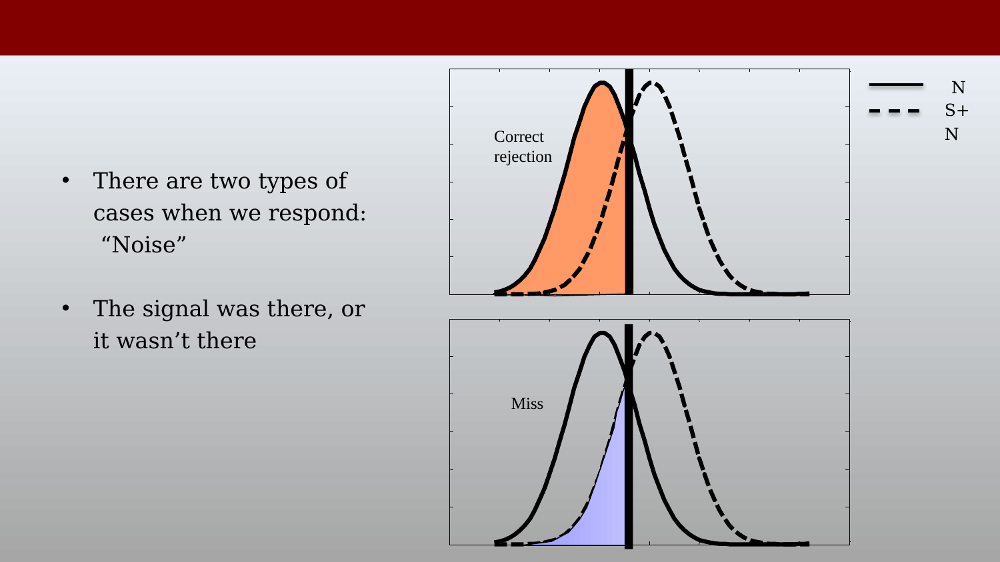{#fig-ch46-correct-rejection-miss-regions fig-alt="Two stacked plots of the same two overlapping bell curves and criterion line; the top plot shades the noise curve's left tail orange and labels it Correct rejection, the bottom plot shades the signal-plus-noise curve's left tail purple and labels it Miss."}
:::

Only two of these four values are independent, since hit and miss rates sum to one, and false-alarm and correct-rejection rates sum to one: $\text{Hit} = 1 - \text{Miss}$, and $\text{Correct Rejection} = 1 - \text{False Alarm}$. By convention, performance is usually summarized using the hit rate and the false-alarm rate.

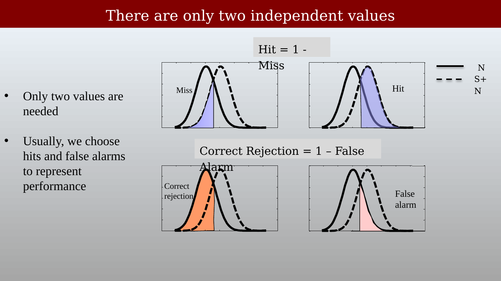{#fig-ch46-four-outcomes-summary fig-alt="Four small plots of the same two overlapping bell curves with different regions shaded (Miss, Hit, Correct rejection, False alarm) and two equations relating Hit to Miss and Correct Rejection to False Alarm."}

## The receiver operating characteristic

Where should the criterion be set? There is no single correct answer — it depends on the relative cost of misses versus false alarms in the particular decision being made. The useful move is not to pick one criterion, but to sweep the criterion across its whole range and see how hit rate and false-alarm rate trade off against each other. A low criterion produces a high hit rate but also a high false-alarm rate; a high criterion produces a low false-alarm rate but also a low hit rate.

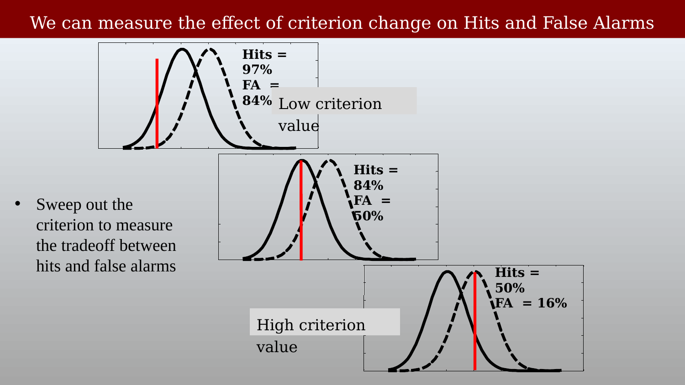{#fig-ch46-criterion-sweep-three-levels fig-alt="Three overlapping bell-curve plots stacked vertically, each with a criterion line at a different position and the resulting hit and false-alarm percentages labeled, moving from low criterion at top to high criterion at bottom."}

Plotting hit rate (vertical axis) against false-alarm rate (horizontal axis) as the criterion sweeps across its range traces out the **receiver operating characteristic (ROC)** curve. Each point on the curve corresponds to one criterion setting.

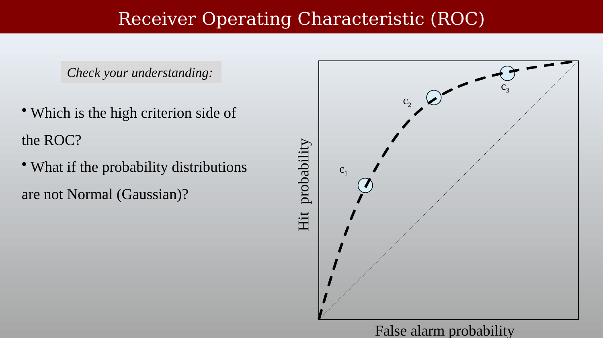{#fig-ch46-roc-curve-points fig-alt="Curved dashed line from the origin to the top-right corner of a plot with axes Hit probability and False alarm probability, with three labeled points c1, c2, and c3 along the curve and a diagonal reference line from corner to corner."}

The criterion moves a decision-maker *along* a single ROC curve; discriminability ($d'$) determines *which* curve you're on. A guessing decision-maker with no discriminating information at all — $d' = 0$ — produces an ROC curve that lies exactly on the diagonal, since hit rate equals false-alarm rate at every criterion. Increasing $d'$ bows the curve further toward the upper-left corner (high hits, low false alarms).

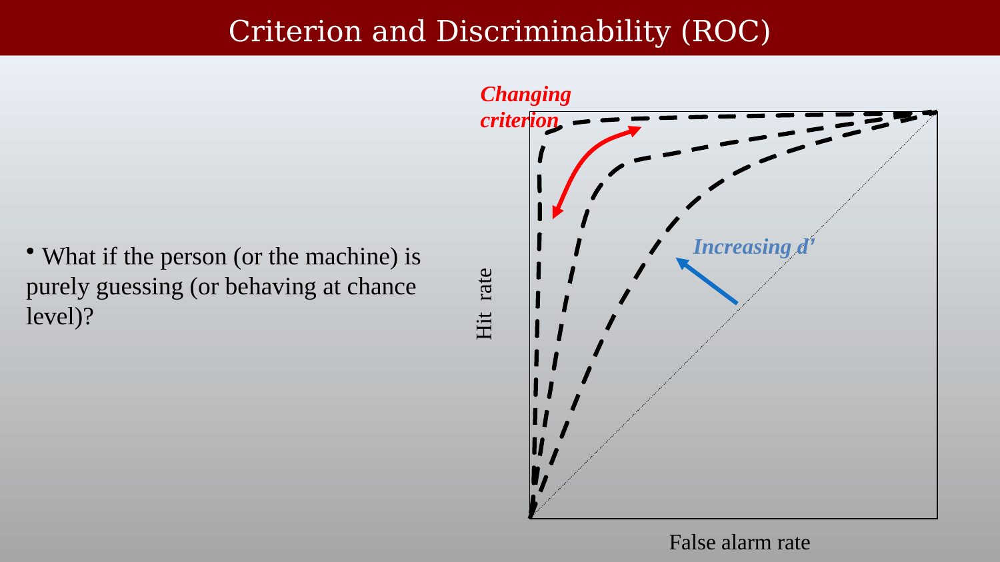{#fig-ch46-roc-curves-criterion-dprime fig-alt="Three nested dashed ROC curves of increasing bow toward the upper left, with a red arrow labeled Changing criterion along the outermost curve and a blue arrow labeled Increasing d prime pointing from the diagonal toward the curves."}

## Area under the curve

Measuring the hit rate, measuring the false-alarm rate, and plotting the ROC curve as the criterion sweeps gives a full picture of performance independent of any single criterion choice. Collapsing that curve to a single number — the **area under the curve (AUC)** — gives a criterion-free summary of discriminability: an AUC of 0.5 is chance performance (the diagonal), and an AUC of 1.0 is perfect discrimination.

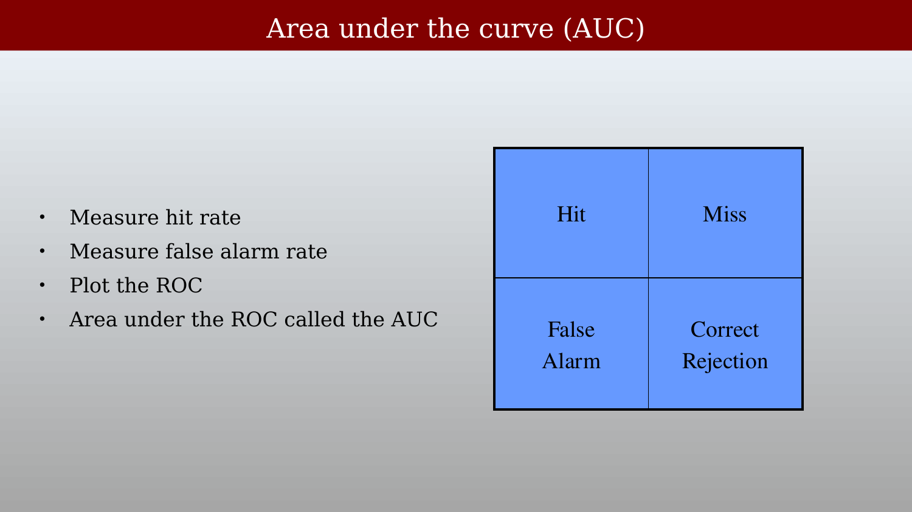{#fig-ch46-auc-explanation fig-alt="Two-by-two blue table with cells labeled Hit, Miss, False Alarm, and Correct Rejection, alongside bullet points about measuring hit rate, false alarm rate, plotting the ROC, and the area under it."}

## Multiple names for the same ideas

Different research communities have converged on the same underlying logic but use different vocabulary for it, which can make the literature harder to read across fields than it needs to be:

Statisticians speak of **Type I and Type II errors**. Psychologists speak of **hits and false alarms**. Machine-learning and diagnostic-testing communities speak of **true positives** and **true negatives**. Medicine speaks of **sensitivity and specificity**. And the size of the underlying effect is reported as **$d'$** or as **area under the curve (AUC)**, depending on the field. All of these are describing the same two-by-two table and the same criterion-dependent tradeoff — worth keeping in mind when the same statistical idea shows up under an unfamiliar name in a paper from a different field.
