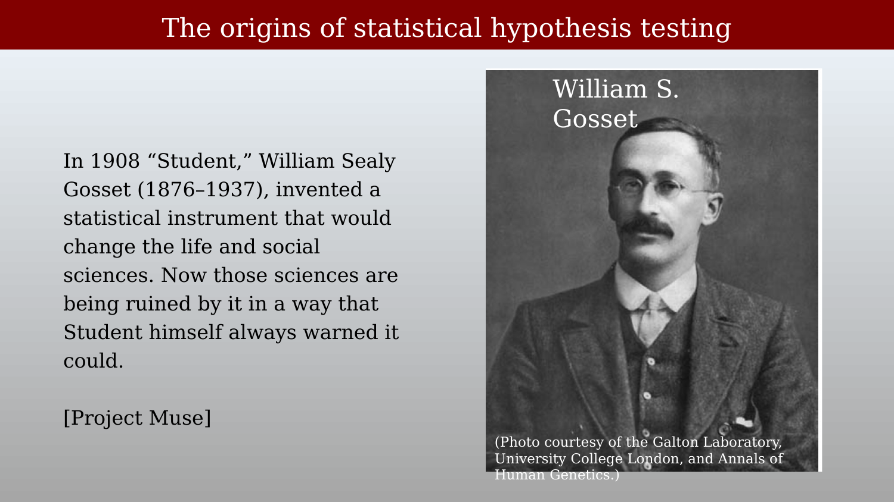
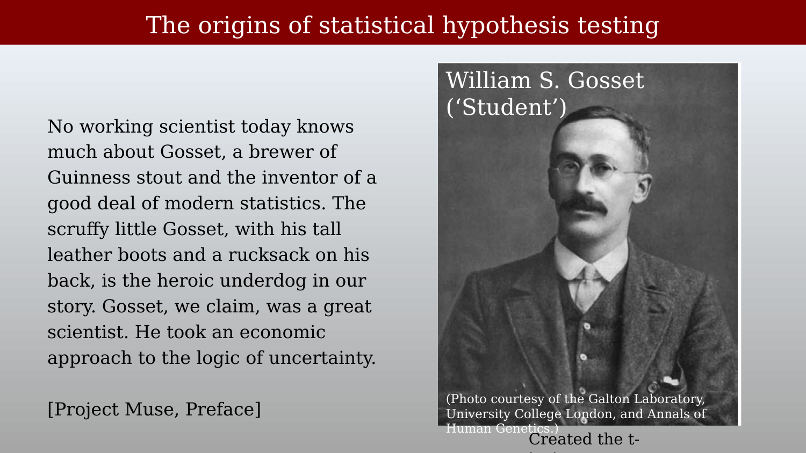
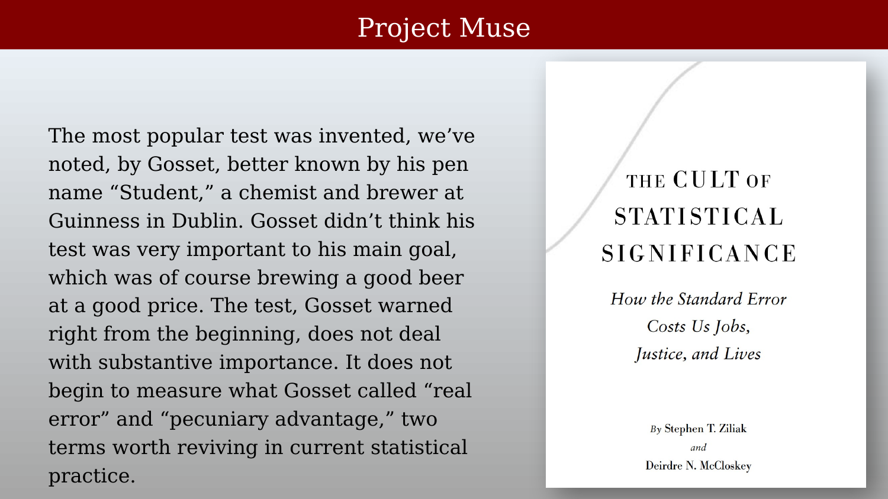
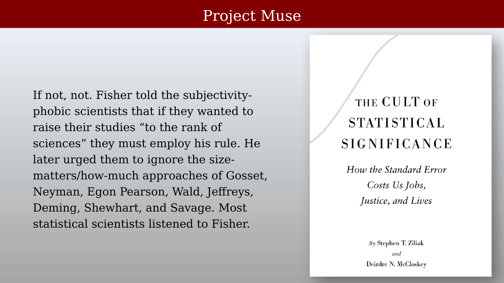

# The history and philosophy of hypothesis testing



---

The statistical machinery covered in the last several chapters — $p$-values, significance testing, $d'$ — feels like a permanent, neutral backdrop to quantitative science. It is neither: it is a specific set of tools with a specific history, invented for specific purposes, adopted unevenly across fields, and still argued about today. This closing chapter steps back from technique to ask where this machinery came from, and whether science actually requires it.

## Science without statistical inference

The psychologist Gerd Gigerenzer has argued that routine inferential statistics — $p$-values, confidence intervals, and the like — are far less central to the practice of science than is commonly assumed, and that many of the most important discoveries in the history of science were made without them at all:

> To understand how deeply the inference revolution changed the social sciences, it is helpful to realize that routine statistical tests, such as calculations of p values or other inferential statistics, are not common in the natural sciences. Moreover, they have played no role in any major discoveries in the social sciences. Consider how Isaac Newton, the father of the first unified system of modern physics, practiced research. In his Opticks, Newton (1704/1952) advanced propositions about the nature of light, such as that white light consists of spectral colors. Then he reported in detail a series of experiments to test these. In other words, for Newton, an experiment meant putting in place a set of conditions, derived from a theory, and then demonstrating the predicted effect. Nowhere in his writings is sampling or statistical inference mentioned.
>
> — @gigerenzer2015-nq

{#fig-ch48-newton-opticks-quote fig-alt="Text slide titled Science without statistical inference, quoting Gigerenzer on Isaac Newton's experimental method in Opticks, attributed to Gigerenzer via JW."}

Gigerenzer is careful to note that Newton was not opposed to statistical reasoning as such — he simply confined it to a different domain, quality control, rather than to scientific discovery itself:

> However, Newton was not hostile to statistical inference. In his role as the master of the London Royal Mint, he had to make sure that the amount of gold in the coins was neither too little nor too large. For that problem, he relied on a sampling scheme named the Trial of the Pyx. The trial consisted of a sample of coins drawn and placed in a box known as the Pyx (derived from the Greek term for box), a null hypothesis to be tested (the standard coin), a two-sided alternative, a test statistic, and a critical region (Stigler, 1999). *In Newton's view, sampling and statistical inference were needed for quality control in a mint but not in science*. Similarly, inferential statistics did not contribute to Watson and Crick's discovery of the double helix or to Einstein's special relativity theory.
>
> The same can be said for virtually all of the classical discoveries in psychology. You will not find Jean Piaget calculating a t test. Wolfgang Kohler developed the Gestalt laws of perception, Ivan P. Pavlov the principles of classical conditioning, B. F. Skinner those of operant conditioning, George Miller his magical number seven plus minus two, and Herbert A. Simon his Nobel Prize–winning work in economics — all without calculating p values, confidence intervals, or Bayes factors. This was not because they did not know statistical inference. It was known long ago.
>
> — @gigerenzer2015-nq

This is a deliberately provocative claim, not a settled consensus — Gigerenzer's broader argument is that statistical inference is a genuinely useful *tool*, best suited to specific problems (like Newton's coinage quality control, or like deciding whether an fMRI beta weight differs from zero), but a poor *substitute* for the kind of direct theoretical prediction and demonstration that drove discoveries like Newton's optics, Watson and Crick's double helix, or Piaget's developmental stages.

## Where hypothesis testing came from

If routine significance testing was not how most of the classic discoveries were made, where did it come from, and how did it become so dominant? Ziliak and McCloskey trace the story to the statistician William Sealy Gosset — better known by his pen name "Student" — a brewer at Guinness in Dublin who invented the t-test in 1908 while working on small-sample quality-control problems for the brewery [@ziliak2008-cult]:

> In 1908 "Student," William Sealy Gosset (1876–1937), invented a statistical instrument that would change the life and social sciences. Now those sciences are being ruined by it in a way that Student himself always warned it could.
>
> — @ziliak2008-cult

{#fig-ch48-gosset-quote-brewer fig-alt="Portrait photo of William S. Gosset in a suit and tie, next to a quote about him inventing a statistical instrument in 1908."}

Ziliak and McCloskey's book is explicitly a defense of Gosset against the way his invention was later used, and a critique of the statistician who they argue was most responsible for that shift, Ronald A. Fisher:

> No working scientist today knows much about Gosset, a brewer of Guinness stout and the inventor of a good deal of modern statistics. The scruffy little Gosset, with his tall leather boots and a rucksack on his back, is the heroic underdog in our story. Gosset, we claim, was a great scientist. He took an economic approach to the logic of uncertainty.
>
> — @ziliak2008-cult, Preface

> For over two decades he [Gosset] quietly tried to educate Fisher. But Fisher, our flawed villain, erased from Gosset's inventions the consciously economic element. We want to bring it back.
>
> — @ziliak2008-cult, Preface

{#fig-ch48-fisher-quote-villain fig-alt="Portrait photo of Ronald A. Fisher in a suit, next to a quote describing him as a flawed villain who erased the economic element from Gosset's statistical test."}

Gosset himself, according to this account, saw his test as a practical tool for a specific brewing problem — not as a universal rule for scientific significance, and not as a substitute for asking how large or economically meaningful an effect actually was:

> The most popular test was invented, we've noted, by Gosset, better known by his pen name "Student," a chemist and brewer at Guinness in Dublin. Gosset didn't think his test was very important to his main goal, which was of course brewing a good beer at a good price. The test, Gosset warned right from the beginning, does not deal with substantive importance. It does not begin to measure what Gosset called "real error" and "pecuniary advantage," two terms worth reviving in current statistical practice.
>
> — @ziliak2008-cult

{#fig-ch48-gosset-quote-real-error fig-alt="Text slide quoting Ziliak and McCloskey on Gosset's modest view of his own test as a practical brewing tool, next to the book cover of The Cult of Statistical Significance."}

Ziliak and McCloskey argue that Fisher, in two influential books written and revised during the 1920s and 1930s, replaced this economically grounded approach with a purely statistical rule of thumb — the "Rule of Two" — and that this rule, more than any single later development, is responsible for equating "significant" with "important" across the life and social sciences ever since:

> But Karl Pearson and especially the amazing Ronald Fisher didn't listen. In two great books written and revised during the 1920s and 1930s, Fisher imposed a Rule of Two: if a result departs from an assumed hypothesis by two or more standard deviations of its own sampling variation, regardless of the size of the prize and the expected cost of going for it, then it is to be called a "significant" scientific finding.
>
> — @ziliak2008-cult

{#fig-ch48-fisher-quote-rule-of-two fig-alt="Text slide quoting Ziliak and McCloskey describing Fisher's Rule of Two for statistical significance, next to the book cover of The Cult of Statistical Significance."}

And, in their account, the rule stuck — not because Gosset's economically grounded alternative was refuted, but because most of the field simply followed Fisher's simpler, purely statistical convention instead, a convention that persists essentially unchanged in the routine "$p < 0.05$" thresholds used throughout neuroimaging and the rest of the life sciences today:

> If not, not. Fisher told the subjectivity-phobic scientists that if they wanted to raise their studies "to the rank of sciences" they must employ his rule. He later urged them to ignore the size-matters/how-much approaches of Gosset, Neyman, Egon Pearson, Wald, Jeffreys, Deming, Shewhart, and Savage. Most statistical scientists listened to Fisher.
>
> — @ziliak2008-cult

{#fig-ch48-fisher-quote-legacy fig-alt="Text slide quoting Ziliak and McCloskey describing how most statistical scientists adopted Fisher's rule over Gosset's economic approach, next to the book cover of The Cult of Statistical Significance."}

## Why this history matters for fMRI

Ziliak and McCloskey's account is itself a historical argument, not a neutral fact, and like any single-narrative history it simplifies a more tangled real story — but the underlying methodological point stands on its own, independent of how fairly it treats Fisher personally. Every chapter in this part of the book has used a "$p < 0.05$," "$d' $ is large," or "the beta weight is significant" style of claim, and that convention traces directly back to the specific historical episode described above, not to any deeper logical necessity. The caution from the previous chapter — that statistical significance is not the same as scientific or clinical importance — is not a modern methodological fad; it is, on this account, closer to Gosset's *original* intention than the significance-testing convention that eventually displaced it.
