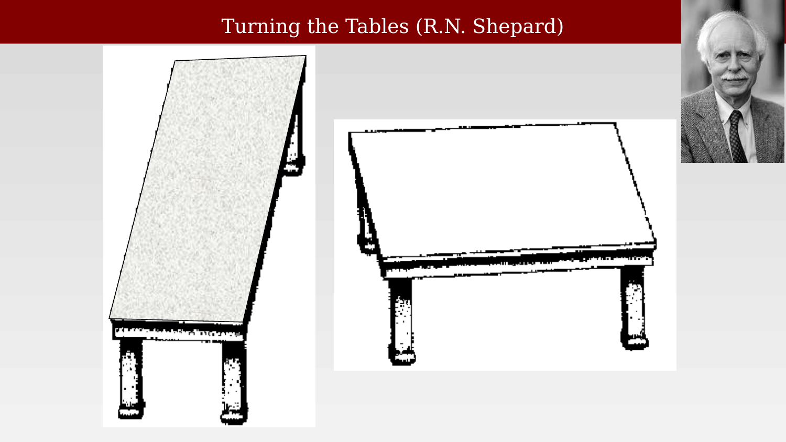
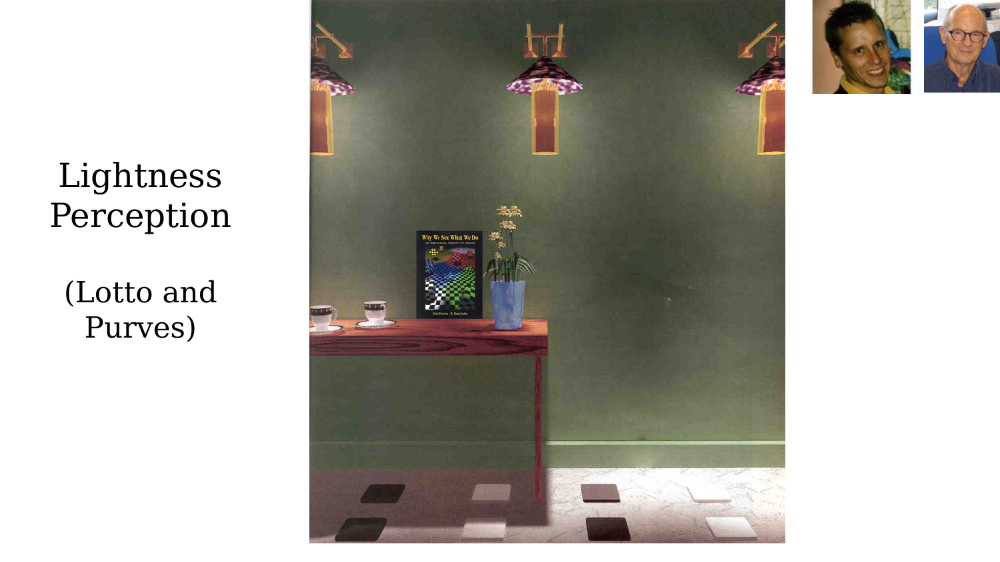
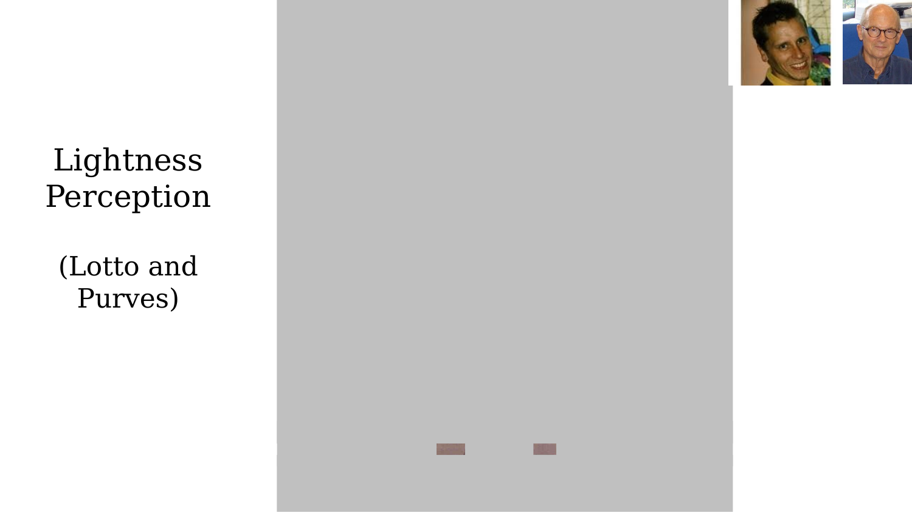
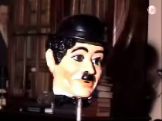

# Introduction to vision



---

This chapter opens a new part of the book: visual neuroscience, studied with fMRI. The material ahead is organized around six questions. Is vision constructive — are our perceptions an inference rather than a direct readout of the world? Does a "visual cortex" even exist, and how was that established? What is the anatomical pathway from eye to cortex? What are "the many maps" of visual cortex, and how were they discovered? What can human fMRI tell us about these maps that earlier methods could not? And, beyond the maps themselves, what functional specializations exist within visual cortex? This chapter addresses the first question directly, using visual illusions as evidence, and sets up the rest as a roadmap for the chapters that follow.

## Vision is constructive

The most direct evidence that perception is an inference, not a direct measurement, comes from illusions: displays where the physical stimulus is fixed and known, but perception of it is demonstrably wrong, or at least not what a simple light-meter or ruler would report. If vision were a transparent window onto the physical world, these illusions would not exist. Cognitive scientist Roger Shepard's "Turning the Tables" is a classic example: the two parallelogram "tabletops" below are identical in size and shape — congruent, in fact — yet one looks long and narrow while the other looks short and wide [@shepard1990-mingsightsbook].

{#fig-ch49-shepard-turning-tables fig-alt="Two black-and-white line drawings of tables, side by side, with a portrait of Roger Shepard in the upper right."}

Lightness — the perceived shade of grey or color of a surface — is similarly constructed rather than read off directly from the light reaching the eye. In a rendered scene by Lotto and Purves, two small patches on the floor appear to be different shades: one look like it sits in shadow, the other in direct light, and their apparent lightness follows the scene's implied illumination [@purves2003-whyweseewhatwedo].

::: {.panel-tabset}
## In context
{#fig-ch49-lightness-perception-context fig-alt="Rendered image of a room with green walls, hanging lamps, a side table, and small colored floor tiles; two of the tiles are highlighted."}

## Isolated
{#fig-ch49-lightness-perception-isolated fig-alt="The same two small patches from the previous figure, shown isolated on a plain grey background, appearing identical in color."}
:::

Isolated from their surrounding context, the two patches are revealed to be physically identical. The visual system does not report the light actually reaching the eye from each patch; it reports an inferred surface lightness, computed using the surrounding scene as context — and that inference can be, and regularly is, wrong in the sense of not matching the raw physical stimulus.

## The hollow-mask illusion

Perhaps the most vivid demonstration of vision as active construction is the hollow-mask illusion, popularized by the psychologist Richard Gregory: a mask of a face, viewed from the inside (physically concave, hollow), is nonetheless perceived as a normal, convex face — and the illusion persists even as the mask rotates, producing apparent motion in the wrong direction as the visual system insists on a convex interpretation it has essentially never encountered violated in ordinary experience [@gregory1970-intelligenteye].

::: {.content-visible when-format="html"}
{#vid-ch49-hollow-mask-illusion width="70%"}
:::

::: {.content-visible when-format="pdf"}
{#vid-ch49-hollow-mask-illusion width="70%"}
:::

## Why begin with illusions?

These demonstrations are not curiosities separate from the main subject of this part of the book — they are the motivation for it. Vision is inference: the cortex does not passively transmit an image, it actively constructs a stable representation of the world from ambiguous, context-dependent sensory data. Having established that the cortex constructs a representation, the natural next question is a spatial one: how is that representation organized? The following chapters trace the history of how that question was answered — first anatomically, then physiologically, and finally with human fMRI — and what the answer turned out to be: not one visual cortex, but dozens of distinct, systematically organized visual field maps.
