# History of vision science



---

The previous chapter argued, from illusions alone, that vision is a construction rather than a direct readout of the world. This chapter asks a more basic historical question: how did anyone come to believe there is a "visual cortex" at all, and how was its internal organization first mapped? The answer is not a tidy, linear success story. It runs through a bitter priority dispute between two 19th-century physiologists, a war between Russia and Japan, and a pair of independently drawn maps of human striate cortex — and only afterward does it connect to the subcortical wiring (LGN, superior colliculus, pulvinar) that carries the retinal signal to cortex in the first place.

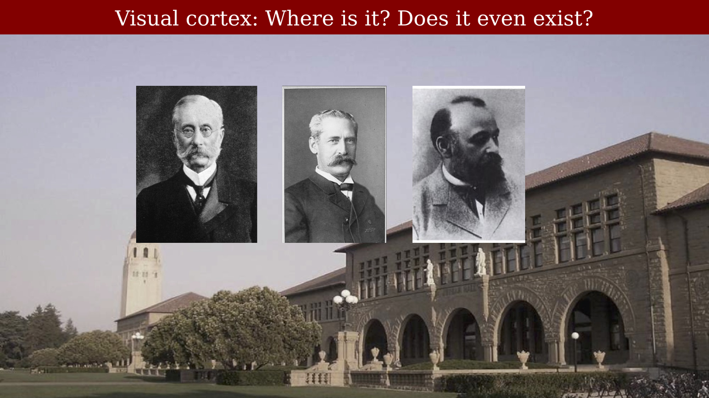{#fig-ch50-visual-cortex-does-it-exist fig-alt="Three unnamed historical portraits over a background photo, under the heading 'Visual cortex: Where is it? Does it even exist?'"}

## Is there a visual cortex at all?

In 1876, the British neurologist David Ferrier reported that removing a region of monkey parietal lobe — the angular gyrus — produced blindness, and he proposed that this region was the seat of vision [@glickstein1988-discoveryvisualcortex]. In fact, Ferrier's occipital lesions had produced visual deficits too subtle to notice from a monkey's spontaneous behavior, while his parietal lesions produced a change in behavior — probably visual neglect and a disinclination to move, rather than blindness as such — that he misread as loss of sight.

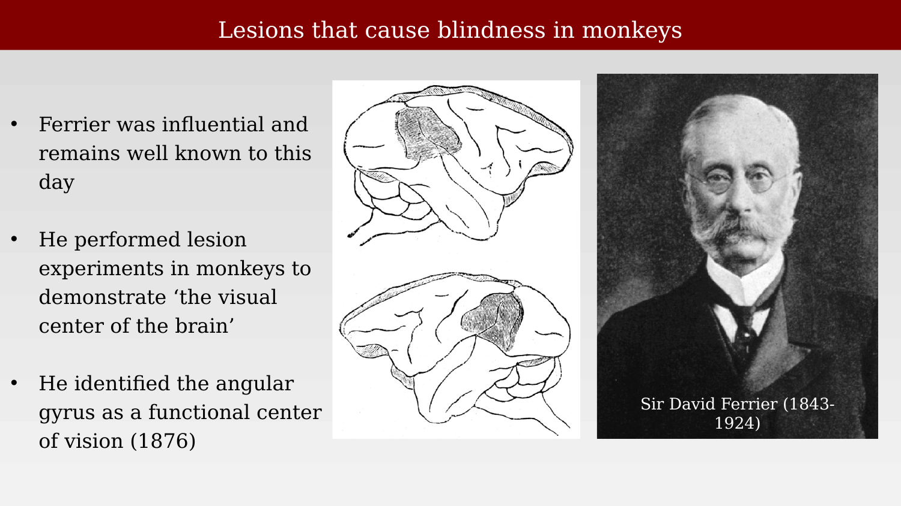{#fig-ch50-ferrier-monkey-lesions fig-alt="Portrait of David Ferrier alongside two hand-drawn monkey-brain diagrams showing lesioned regions."}

The German physiologist Hermann Munk disagreed. In 1881 he reported that removing the occipital cortex from one side of a monkey's brain caused hemianopia — blindness in one half of the visual field of each eye — and that removing occipital cortex bilaterally produced total blindness. From this, Munk correctly located the "seat of vision" in the occipital lobe rather than the angular gyrus, and correctly inferred that both eyes must project to both cerebral hemispheres.

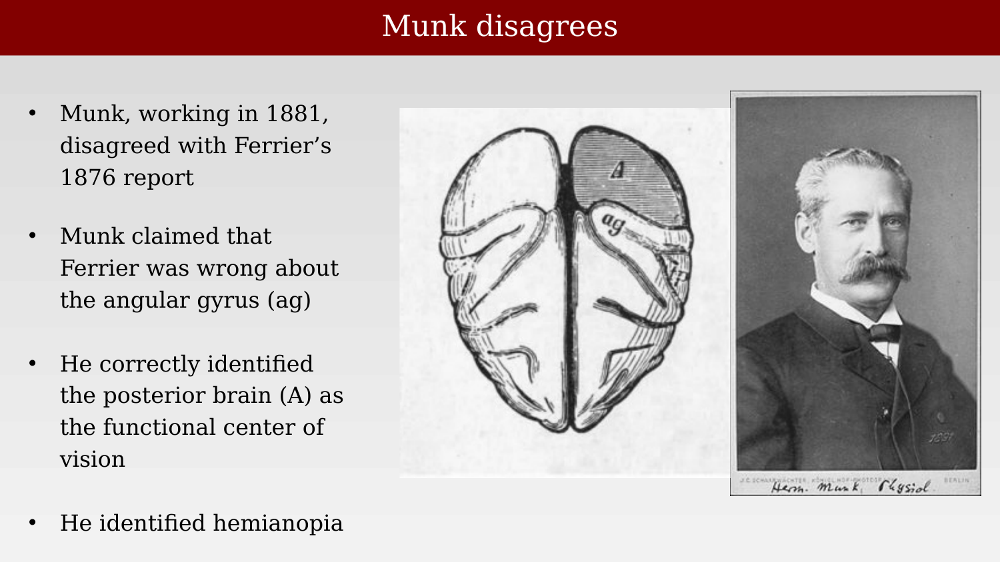{#fig-ch50-munk-disagrees fig-alt="Portrait of Hermann Munk next to a diagram of a monkey brain viewed from above, with a shaded posterior region labeled A and the angular gyrus labeled ag."}

Munk did not disagree gently. Asked to comment on Ferrier's work at a later scientific session, he dismissed Ferrier's angular-gyrus claims as "worthless and gratuitous constructions," and concluded flatly that "Mr. Ferrier had not made one correct guess, all his statements have turned out to be wrong." The dispute became personal enough that William James remarked on it in his 19th-century psychology textbook:

> The subject of localization of functions in the brain seems to have a peculiar effect on the temper of those who cultivate it experimentally ... Munk's absolute tone about his observations and his theoretical arrogance have led to his ruin as an authority.
>
> — William James, quoted in @glickstein1988-discoveryvisualcortex

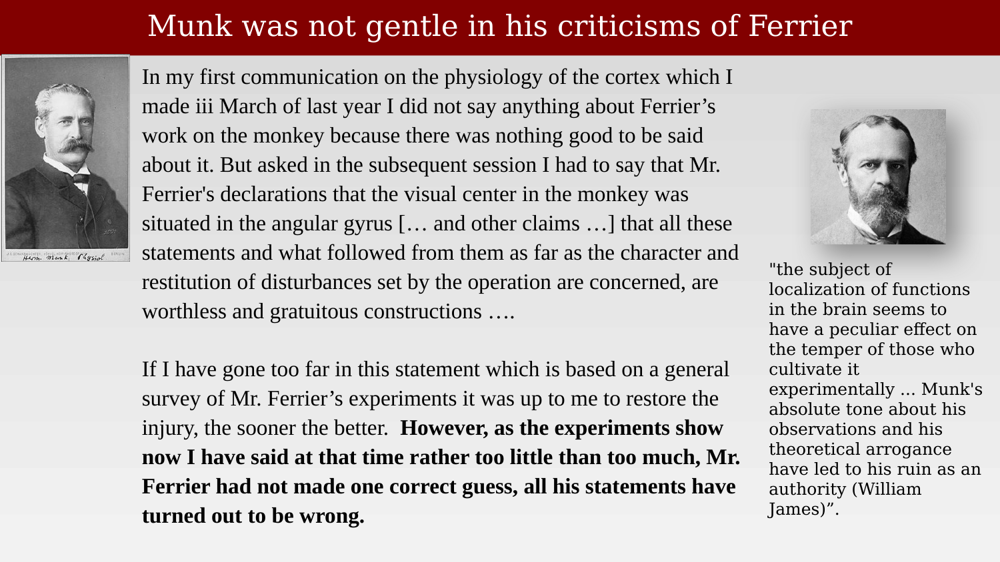{#fig-ch50-munk-criticism-james-quote fig-alt="Portrait of Hermann Munk beside a block of quoted text criticizing Ferrier, with a second portrait and quotation from William James at right."}

Ferrier himself eventually retreated from his original position, though not from every claim:

> Formerly, I localized the visual centres in the angular gyrus, to the exclusion of the occipital lobes. This being a partial truth is an error. ... Complete destruction of the angular gyri on both sides causes for a time total blindness, succeeded by a lasting visual impairment in both eyes. The only lesion which causes complete and permanent blindness is total destruction of the occipital lobes and angular gyri on both sides.
>
> — David Ferrier, quoted in @glickstein1988-discoveryvisualcortex

Ferrier still insisted, incorrectly, that Munk's conclusions were "totally erroneous." Later work vindicated Munk's occipital localization outright. Max Planck's much-quoted remark on how science actually progresses is an apt epitaph for the episode: "A new scientific truth does not triumph by convincing its opponents and making them see the light, but rather because its opponents eventually die, and a new generation grows up that is familiar with it" — popularly compressed to "science advances one funeral at a time."

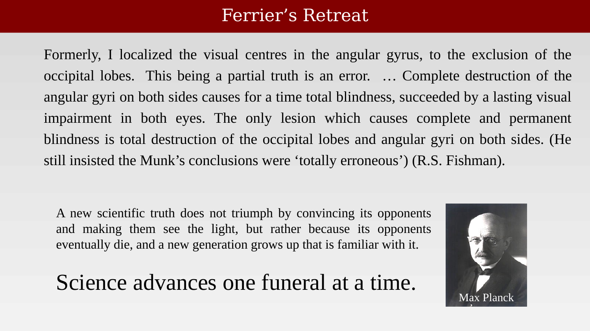{#fig-ch50-ferrier-retreat-planck-quote fig-alt="Quoted text of Ferrier's retreat statement at left, and Max Planck's portrait with the 'science advances one funeral at a time' quotation at right."}

For reference, a modern textbook rendering of where these debates eventually landed — the occipital lobe as visual cortex — is shown below.

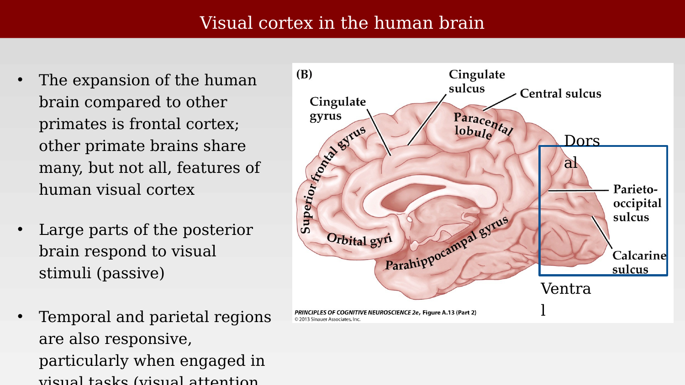{#fig-ch50-visual-cortex-human-brain-purves fig-alt="Textbook diagram of a human brain in sagittal view with the occipital visual cortex highlighted."}

## Confirming the occipital lobe in human patients

Munk's and Ferrier's evidence came from lesion experiments in monkeys. Confirmation in humans came from Swedish neurologist Salomen Henschen, who in 1890 mapped the site of brain damage in partially blind human patients and related it systematically to the pattern of visual field loss. Henschen's cases — a handful of which are reproduced below — consistently implicated the calcarine region, confirming in humans what Munk had proposed from animal lesions: that vision requires the occipital lobe.

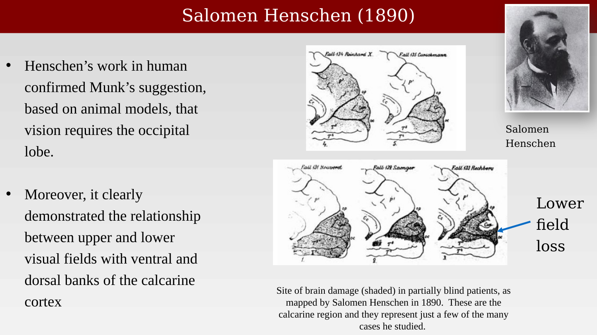{#fig-ch50-henschen-1890 fig-alt="Portrait of Salomen Henschen alongside five schematic brain diagrams with shaded lesion sites, and an arrow indicating lower visual field loss."}

## Mapping the visual field onto V1

Henschen's lesions were the product of natural disease and injury, essentially unplanned experiments. A far larger and more systematic set of "experiments" arrived, tragically, by way of war. The Russo-Japanese War of 1904–05 introduced smaller, faster rifle rounds that could pass through the skull without shattering it — meaning that, for the first time, substantial numbers of soldiers survived closed head wounds to the occipital lobe.

{#fig-ch50-russo-japanese-war fig-alt="Japanese woodcut print depicting soldiers in combat near a stone bridge during the Russo-Japanese War."}

The Japanese physician Tatsuji Inouye examined soldiers with occipital gunshot wounds and correlated the location of each wound with the resulting pattern of visual field loss. From these correlations he worked out, for the first time, how the visual field is mapped systematically onto primary visual cortex.

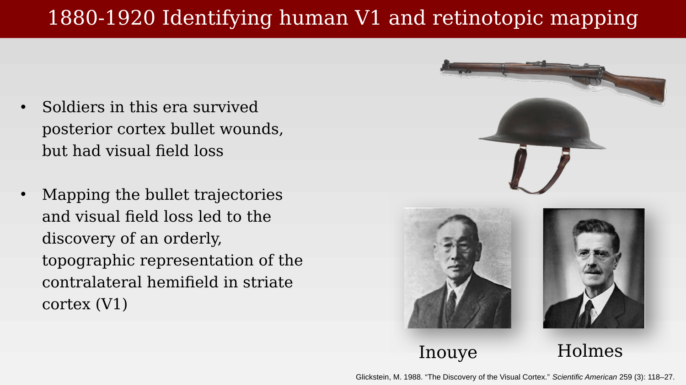{#fig-ch50-identifying-human-v1-1880-1920 fig-alt="A rifle and helmet above portraits of Tatsuji Inouye and Gordon Holmes, under the heading '1880-1920 Identifying human V1 and retinotopic mapping.'"}

Inouye published his scheme in 1909. He described locations in the visual field using an azimuth/elevation coordinate system, then mapped these coordinates onto the lips and banks of the calcarine fissure. The resulting diagram showed that the center of the visual field is represented toward the rear of the occipital lobe, with more peripheral field positions represented progressively further forward — and that a disproportionately large fraction of visual cortex is devoted to central (foveal) vision, an early hint of what would later be called cortical magnification.

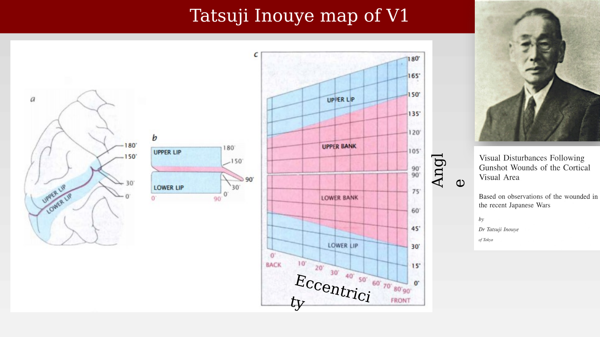{#fig-ch50-inouye-map-v1 fig-alt="Diagram showing the calcarine fissure spread open to reveal upper and lower banks, with a grid mapping azimuth and eccentricity coordinates, alongside a portrait of Tatsuji Inouye and the title page of his 1909 monograph on gunshot wounds of the cortical visual area."}

A second, independently derived map followed from the British neurologist Gordon Holmes in 1918, based on his own examination of British soldiers with occipital gunshot wounds from the First World War. Holmes's scheme quickly supplanted Inouye's, mainly because it is easier to read: it shows the disproportionate cortical representation of central vision in both the vertical and horizontal directions, whereas Inouye's diagram showed only the horizontal magnification.

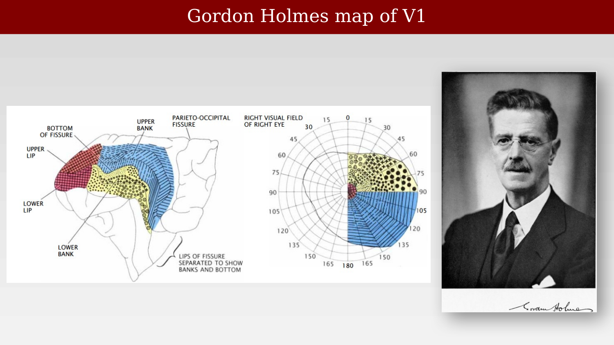{#fig-ch50-holmes-map-v1 fig-alt="A brain diagram with the calcarine fissure opened and color-coded, next to a matching polar plot of the right visual field, and a portrait of Gordon Holmes."}

The Holmes map remained the standard reference for decades, but it was not perfectly accurate: a 1991 reanalysis correlating MRI scans with visual field defects found that Holmes had underestimated the cortical area devoted to central vision, and proposed a revised map bringing the human data into closer agreement with measurements from nonhuman primates [@horton1991-holmesmap].

## From eye to cortex: subcortical targets and layered structure

Mapping the visual field onto cortex answers where the signal ends up, but not how it gets there. In primates, about 90% of optic nerve fibers terminate in the two lateral geniculate nuclei (LGN) of the thalamus, whose outputs form the optic radiation — the major pathway to V1. A smaller number of fibers branch off to other targets: the suprachiasmatic nucleus (circadian timing), the superior colliculus and pretectum (midbrain structures involved in eye movements and pupillary control), and, via the superior colliculus, the pulvinar, which in turn projects onward to structures including the amygdala.

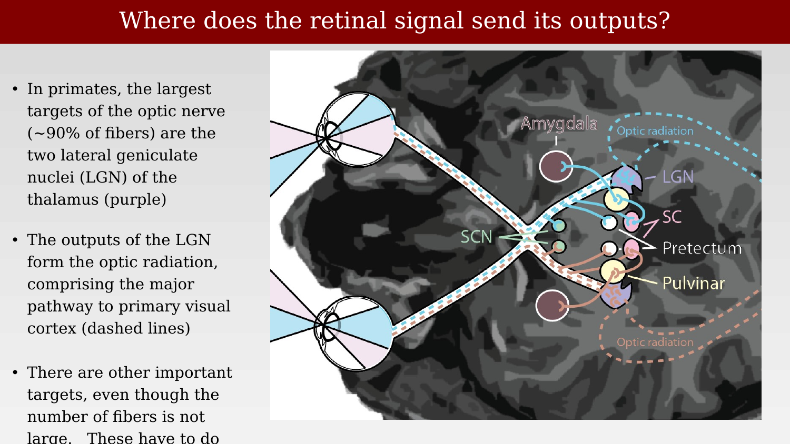{#fig-ch50-retinal-signal-outputs fig-alt="Schematic of two eyes projecting via the optic nerves and chiasm to labeled subcortical targets including LGN, SCN, superior colliculus, pretectum, pulvinar, and amygdala, overlaid on a grayscale brain image."}

At the optic chiasm, roughly half of each eye's fibers cross to the opposite hemisphere (hemidecussation), so that each hemisphere receives input from the corresponding half of the visual field in both eyes. This crossing pattern can be seen directly in structural MRI, and it differs across species — the rodent chiasm, in particular, is organized differently from the primate one (a point taken up again in the chapter on cortical plasticity).

::: {.content-visible when-format="html"}
{#vid-ch50-optic-chiasm-rodent width="70%"}
:::

::: {.content-visible when-format="pdf"}
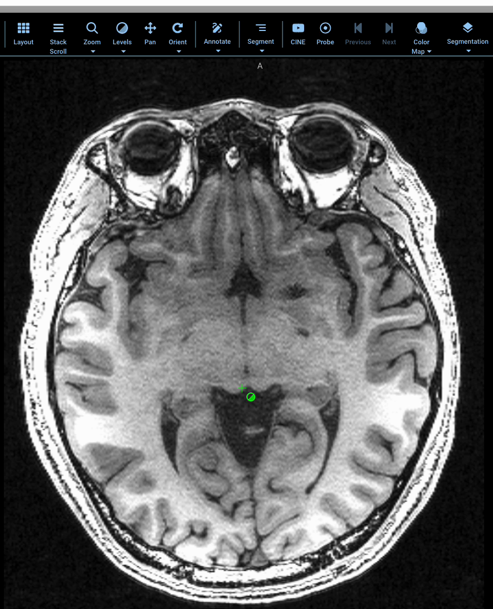{#vid-ch50-optic-chiasm-rodent width="70%"}
:::

The functional consequence of hemidecussation is that damage to one optic nerve causes monocular field loss, while damage after the chiasm — in the optic tract, LGN, or cortex — causes hemianopia, loss of the same half of the visual field in both eyes.

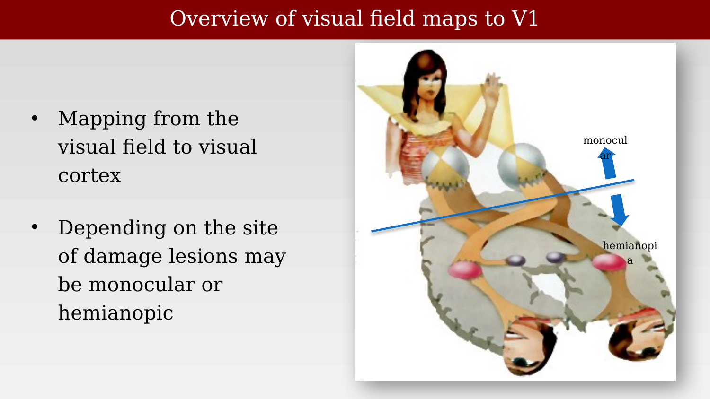{#fig-ch50-hemianopia-overview fig-alt="Illustration of a person with visual field diagrams overlaid, with arrows labeled monocular and hemianopia pointing to different regions of the combined visual field."}

The LGN itself is a layered structure, roughly the size of a walnut, and the layering is functionally organized. The two ventral layers (magnocellular, M) receive input from parasol retinal ganglion cells; the four dorsal layers (parvocellular, P) receive input from midget ganglion cells; and small koniocellular cells, interleaved between the main layers, receive input from small bistratified ganglion cells. Each layer receives input from only one eye, alternating ipsilateral and contralateral as one moves through the stack.

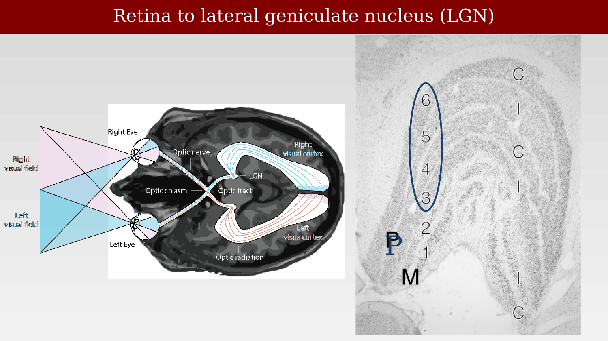{#fig-ch50-retina-to-lgn fig-alt="Left panel: schematic of two eyes projecting through the optic chiasm to the LGN and visual cortex, with right and left visual field inputs color coded. Right panel: a stained coronal section of the LGN with its six layers circled and labeled."}

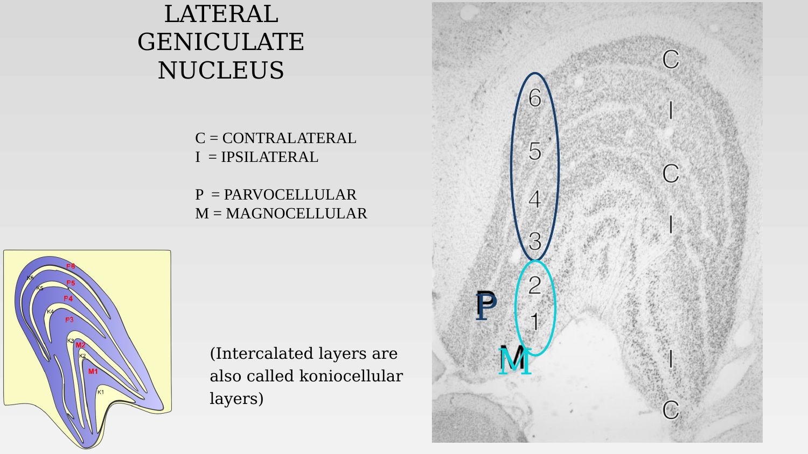{#fig-ch50-lgn-layers fig-alt="Diagram of the LGN's six main layers plus koniocellular interlaminar zones, labeled parvocellular, magnocellular, contralateral, and ipsilateral, alongside a matching stained coronal section."}

Finally, the relative size of the LGN-to-V1 projection is not fixed across species — it scales dramatically with the number of LGN afferents. Comparing mouse, rabbit, cat, and macaque, both the number of V1 neurons and the area of V1 grow as a power-law function of the number of LGN neurons, with an exponent near 3/2: as the thalamic input expands over evolution, cortex expands disproportionately faster [@kremkow2018-thalamocortical]. This "overexpansion" is one clue that primate V1, and the many additional visual areas surveyed in the next chapters, are doing substantially more than simply relaying the thalamic signal forward.

{#fig-ch50-thalamocortical-circuits-species fig-alt="Three panel figure: a line plot of percent retinal ganglion cells to superior colliculus versus thalamus across four species, and two log-log scatter plots showing power-law scaling of V1 neuron count and V1 area against LGN neuron count across several mammalian species."}

By the 1920s, then, the broad outline was in place: vision depends on occipital cortex, the visual field maps onto that cortex in an orderly (if magnified-toward-center) fashion, and the retinal signal reaches cortex predominantly via a layered thalamic relay, the LGN, with several smaller subcortical way-stations alongside it. What was not yet appreciated is that V1 is only the first of many such maps. The next chapter takes up the discovery — decades later, and initially in animals far removed from primates — that visual cortex contains not one map, but dozens.
