# Discovery of multiple maps



---

The previous chapter ended with V1 (striate cortex) established as a single, orderly map of the visual field, fed by a layered thalamic relay. That picture, complete as it seemed by the 1920s, turned out to be only the first chapter. Starting in the mid-20th century, physiologists found that the visual field is not mapped once onto cortex — it is mapped many times over, in a whole set of distinct, systematically organized areas. This chapter traces that discovery, from early electrode mapping in the rabbit and cat, through the difficulty of extending the same approach to primates, to the arrival of fMRI, which made it practical to measure a dozen or more human visual field maps in a single scanning session.

## A second visual map, found with electrodes

The first hint that a single visual map might not be the whole story came from work in the rabbit and cat carried out in Clinton Woolsey's lab at the University of Wisconsin. Using electrodes to record local field potentials evoked by localized light stimulation of the retina, Thompson, Woolsey, and Talbot mapped not one but two systematic projections of the visual field onto cortex, which they labeled visual areas I and II, separated by a "line of decussation" across which the two maps were mirror images of one another [@thompson1950-rabbitvisualareas].

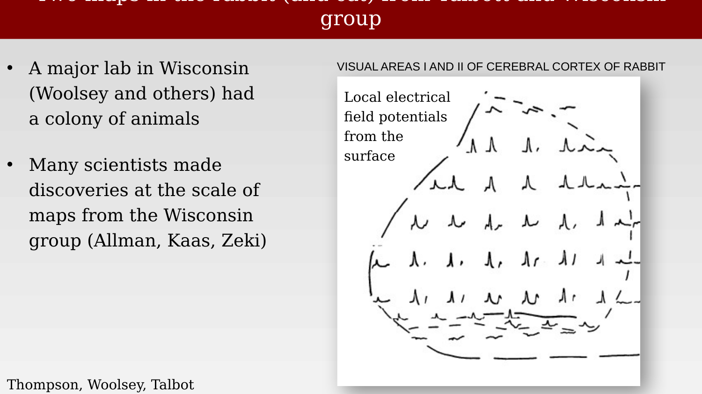{#fig-ch51-rabbit-visual-areas-1-2-fieldpotentials fig-alt="Diagram of a rabbit brain outline with rows of small evoked-potential waveform traces recorded at each electrode position."}

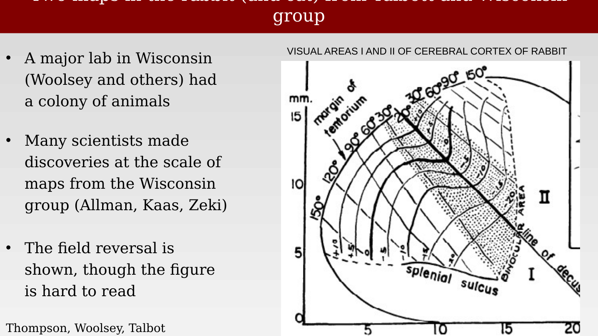{#fig-ch51-rabbit-visual-areas-1-2-map fig-alt="Contour map of visual field coordinates (in degrees) projected onto the rabbit cortical surface, showing two adjoining mirror-symmetric maps labeled I and II."}

## Many more maps, including in primate

The rabbit result was not an isolated curiosity. Over the following decades, additional maps were reported across a range of species: Allman and Kaas identified area MT in 1971; Cowey reported findings in squirrel monkey; Hubel and Wiesel described a third visual area (V3) in monkey in 1965; and Semir Zeki reported a series of additional maps through the 1960s and 1970s. By the time this body of work matured, it was clear that "visual cortex" was shorthand for a whole family of areas, not a single region.

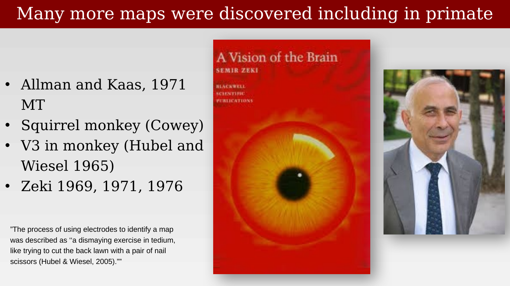{#fig-ch51-many-more-maps-primate fig-alt="Portraits of two vision scientists at left, and the book cover of 'A Vision of the Brain' by Semir Zeki, alongside a portrait of Zeki, at right."}

The methods available at the time made this kind of mapping exceptionally laborious. Electrode-based mapping meant advancing a single electrode through cortex, recording a receptive field, moving to the next position, and repeating — area by area, animal by animal. Hubel and Wiesel later described the process bluntly:

> The process of using electrodes to identify a map was described as "a dismaying exercise in tedium, like trying to cut the back lawn with a pair of nail scissors."
>
> — @hubel2005-brainvisualperception

## Bringing multiple-map mapping to humans

Everything up to this point had come from invasive electrode recordings or postmortem lesion analysis in animals or, at best, in human patients with naturally occurring brain damage. Measuring multiple visual field maps in the *living human brain*, non-invasively, required different tools entirely — and those tools were, for decades, too coarse for the job.

The earliest non-invasive functional measurements came from positron emission tomography (PET). @fox1986-mappingvisualcortex used PET to measure blood flow responses to visual stimulation restricted to different parts of the visual field, and were able to show that more central (foveal) stimulation activated cortex at a different location than more peripheral stimulation — an early, coarse demonstration of retinotopic organization in living human cortex. But PET's spatial resolution was poor: individual voxels spanned roughly a centimeter on a side, far larger than the distance separating neighboring visual field maps on the cortical surface.

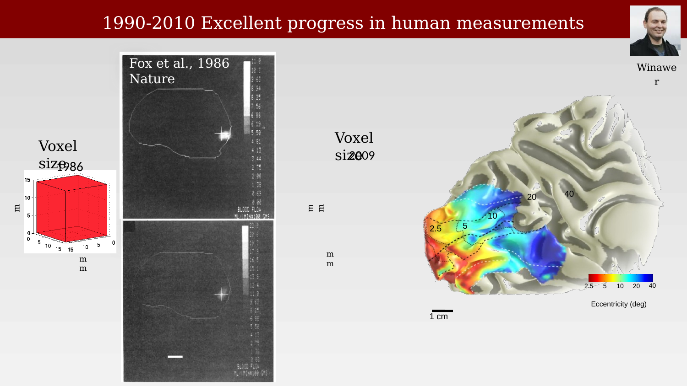{#fig-ch51-pet-vs-fmri-voxel-eccentricity fig-alt="Left: two grayscale PET blood-flow images with a large red voxel cube for scale. Right: a smaller voxel cube for scale next to an inflated cortical surface colored by eccentricity, ranging red (near fovea) to blue (periphery)."}

The arrival of functional MRI in the early 1990s changed this. Higher spatial resolution made it possible not just to detect a rough retinotopic gradient, but to resolve the boundaries between adjacent maps directly. By 2010, superimposing area boundaries on the same eccentricity data reliably identified V1, V2, and V3 as three separate, adjoining maps in an individual subject.

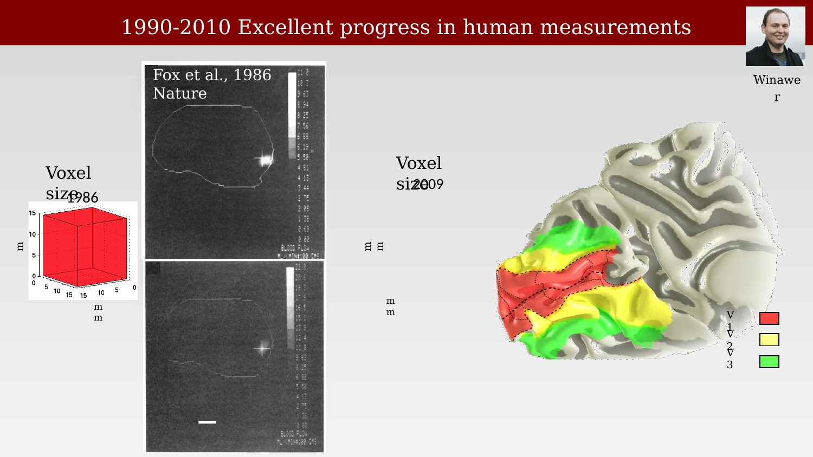{#fig-ch51-pet-vs-fmri-v1v2v3-borders fig-alt="Same PET-versus-fMRI voxel comparison as the previous figure, but the inflated cortical surface now shows three colored regions labeled V1, V2, and V3."}

It is worth pausing to consolidate what a century of lesion-based work — Munk, Henschen, Inouye, Holmes — had already established about V1 alone before fMRI entered the picture: a single orderly map of the contralateral hemifield, with the upper visual field represented on the lower bank of the calcarine fissure and the lower visual field on the upper bank, and a strong foveal bias (cortical magnification) evident even in the coarse lesion data.

{#fig-ch51-v1-visual-field-map-summary fig-alt="Left: an anatomical drawing of the calcarine fissure with iso-eccentricity contours and upper/lower field boundaries marked. Right: a schematic half visual field with upper and lower vertical meridian labeled and a shaded foveal region."}

## Traveling-wave retinotopic mapping with fMRI

The fMRI method that made this kind of boundary mapping practical is often called traveling-wave or phase-encoded retinotopic mapping. Rather than presenting one fixed stimulus location at a time, the stimulus itself sweeps continuously through the visual field while the subject fixates centrally, and each cortical location's response phase reveals which part of the visual field it represents.

One version of the stimulus is an expanding (or contracting) ring of high-contrast flickering checkerboard, which sweeps outward from the fovea and drives a traveling wave of activity from the foveal representation toward the peripheral representation of each map.

::: {.content-visible when-format="html"}
{#vid-ch51-eccentricity-stimulus-mapping width="70%"}
:::

::: {.content-visible when-format="pdf"}
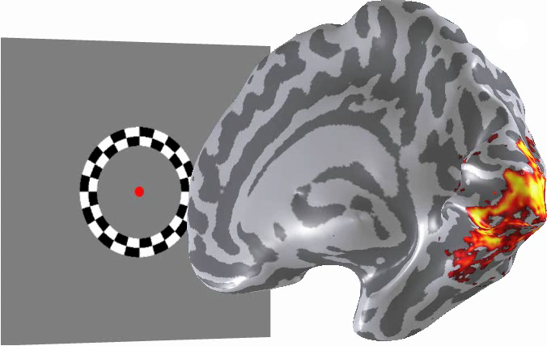{#vid-ch51-eccentricity-stimulus-mapping width="70%"}
:::

The result, summarized across an entire scan, is a smooth pseudo-color map of eccentricity across the cortical surface: red near the fovea, progressing through the spectrum toward blue in the far periphery.

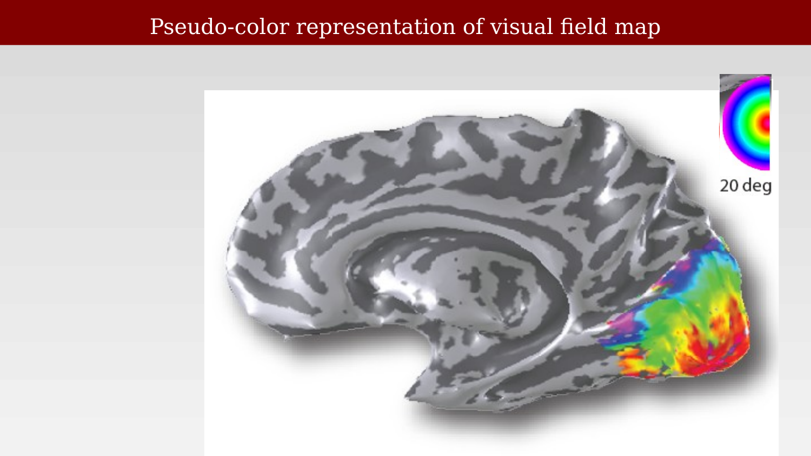{#fig-ch51-eccentricity-map-result fig-alt="Inflated cortical surface, medial view, with a wedge-shaped region near the occipital pole colored in a rainbow gradient from red at the pole through green and blue further away, with a color legend labeled '20 deg'."}

A complementary stimulus — a checkerboard wedge that rotates around fixation — maps the other visual field coordinate, polar angle, and its reversals in the response phase are what actually delineate the boundaries between adjacent maps (each map reverses the direction of its angular representation relative to its neighbor, which is precisely the "mirror symmetry" already visible in the 1950 rabbit data).

::: {.content-visible when-format="html"}
{#vid-ch51-polar-angle-stimulus-mapping width="70%"}
:::

::: {.content-visible when-format="pdf"}
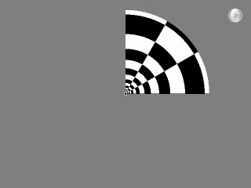{#vid-ch51-polar-angle-stimulus-mapping width="70%"}
:::

Combining eccentricity and polar-angle maps delineates map boundaries directly: each individual map is a contiguous region with a full, systematic representation of visual field position, and neighboring maps meet along a reversal in the angular representation.

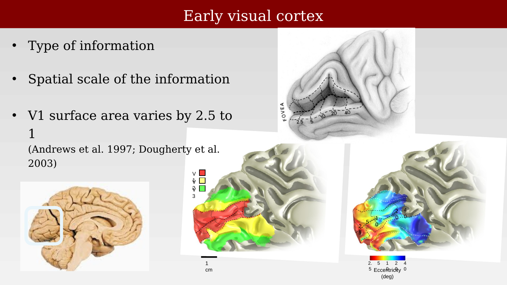{#fig-ch51-early-visual-cortex-summary fig-alt="A composite figure: an anatomical calcarine-fissure drawing, an inflated cortical surface colored by map identity (V1/V2/V3), and the same surface colored by eccentricity, side by side, with a whole-brain inset showing the occipital region highlighted."}

Even within a single, well-defined map like V1, there is substantial individual variation: total V1 surface area varies roughly 2.5-fold across neurologically normal individuals, and this variation is coordinated with the size of the optic tract and LGN in the same individual — larger peripheral visual structures go with larger V1 [@andrews1997-correlatedsizevariations; @dougherty2003-v1v2v3representations].

## From single maps to a catalog

By the 2000s, phase-encoded fMRI mapping of the kind illustrated above had been applied broadly enough to produce something like a catalog of human visual field maps: not just V1, V2, and V3, but numerous additional maps in lateral, ventral, and dorsal occipital cortex, and further maps extending into posterior parietal cortex.

::: {.content-visible when-format="html"}
{#vid-ch51-rotating-brain-map-clusters width="70%"}
:::

::: {.content-visible when-format="pdf"}
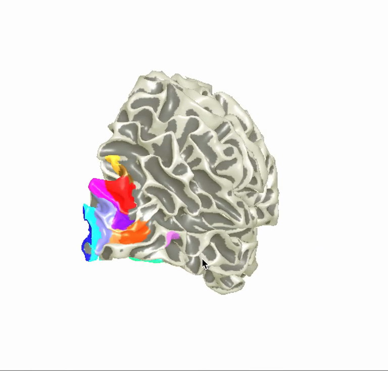{#vid-ch51-rotating-brain-map-clusters width="70%"}
:::

Two review papers, published a few years apart, surveyed this rapidly growing catalog and are useful reference points for the material in the chapters that follow: @wandell2007-visualfieldmaps catalogued the maps known by 2007 — including medial occipital (V1, V2, V3), lateral occipital (LO-1, LO-2, hMT+), ventral occipital (hV4, VO-1, VO-2), dorsal occipital (V3A, V3B), and posterior parietal (IPS-0 through IPS-4) maps — and discussed how maps cluster into groups that share a common eccentricity representation while alternating their angular representation; @wandell2011-imagingretinotopicmaps reviewed the fMRI measurement methods themselves in more detail.

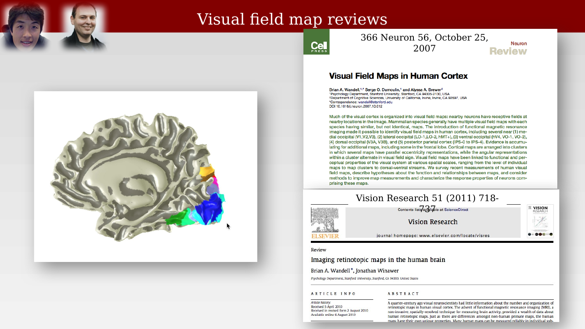{#fig-ch51-visual-field-map-reviews fig-alt="Two journal article title pages side by side: 'Visual Field Maps in Human Cortex' (Neuron, 2007) and 'Imaging retinotopic maps in the human brain' (Vision Research, 2011), with author photos of Wandell and Winawer at top left."}

The existence of a dozen or more maps immediately raises a further question, taken up in the next chapter: if the visual field is represented redundantly across so many distinct cortical areas, what is the relationship between them — are they a hierarchy, a set of parallel pathways, or something else?
