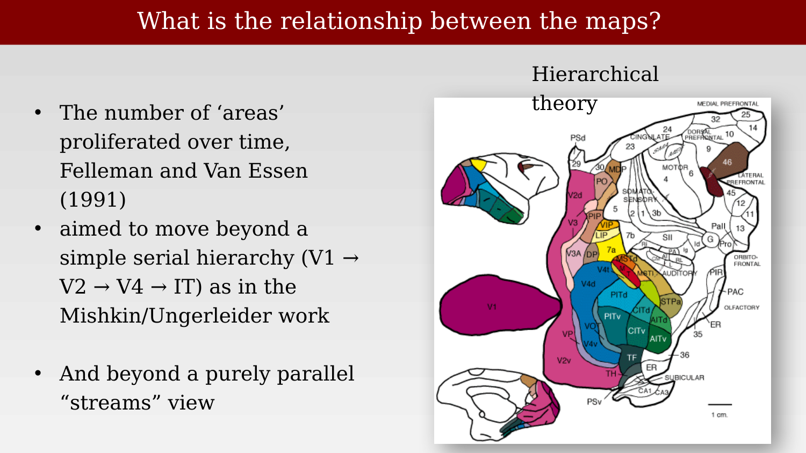
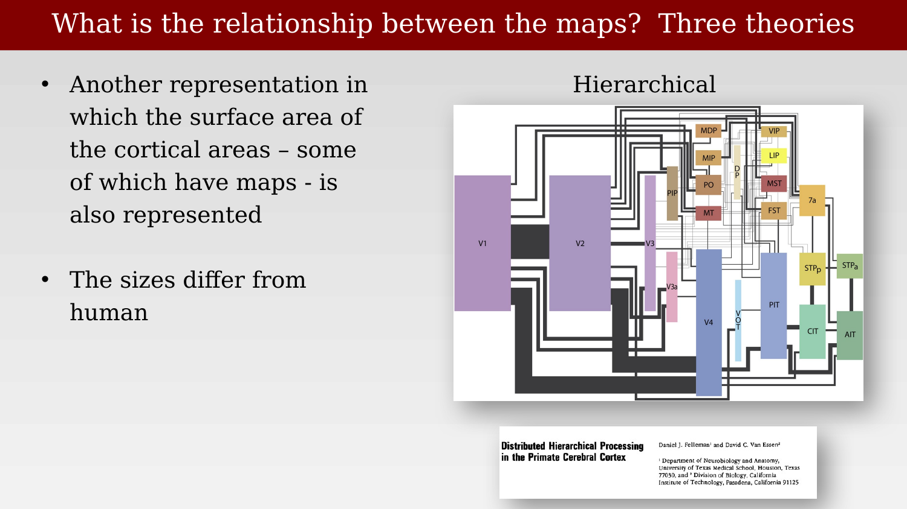
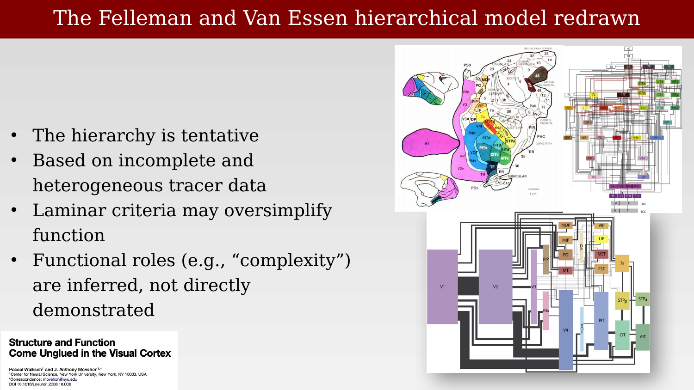
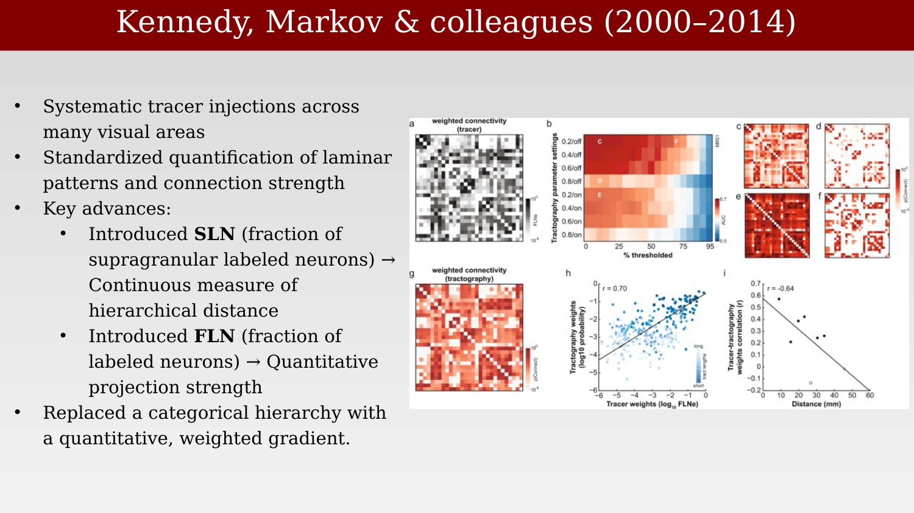
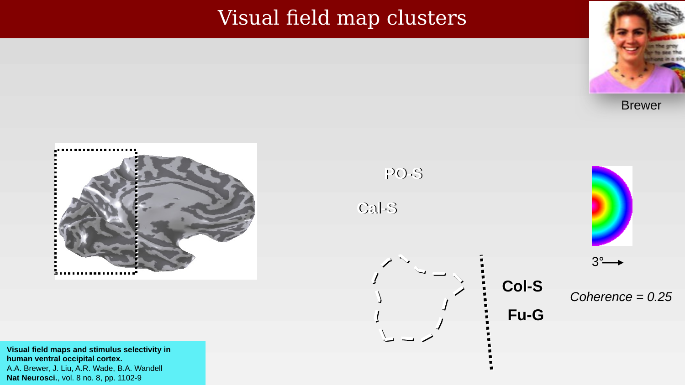
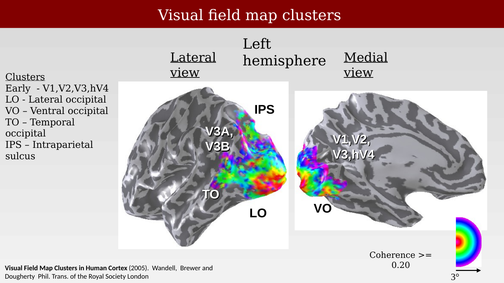
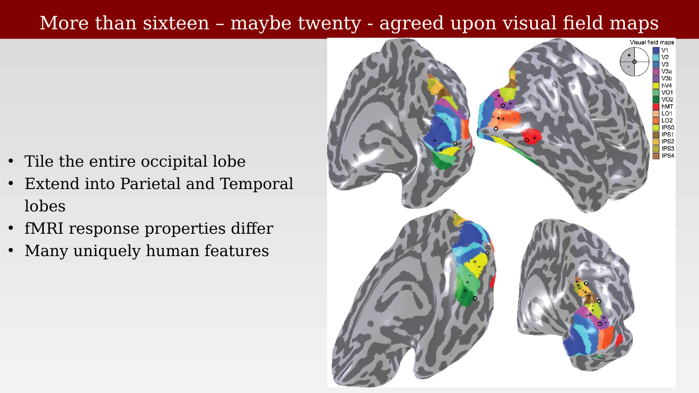
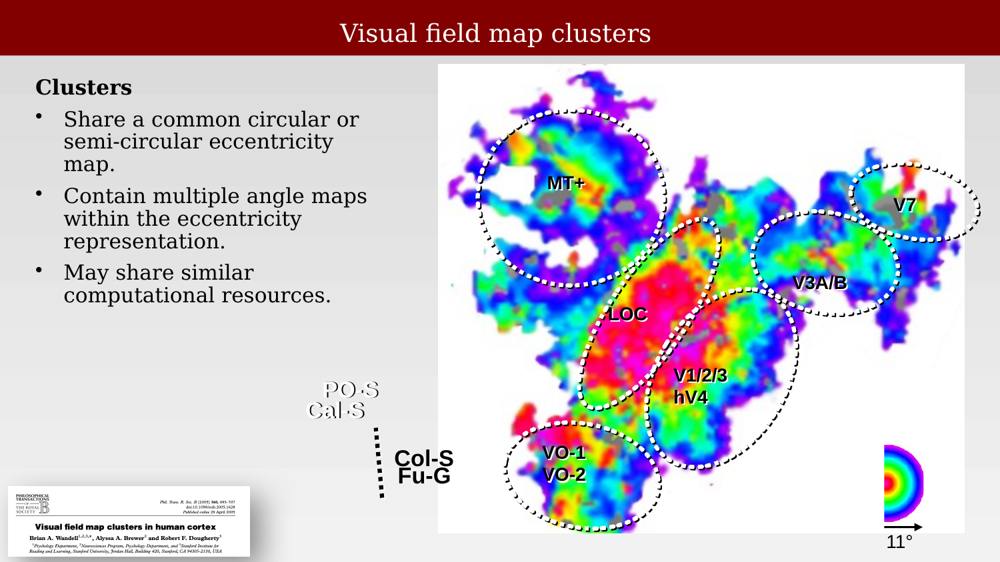

# Organization of the maps



---

Once it was clear that visual cortex contains many distinct maps rather than one, a new question took center stage: what is the relationship between them? Three broad answers have been proposed and refined over the past four decades — two large functional streams, a single feedforward hierarchy, and a set of map clusters organized around shared eccentricity representations — and this chapter works through each in turn, along with the evidence and criticisms that have shaped them.

## Two streams: object vision and spatial vision

The first influential answer came from lesion studies in monkeys. Damage to inferior temporal (IT) cortex impairs object discrimination — telling shapes, patterns, or object identities apart — while leaving performance on purely spatial-location tasks intact. Damage to posterior parietal cortex shows the opposite pattern: impaired spatial judgment and visually guided reaching, with object discrimination itself intact. This double dissociation, established using object-discrimination tasks, landmark/spatial-relation tasks, and visually guided reaching and spatial-memory tasks, was reinforced by anatomical tracer studies showing two largely separate corticocortical pathways leaving striate cortex: a ventral pathway (V1 → V2 → V4 → inferior temporal cortex) and a dorsal pathway (V1 → V2 → MT → posterior parietal cortex) [@mishkin1983-twocorticalpathways; @ungerleider1982-twocorticalsystems].

{#fig-ch52-what-where-pathways-summary fig-alt="Lateral view of a macaque brain with the ventral temporal pathway (V1, V2, V4, PIT, AIT) highlighted in red under the label 'object recognition,' and the dorsal parietal pathway (V2, MT, 7a, LIP) highlighted in blue under the label 'spatial processing (action),' with the original 1983 Trends in Neurosciences title page shown below."}

The original interpretation of this dissociation was framed in terms of the *content* of the represented information: the ventral, "what" pathway carries object identity, form, and color, while the dorsal, "where" pathway carries spatial location, motion, and spatial relationships. A later, influential reformulation shifted the emphasis from content to function: Goodale and Milner argued the dorsal stream is specialized for the visual guidance of action, while the ventral stream is specialized for conscious perceptual identification — vision-for-action versus vision-for-perception, rather than strictly where versus what [@goodale1992-separatevisualpathways].

## A hierarchical network of areas

A second, complementary answer emphasizes not two streams but a graded hierarchy of processing stages. Felleman and Van Essen's 1991 synthesis of tracer studies proposed a distributed, hierarchical network of visual areas connected by structured feedforward and feedback pathways, with each connection's laminar termination pattern (ascending, descending, or lateral) used to infer its position in the hierarchy. The result — dozens of areas linked by hundreds of reported connections — was already far denser and more reciprocal than a simple serial chain.

{#fig-ch52-hierarchical-theory-fve-diagram fig-alt="A complex wiring diagram with dozens of colored boxes labeled with area abbreviations (V1, V2, V3, MT, LIP, IT areas, prefrontal areas, etc.), connected by many crossing gray lines, organized in rough hierarchical tiers from bottom (early visual) to top (frontal)."}

A second version of the same synthesis scales each area's box by its cortical surface area and each connection's line by its estimated number of fibers, making clear just how much cortical territory is devoted to each stage — and how much this differs between macaque and human [@felleman1991-distributedhierarchical].

{#fig-ch52-hierarchical-theory-scaled-areas fig-alt="A hierarchy diagram similar to the previous figure, but with boxes of varying size proportional to cortical surface area — V1 and V2 are large, later areas progressively smaller — connected by lines of varying thickness, with the original Felleman and Van Essen 1991 title page shown below."}

Even in its scaled form, the hierarchical model has drawn sustained criticism. It rests on incomplete and heterogeneous tracer data collected across many separate studies; its laminar criteria for ordering areas may oversimplify what is actually a much more heterogeneous set of connections; and functional labels like "complexity" assigned to higher tiers are typically inferred from position in the diagram rather than demonstrated directly. A 2008 commentary put the underlying worry sharply: anatomical structure and functional role do not always travel together in visual cortex [@wallisch2008-structurefunctionunglued].

{#fig-ch52-fve-model-redrawn-critique fig-alt="Two hierarchy diagrams shown together — the dense wiring diagram and the area-scaled version — with the title page of a 2008 Neuron commentary by Wallisch and Movshon shown beneath."}

More recent work has tried to replace the qualitative, categorical hierarchy with a quantitative, continuously graded one. Kennedy, Markov, and colleagues carried out systematic tracer injections across many visual areas and introduced standardized, quantitative measures of connection strength and laminar pattern: the fraction of labeled neurons that are supragranular (SLN), used as a continuous index of hierarchical distance, and the fraction of labeled neurons overall (FLN), used as a quantitative measure of projection strength. The result replaces a small number of discrete hierarchical levels with a continuous, weighted, and directed connectivity gradient [@markov2014-weightedconnectivity; @markov2014-anatomyhierarchy; @barone2000-laminardistribution].

{#fig-ch52-kennedy-markov-quantitative-connectivity fig-alt="A multi-panel figure with grayscale and red-scale connectivity matrices, a heatmap of tractography parameter settings, and two scatter plots relating tracer weights, tractography weights, and interareal distance."}

## Visual field map clusters

A third organizing principle, developed specifically from human fMRI retinotopic mapping, groups maps not by stream or by hierarchical tier but by a shared representation of the visual field. Beginning around 2005, groups of adjacent maps were found to share a single, common eccentricity representation — typically organized as a circular or semicircular gradient from a shared foveal confluence — while containing multiple distinct angular (polar-angle) maps within that shared eccentricity envelope. Neighboring maps within a cluster often mirror each other's angular representation, echoing the same mirror-symmetric organization already seen in the 1950 rabbit data.

The first cluster identified beyond early visual cortex was in ventral occipital cortex, where a systematic set of retinotopic measurements was combined, for the first time, with measurements of color, object, and face selectivity in the same region.

{#fig-ch52-vo-cluster-brewer2005 fig-alt="An inflated cortical hemisphere with a dashed box marking the ventral occipital region, alongside a schematic diagram of sulcal landmarks (parieto-occipital sulcus, calcarine sulcus, collateral sulcus, fusiform gyrus) and a small polar-angle color wheel, with a citation to Brewer, Liu, Wade, and Wandell, Nature Neuroscience 2005."}

This discovery prompted a broader naming convention, still in use, in which newly identified clusters are named for their approximate location rather than assigned the next integer in a "V-number" sequence: lateral occipital (LO), ventral occipital (VO), temporal occipital (TO), and intraparietal sulcus (IPS) clusters, alongside the original early cluster (V1, V2, V3, hV4).

{#fig-ch52-cluster-naming-convention fig-alt="Two inflated cortical hemisphere views, lateral and medial, colored by polar angle, with cluster regions labeled IPS, V3A/V3B, TO, LO, V1/V2/V3/hV4, and VO."}

By the following decade, the catalog of well-agreed-upon human visual field maps had grown to somewhere between sixteen and twenty, tiling not just the occipital lobe but extending into parietal and temporal cortex. Many of these maps have fMRI response properties, and in some cases apparent existence, that are not straightforward analogs of any macaque area — a reminder that the human visual system, while broadly similar to that of other primates, is not simply a scaled-up copy of it.

{#fig-ch52-sixteen-to-twenty-maps fig-alt="Four inflated cortical surface views, each colored with a patchwork of differently colored regions corresponding to over a dozen named visual field maps, with a legend listing V1, V2, V3, V3a, V3b, hV4, VO1, VO2, hMT, LO1, LO2, IPS0-IPS4."}

The cluster concept ties the whole chapter together: clusters share a common eccentricity envelope and may share overlapping computational resources, but different clusters occupy different positions in both the two-stream framework (early/LO/V3A-B skew dorsal-ventral differently than VO/TO) and the hierarchical framework (clusters sit at different, and only roughly ordered, hierarchical depths). None of the three organizing principles surveyed in this chapter — streams, hierarchy, clusters — fully supersedes the others; each captures a different, partially overlapping regularity in how the visual field maps are related to one another.

{#fig-ch52-clusters-eccentricity-overlay fig-alt="A flattened or inflated cortical patch colored by eccentricity in rainbow colors, with dashed outlines marking cluster boundaries labeled MT+, V7, V3A/B, LOC, V1/2/3 plus hV4, and VO-1/VO-2."}

The next chapter turns from this general organizational scaffold to specific functional specializations found within and across these maps and clusters — beginning with the long clinical history of one particularly well-studied specialization, the reading pathway in ventral occipitotemporal cortex.
