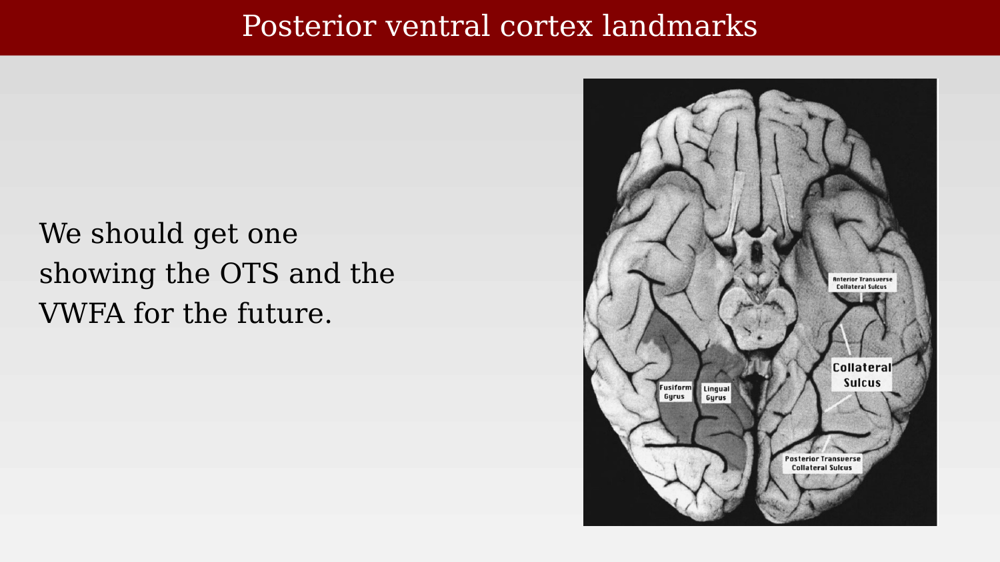
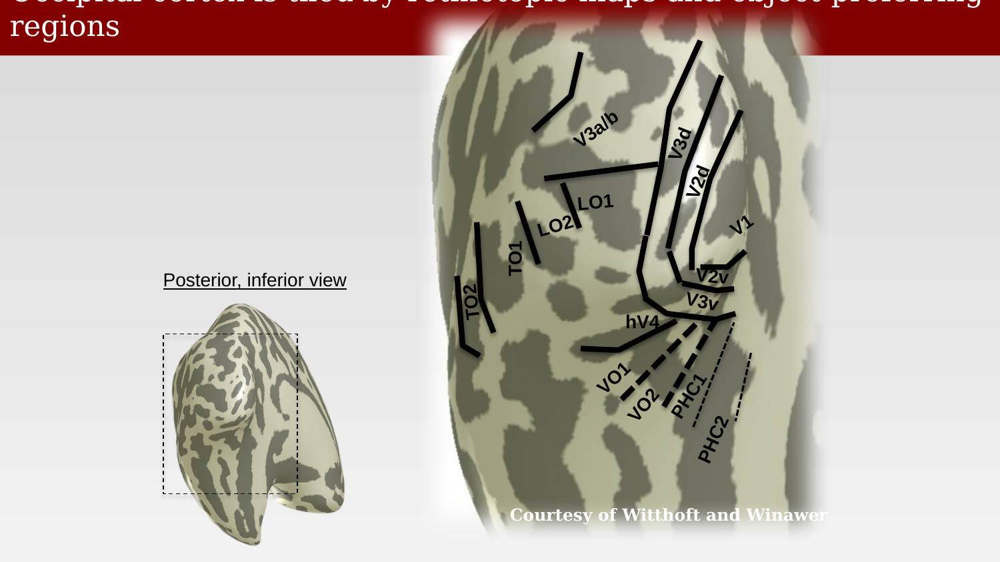

# Visual specializations



---

The last two chapters described visual cortex as a set of maps, organized into streams, hierarchies, and clusters that each represent the visual field in an orderly way. This closing chapter asks a different question: within and beyond these retinotopic maps, are there regions specialized for particular kinds of visual content — not just particular parts of the visual field, but particular categories of thing in it? The clearest historical test case is reading, a uniquely human, culturally acquired skill with no dedicated evolutionary history, which nonetheless recruits a strikingly consistent patch of ventral occipitotemporal cortex. The chapter follows that case from its 19th-century clinical origins to a modern fMRI-based map of category selectivity across the whole of ventral temporal cortex.

## An early test case: reading and the connectionist tradition

The idea that specific cortical regions and their connections support specific visual-cognitive functions predates fMRI by more than a century, and reading was one of the first skills studied this way. Carl Wernicke's 1874 monograph described a form of aphasia arising from posterior temporal damage and, more generally, argued for a connectionist framework: cognitive functions depend on connections between sensory and motor regions, and disorders of cognition can be explained by disconnections between them rather than damage to a single "faculty" center. Applied to reading, this framework treats reading as a connection circuit linking vision, sound, and language, with particular emphasis on the angular gyrus [@wernicke1874-aphasischesymptomencomplex].

Joseph Jules Dejerine extended this connectionist logic with a specific and startling case: a patient who could still write spontaneously and from dictation, but had lost the ability to read — including his own writing — a dissociation now known as alexia without agraphia, or pure alexia. Dejerine's detailed post-mortem anatomical study located extensive pathology, including damage to the inferior longitudinal fasciculus and ventral occipital cortex, and argued for a degree of anatomical specialization for reading in ventral occipitotemporal cortex — a claim that did not sit well with Wernicke's more purely connectionist framework [@dejerine1892-cecitiverbale].

Norman Geschwind's mid-20th-century synthesis, "Disconnexion Syndromes in Animals and Man," revived and systematized this line of reasoning for a modern audience, cataloguing an extensive range of neurological syndromes explicable as disconnections between otherwise intact cortical regions rather than damage to the regions themselves [@geschwind1965-disconnexionsyndromes].

{#fig-ch53-wernicke-dejerine-geschwind-warrington fig-alt="Four oval portrait photographs labeled K. Wernicke, J. Dejerine, N. Geschwind, and E. Warrington, alongside a hand-drawn brain diagram with connections labeled a, b, and Broca's/Wernicke's-area-style annotations, and the title page of a 1965 Brain journal article by Norman Geschwind."}

A vivid illustration of the resulting reading deficit comes from a patient studied by Kinsbourne and Warrington, whose reading was slow, halting, and error-prone despite intact speech and comprehension of spoken language:

> Reading was slow, halting and inaccurate. An example taken from her reading of a standard text is given below. For: "Their lower cliffs in pale grey shadow, hardly distinguishable from floating vapour," she read: "Their lower clipped in pale grey shadow, hardly distinct from the floating valley." She spelt out aloud all but the very shortest words, letter by letter, and then arrived at the correct word by a process of auditory recall. Reading was therefore very slow, and she was reluctant to attempt it. Any attempt to read more quickly was vitiated by numerous paralexic errors, as in the example given above. The reading of series of numbers was similarly affected. The pattern of disability in this patient paralleled almost exactly that of the previous four patients with disordered picture interpretation and reading.
>
> — @kinsbourne1962-simultaneousformperception

::: {.callout-note}
The source slides for this case reference an accompanying figure ("early lesion report," "early PET dyslexia," and a summary of coordinates from later studies), but that figure could not be located among the rendered slide images for this deck — it may be on a slide that was later removed or altered without updating the speaker notes. The quotation above is reproduced from the notes text; Brian may want to track down and add the original figure.
:::

## Modern category-selective regions

Lesion evidence like Dejerine's case is necessarily coarse and rare. Functional MRI made it possible to test for category selectivity directly and repeatedly in healthy volunteers, and a broadly similar set of regions — for color, faces, motion, and word recognition — has since been mapped with much greater precision, echoing findings assembled across many neurological case studies from the 1970s onward (Zeki, Meadows, Geschwind, Greenblatt, Nobre, McCarthy, Cohen, Dehaene, among others).

{#fig-ch53-achromatopsia-prosopagnosia-akinetopsia-alexia fig-alt="Inferior view of a brain with four colored blob regions overlaid bilaterally, labeled in a legend: green for achromatopsia, red for prosopagnosia, dark blue for akinetopsia, and yellow for alexia."}

Interpreting these functional regions requires clear anatomical landmarks on the ventral surface — most importantly the fusiform and lingual gyri and the collateral sulcus that separates them, which recur constantly in the literature on face, object, and word regions.

{#fig-ch53-posterior-ventral-cortex-landmarks fig-alt="Inferior view of a postmortem brain specimen with labels marking the fusiform gyrus, lingual gyrus, and anterior and posterior transverse collateral sulcus."}

One of the best-known examples of a functionally localized region is the fusiform face area, identified by @kanwisher1997-fusiformfacearea using block-design fMRI: a region of fusiform gyrus that responds more strongly to faces than to assorted objects, more strongly to intact faces than to scrambled faces, and more strongly to faces than to houses — a triple dissociation, replicated within individual subjects, that argues for genuine face selectivity rather than a low-level confound of contrast or complexity.

{#fig-ch53-kanwisher-fusiform-face-area fig-alt="Three rows of fMRI results, each showing example face and object/scrambled-face/house stimuli at left, an axial brain slice with a colored activation cluster in the center, and a blue time-course plot of percent signal change at right."}

## Retinotopic maps and object-preferring regions, side by side

Category-selective regions like the fusiform face area do not simply replace the retinotopic maps described in the previous chapter — they sit alongside them, and in some cases overlap with them, tiling occipital and ventral temporal cortex together. The same posterior-inferior view of the cortical surface can be colored either by retinotopic map identity or by category preference.

::: {.panel-tabset}
## Retinotopic maps

{#fig-ch53-retinotopic-maps-occipital fig-alt="Posterior-inferior view of an inflated cortical surface with boundary lines and labels for V1, V2v, V3v, V3d, V2d, V3a/b, LO1, LO2, TO1, TO2, hV4, VO1, VO2, PHC1, and PHC2."}

## Object-preferring regions

{#fig-ch53-object-preferring-regions fig-alt="Same posterior-inferior cortical view as the previous panel, now colored with patches labeled hMT+, IOS bodies, IOG faces, VWFA, lig bodies, pfus faces, ots bodies, mfus faces, PPA, and rsc places."}
:::

At least three face-selective patches, a visual word form area (VWFA), a parahippocampal place area (PPA), and several body-part-selective regions have been identified this way, along with more recently reported category preferences (for example, a candidate "food" area). Some of these object-preferring regions carry retinotopic information as well as category information, rather than being purely non-retinotopic — the two organizing schemes are not mutually exclusive.

Since roughly 2005, this general strategy — naming newly identified regions by their approximate anatomical location (ventral occipital, temporal occipital, lateral occipital, and so forth) rather than assigning them the next integer in a V-number sequence — has become the standard convention, and subsequent work in non-human primates has found broadly similar clustered organization there as well, alongside real species differences of the kind already suggested by V1's evolutionary scaling in an earlier chapter.

## A comprehensive modern map

The most complete synthesis of this category-selectivity work to date comes from Grill-Spector and Weiner's review of the ventral temporal cortex, which assembles category preferences across many studies into a single, consistent map spanning both hemispheres.

{#fig-ch53-grillspector-weiner-category-map fig-alt="Two ventral cortical surface views, right and left, each with numbered colored patches indicating category preference, a legend for faces greater than objects, places greater than objects, words greater than objects, limbs greater than objects, and objects greater than scrambled, plus fovea markers, with a citation to Grill-Spector and Weiner, Nature Reviews Neuroscience, 2014."}

Two features of this map are worth pausing on. First, the word-selective region (dark red, labeled "Words > objects") appears reliably left-lateralized, unlike the largely bilateral face-, place-, and limb-selective regions — a modern echo of Dejerine's original 19th-century clinical observation that pure alexia results specifically from left-hemisphere damage. Second, every category-selective region sits directly adjacent to, and in places overlapping, the retinotopic maps described in the previous chapter (V1-V3, hV4, VO-1/2, PHC-1/2): category selectivity is layered on top of, not instead of, the retinotopic scaffold that this part of the book has traced from Munk and Henschen through Inouye, Holmes, and the modern fMRI map catalog.

That scaffold — a small number of core organizing principles (retinotopy, streams, hierarchy, clusters, category selectivity) discovered piecemeal over a century and a half, from monkey lesions and gunshot wounds to phase-encoded fMRI and quantitative connectivity matrices — is the foundation on which the remaining chapters of this part of the book will build.
