# White Matter Biology



---

## The biology of white matter and myelin

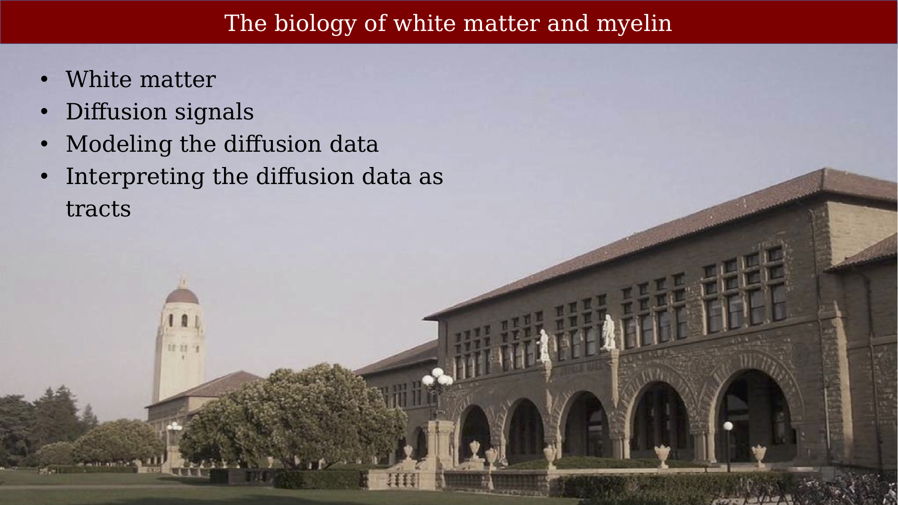{#fig-ch54-the-biology-of-white-matter-and-myelin}

## Human brain characteristics

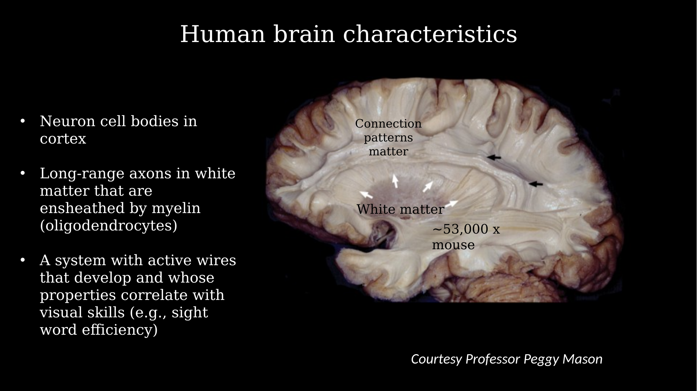{#fig-ch54-human-brain-characteristics}

## Why myelin

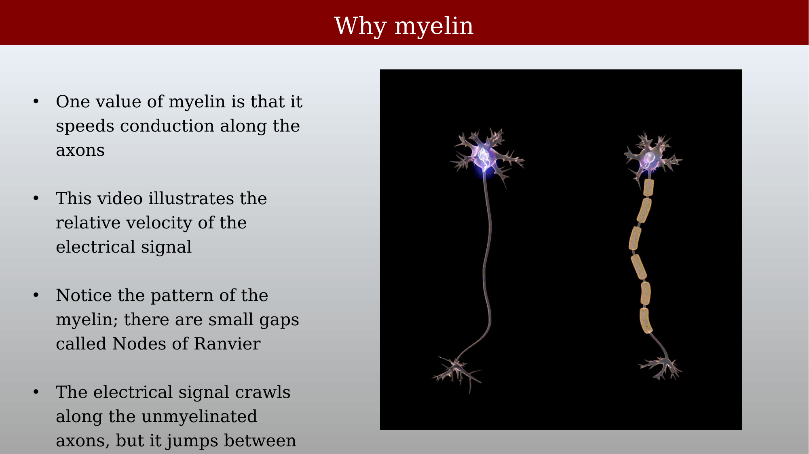{#fig-ch54-why-myelin}

## Several types of glia

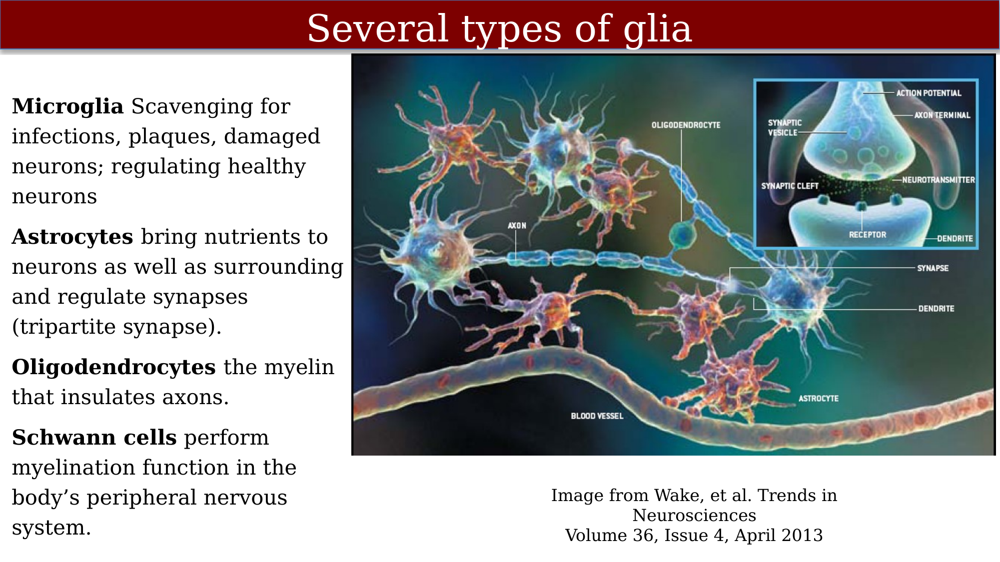{#fig-ch54-several-types-of-glia}

## Myelin is formed by oligodendrcytes whose processes wrap the axons

::: {.panel-tabset}
## Step 1

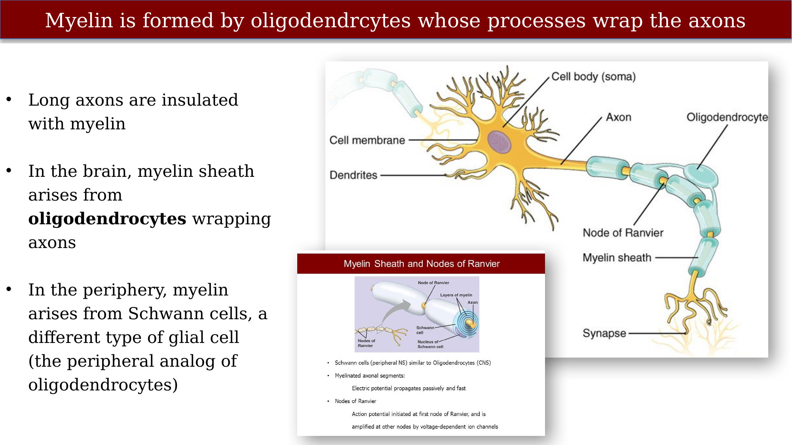{#fig-ch54-myelin-is-formed-by-oligodendrcytes-whose-processe-1}

## Step 2

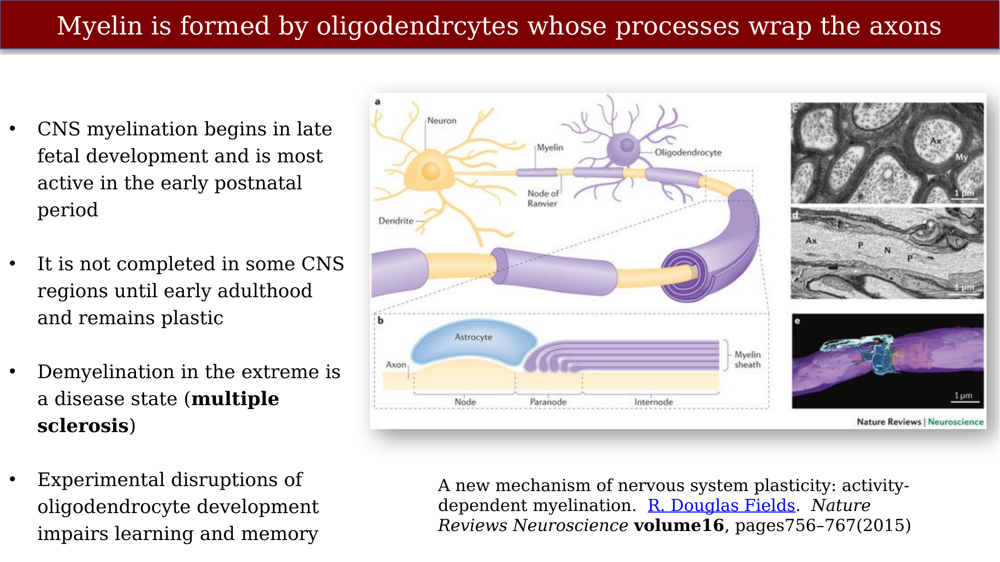{#fig-ch54-myelin-is-formed-by-oligodendrcytes-whose-processe-2}

:::

F. Luo, J. Zhang, K. Burke, R. R. Romito-DiGiacomo, R. H. Miller, Y. Yang, Oligodendrocyte-specific loss of Cdk5 disrupts the architecture of nodes of Ranvier as well as learning and memory. Exp. Neurol. 306, 92–104 (2018). Ian A. McKenzie, D. Ohayon, H. Li, J. P. De Faria, B. Emery, K. Tohyama, W. D. Richardson, Motor skill learning requires active central myelination. Science 346, 318–322 (2014). P. E. Steadman, F. Xia, M. Ahmed, A. J. Mocle, A. R. A. Penning, A. C. Geraghty, H. W. Steenland, M. Monje, S. A. Josselyn, P. W. Frankland, Disruption of oligodendrogenesis impairs memory consolidation in adult mice. Neuron 105, 150–164.e6 (2020). D. J. Dutta, D. H. Woo, P. R. Lee, S. Pajevic, O. Bukalo, W. C. Huffman, H. Wake, P. J. Basser, S. SheikhBahaei, V. Lazarevic, J. C. Smith, R. D. Fields, Regulation of myelin structure and conduction velocity by perinodal astrocytes. Proc. Natl. Acad. Sci. U.S.A. 115, 11832–11837 (2018) Main image: Peripheral inset:

## New papers emerging – increasing awareness in Cog Neuro community

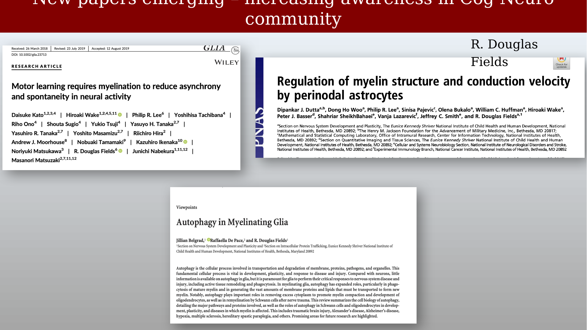{#fig-ch54-new-papers-emerging-increasing-awareness-in-cog-ne}

Japanese paper Abstract Myelination increases the conduction velocity in long-range axons and is prerequisite for many brain functions. Impaired myelin regulation or impairment of myelin itself is frequently associated with deficits in learning and cognition in neurological and psychiatric disorders. However, it has not been revealed what perturbation of neural activity induced by myelin impairment causes learning deficits. Here, we measured neural activity in the motor cortex during motor learning in transgenic mice with a subtle impairment of their myelin. This deficit in myelin impaired motor learning, and was accompanied by a decrease in the amplitude of movement-related activity and an increase in the frequency of spontaneous activity. Thalamocortical axons showed variability in axonal conduction with a large spread in the timing of postsynaptic cortical responses. Repetitive pairing of forelimb movements with optogenetic stimulation of thalamocortical axon terminals restored motor learning. Thus, myelin regulation helps to maintain the synchrony of cortical spike-time arrivals through long-range axons, facilitating the propagation of the information required for learning. Our results revealed the pathological neuronal circuit activity with impaired myelin and suggest the possibility that pairing of noninvasive brain stimulation with relevant behaviors may ameliorate cognitive and behavioral abnormalities in diseases with impaired myelination

## Recent findings about myelin and behavior (Nature, 2020)

::: {.panel-tabset}
## Step 1

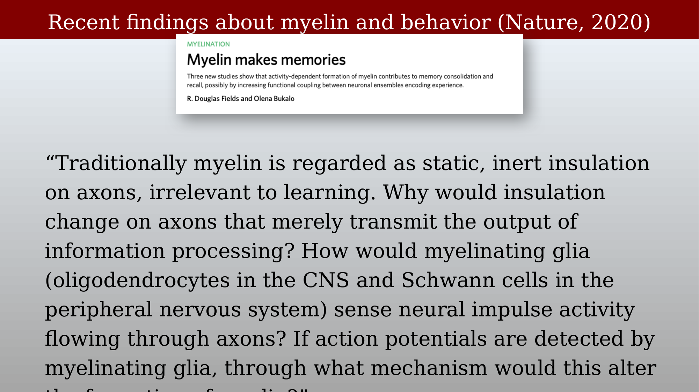{#fig-ch54-recent-findings-about-myelin-and-behavior-nature-2-1}

## Step 2

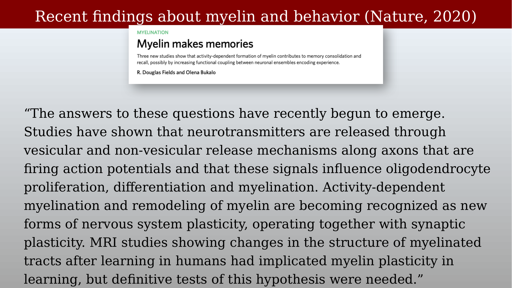{#fig-ch54-recent-findings-about-myelin-and-behavior-nature-2-2}

:::

## Regulation of myelin structure and conduction velocity by perinodal astrocytes

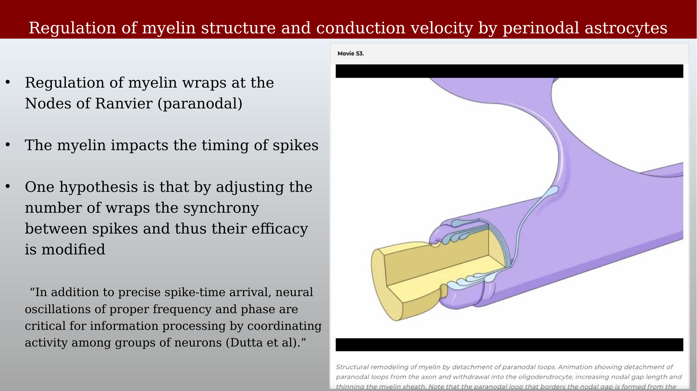{#fig-ch54-regulation-of-myelin-structure-and-conduction-velo}

This Fields paper has lots of interesting points

## Signaling between axons and glia – activity dependent

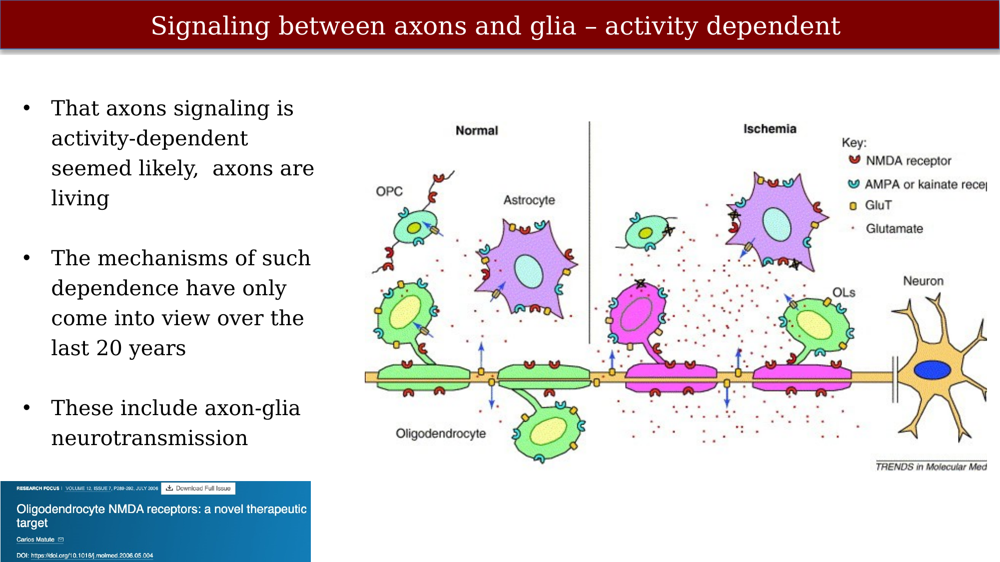{#fig-ch54-signaling-between-axons-and-glia-activity-dependen}

## A behavioral task in mice (Richardson lab, also Monje)

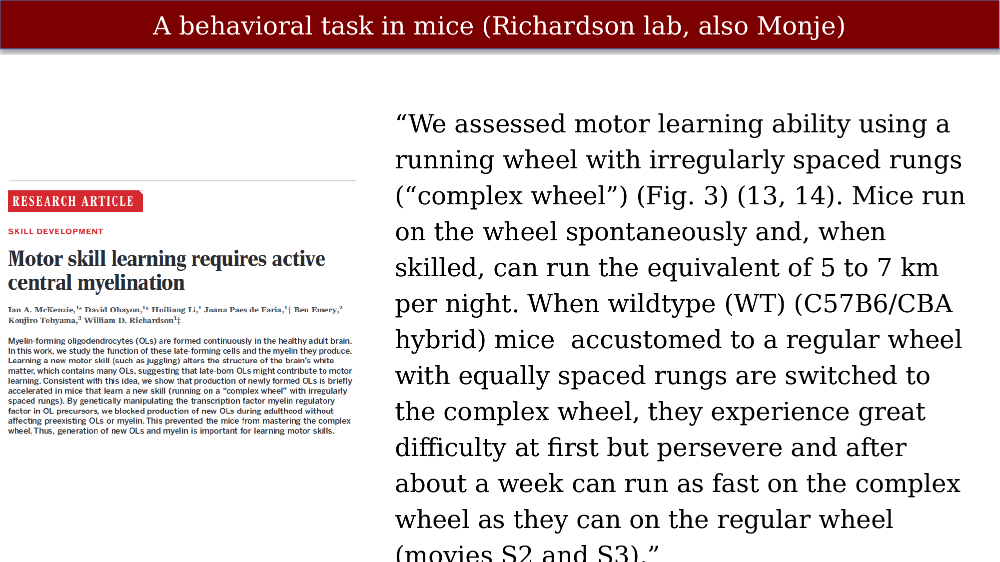{#fig-ch54-a-behavioral-task-in-mice-richardson-lab-also-monj}

## The behavioral task in mice

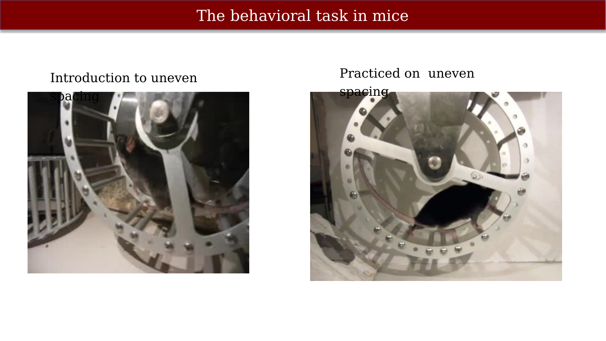{#fig-ch54-the-behavioral-task-in-mice}

## Intervening to block OL generation prevents learning

::: {.panel-tabset}
## Step 1

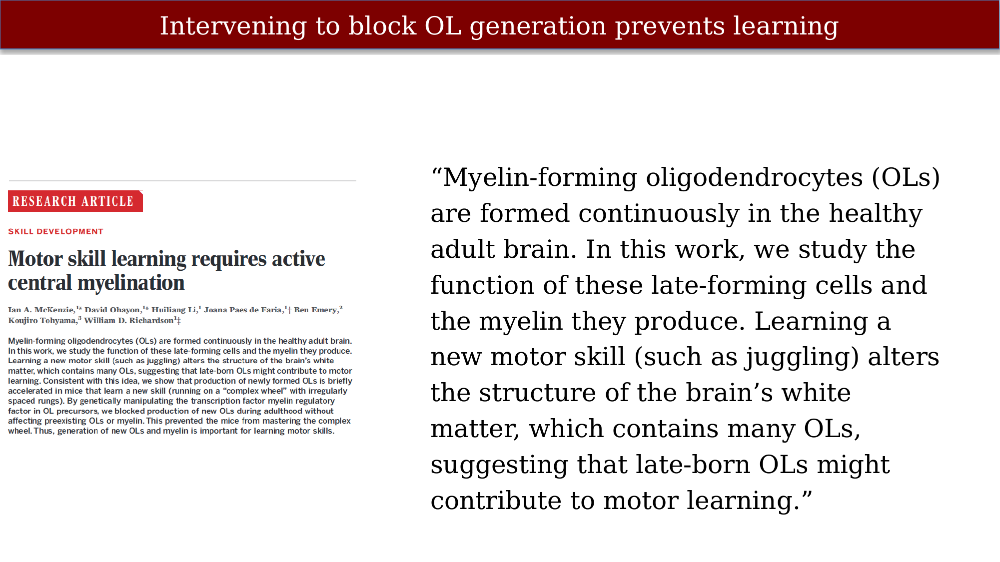{#fig-ch54-intervening-to-block-ol-generation-prevents-learni-1}

## Step 2

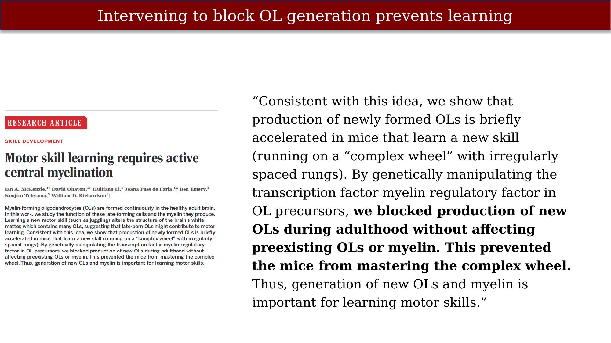{#fig-ch54-intervening-to-block-ol-generation-prevents-learni-2}

:::

## Deleting myelin regularity factor (Myrf)

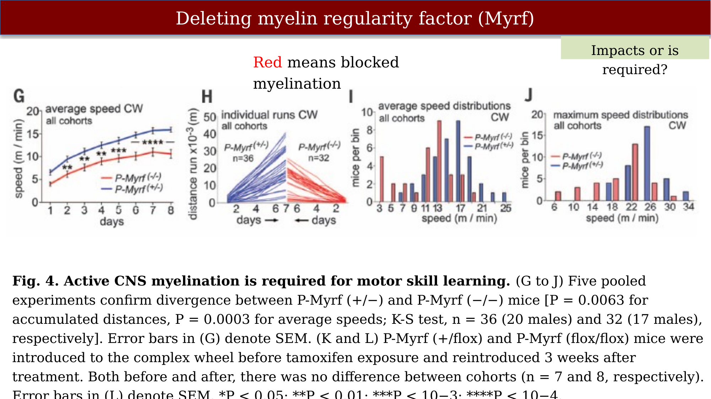{#fig-ch54-deleting-myelin-regularity-factor-myrf}

Fig. 4. Active CNS myelination is required for motor skill learning. (A) The complex wheel pattern. (B) Experimental design. P-Myrf (–/-) and P-Myrf (+/−) mice were housed singly, and tamoxifen was administered from P60 or P90. Three weeks later, they were introduced to the complex wheel (CW). (C and D) On the wheel, P-Myrf (−/−) mice were impaired relative to P-Myrf (+/−) [tamoxifen on P90; means T SEM (error bars), n = 7 and 5, respectively]. (E) Time on wheel at >1 m/min was not different between cohorts. Error bars denote SEM. (F) Individual performances, distance versus time. (G to J) Five pooled experiments confirm divergence between P-Myrf (+/−) and P-Myrf (−/−) mice [P = 0.0063 for accumulated distances, P = 0.0003 for average speeds; K-S test, n = 36 (20 males) and 32 (17 males), respectively]. Error bars in (G) denote SEM. (K and L) P-Myrf (+/flox) and P-Myrf (flox/flox) mice were introduced to the complex wheel before tamoxifen exposure and reintroduced 3 weeks after treatment. Both before and after, there was no difference between cohorts (n = 7 and 8, respectively). Error bars in (L) denote SEM. *P < 0.05; **P < 0.01; ***P < 10−3; ****P < 10−4. Also see fig. S6.

## Neuroscience is broadening its view of computation

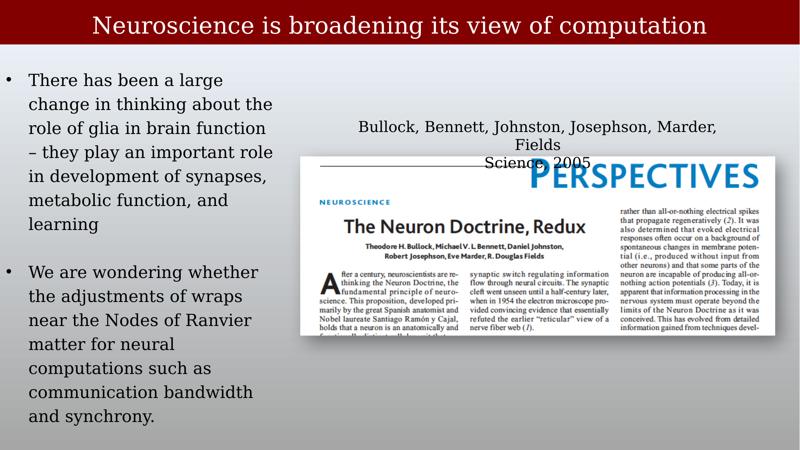{#fig-ch54-neuroscience-is-broadening-its-view-of-computation}

After a century, neuroscientists are rethinking the Neuron Doctrine, the fundamental principle of neuroscience. This proposition, developed primarily by the great Spanish anatomist and Nobel laureate Santiago Ramón y Cajal, holds that a neuron is an anatomically and functionally distinct cellular unit that arises through differentiation of a precursor neuroblast cell. In principle, part of this tenet has held up, but technology and research have extended our knowledge far beyond this simple description. What has evolved is a modern view of the neuron that allows a more broad and intricate perspective of how information is processed in the nervous system. One hundred years since its inception, an examination of the Doctrine indicates that it no longer encompasses important aspects of neuron function. If we are to understand complex, higher level neuronal processes, such as brain function, we need to explore beyond the limits of the Neuron Doctrine. In the early 20th century, the nervous system was thought

## Neuroscience:  Broadening the computational view

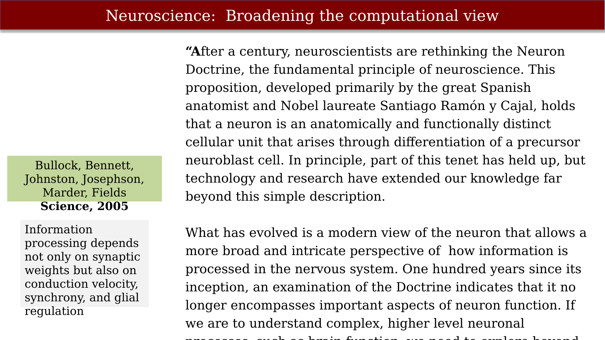{#fig-ch54-neuroscience-broadening-the-computational-view}

After a century, neuroscientists are rethinking the Neuron Doctrine, the fundamental principle of neuroscience. This proposition, developed primarily by the great Spanish anatomist and Nobel laureate Santiago Ramón y Cajal, holds that a neuron is an anatomically and functionally distinct cellular unit that arises through differentiation of a precursor neuroblast cell. In principle, part of this tenet has held up, but technology and research have extended our knowledge far beyond this simple description. What has evolved is a modern view of the neuron that allows a more broad and intricate perspective of how information is processed in the nervous system. One hundred years since its inception, an examination of the Doctrine indicates that it no longer encompasses important aspects of neuron function. If we are to understand complex, higher level neuronal processes, such as brain function, we need to explore beyond the limits of the Neuron Doctrine. In the early 20th century, the nervous system was thought

## MS: An inflammatory demyelinating disease primarily affecting CNS white matter

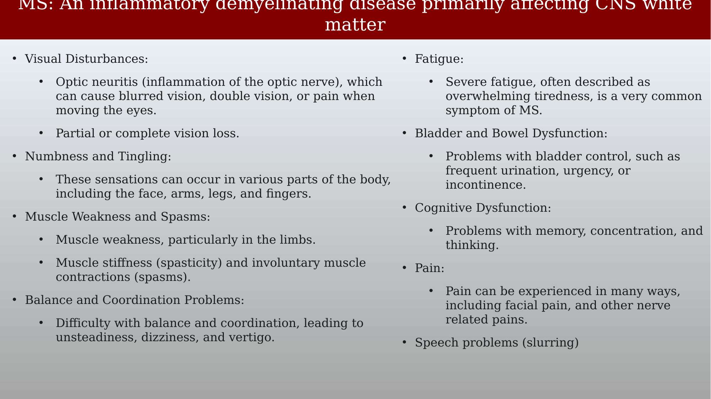{#fig-ch54-ms-an-inflammatory-demyelinating-disease-primarily}

## Multiple sclerosis lesions are visible in multiple types of pulse sequences

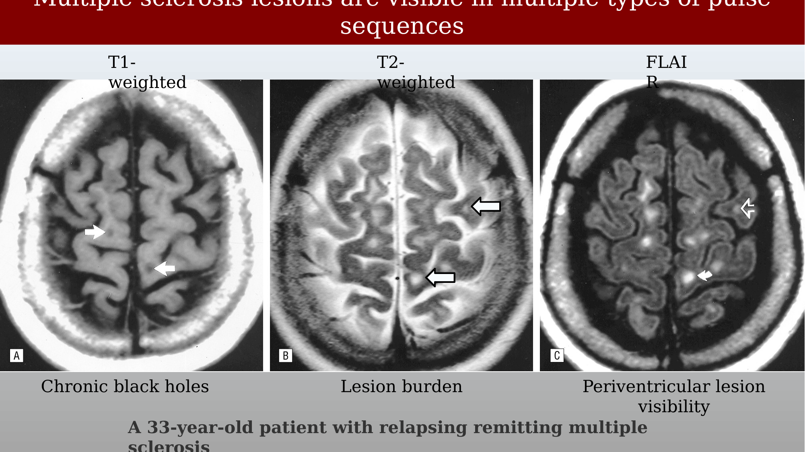{#fig-ch54-multiple-sclerosis-lesions-are-visible-in-multiple}

A 33-year-old patient with relapsing-remitting multiple sclerosis. A, T1-weighted image; B, T2-weighted image; and C, fluid-attenuated inversion recovery (FLAIR) image. Multiple lesions are seen in the axial FLAIR image involving the dorsal frontal cortex and gray-white junction. Several but not all are detected on the T2-weighted image, and 2 of the lesions show definite hypointensity on the T1-weighted image (arrows). The lesions are most crisply shown by FLAIR. Lesions range in diameter from 2 (open arrow) to 7 mm (curved arrow).

## 2nd patient

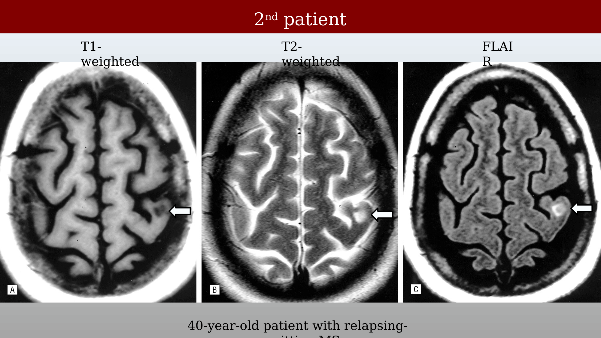{#fig-ch54-2nd-patient}

A 40-year-old patient with relapsing-remitting multiple sclerosis. A, T1-weighted image; B, T2-weighted image; and C, fluid-attenuated inversion recovery (FLAIR) image. The patient has a large cortical-subcortical lesion (12 mm in diameter) in the posterior frontal region that is seen on all sequences. The lesion is most conspicuous on the FLAIR image.

## T2 weighted lesions – Tracking lesions over time

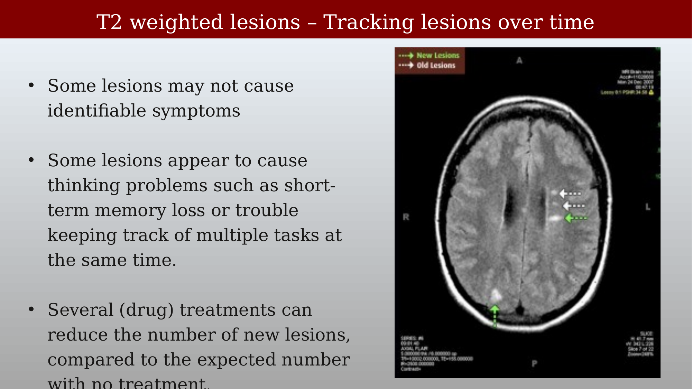{#fig-ch54-t2-weighted-lesions-tracking-lesions-over-time}

## Relapsing-remitting MS (RRMS)

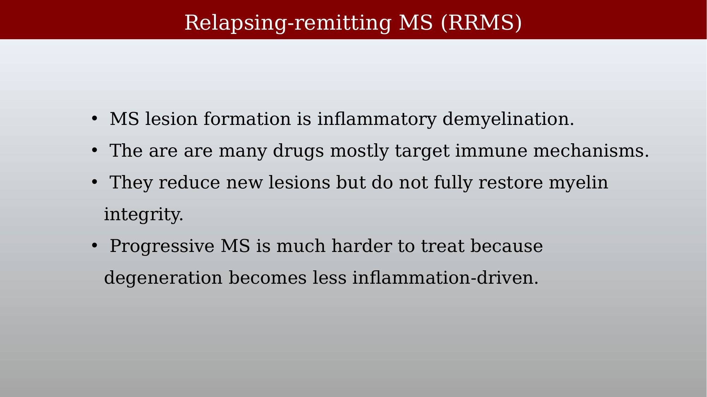{#fig-ch54-relapsing-remitting-ms-rrms}
