# Diffusion Imaging of the Brain



---

## Diffusion imaging: images, bvecs, bvals

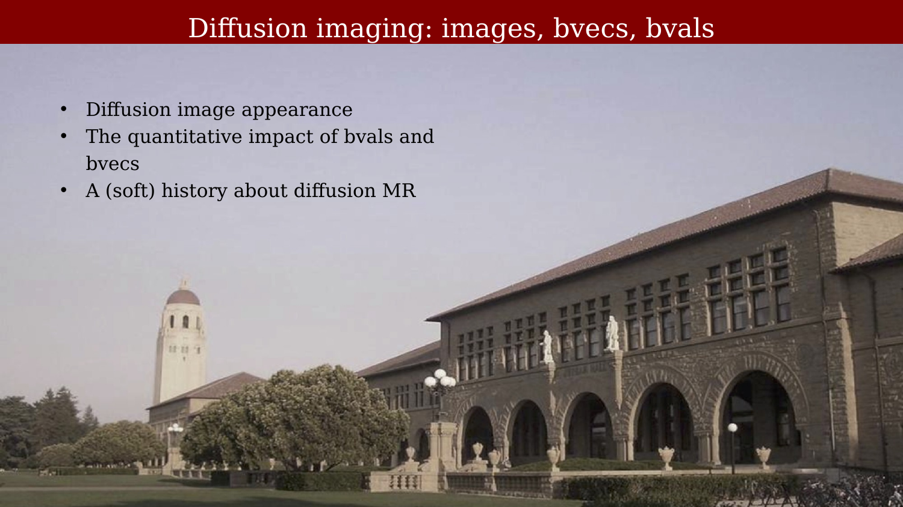{#fig-ch56-diffusion-imaging-images-bvecs-bvals}

## Non-diffusion MR image

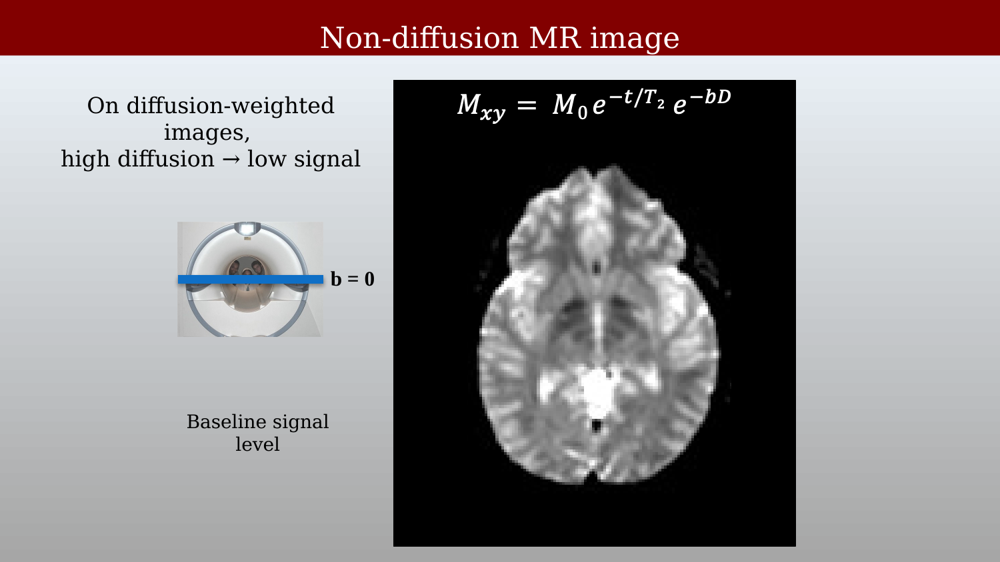{#fig-ch56-non-diffusion-mr-image}

## Diffusion weighting: Directions

::: {.panel-tabset}
## Step 1

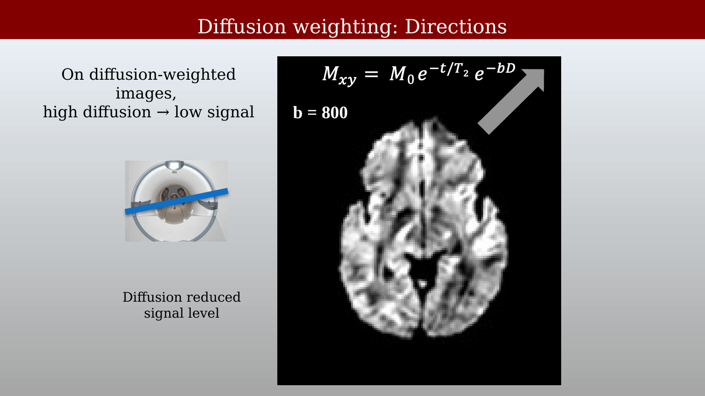{#fig-ch56-diffusion-weighting-directions-1}

## Step 2

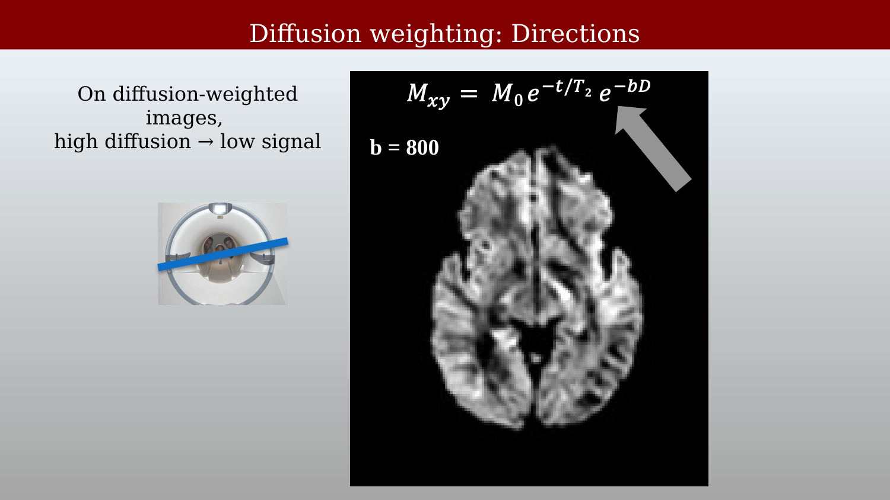{#fig-ch56-diffusion-weighting-directions-2}

:::

## Angular resolution and b-value (Theory)

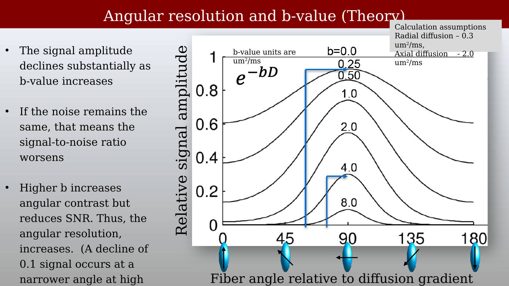{#fig-ch56-angular-resolution-and-b-value-theory}

## Diffusion-weighting:  b-values

::: {.panel-tabset}
## Step 1

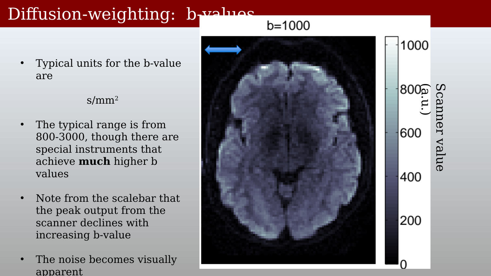{#fig-ch56-diffusion-weighting-b-values-1}

## Step 2

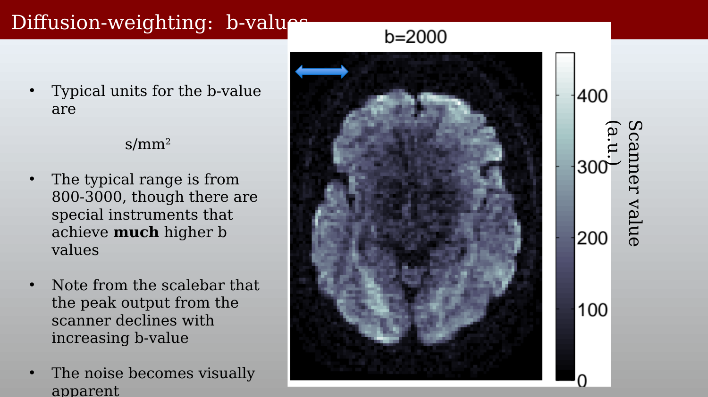{#fig-ch56-diffusion-weighting-b-values-2}

## Step 3

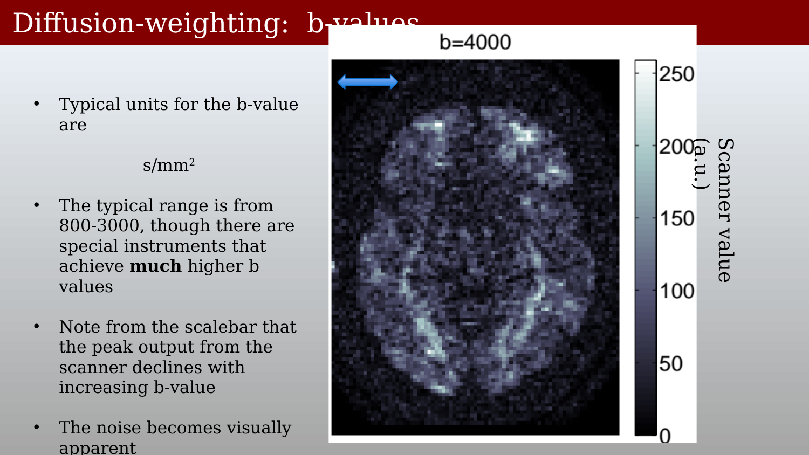{#fig-ch56-diffusion-weighting-b-values-3}

:::

This multiplies the values in ms/um2 by 1000 1000 um = 1mm 1000 ms = 1 sec X ms/um2 = Y (1e-3 s / (1e-6 mm2) So, if use s/mm2 units Y is 1e+3 X = Y

## Stejskal-Tanner equation is essential for measuring diffusion

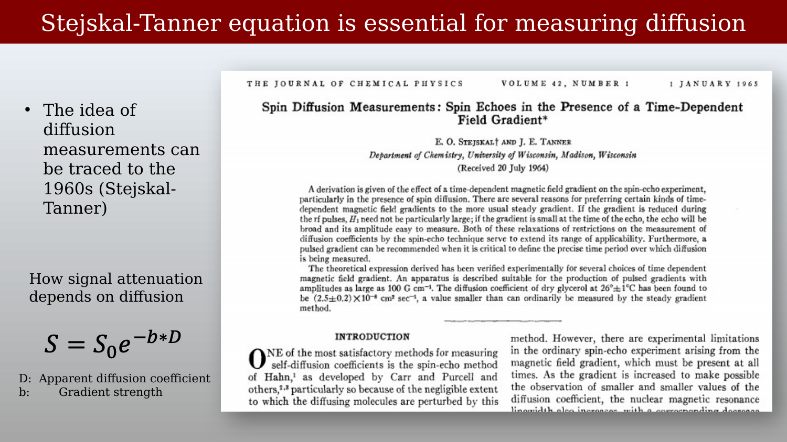{#fig-ch56-stejskal-tanner-equation-is-essential-for-measurin}

## Quantifying diffusion with MR‏

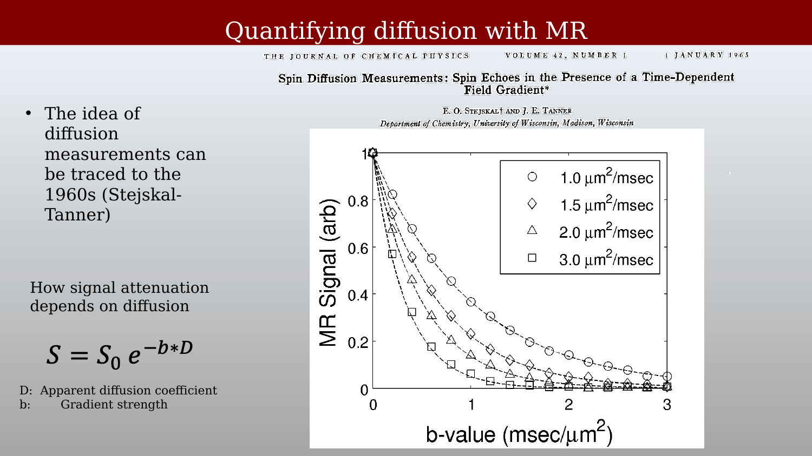{#fig-ch56-quantifying-diffusion-with-mr}

## Diffusion imaging – Mike Moseley!

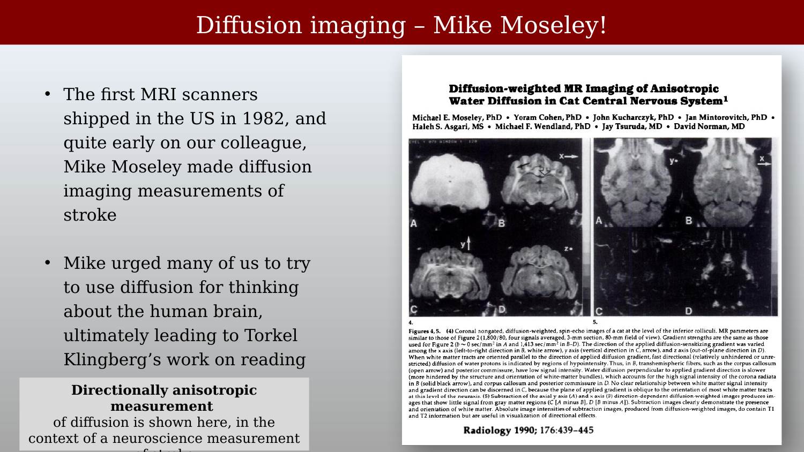{#fig-ch56-diffusion-imaging-mike-moseley}
