# Tractography: Analyzing White Matter Tracts



---

## Segmentation of the corpus callosum:  Simple methods

{#fig-ch60-segmentation-of-the-corpus-callosum-simple-methods}

## Axons tend to travel together in bundles that are called fascicles

{#fig-ch60-axons-tend-to-travel-together-in-bundles-that-are}

IGURE 12-1 Gross dissection of the human brain by the Klingler technique (Dr. Nicklaus Krayenbühl). A, View from above and the left side. Axial section through the frontal (F), parietal (P), and occipital (O) lobes of the left hemisphere discloses the white matter within the centrum semiovale (F-P-O) and the upper border of the corpus callosum. Klingler dissection of the medial surface of the right hemisphere exposes the multiple, superiorly arching commissural fibers (CC) that extend through the corpus callosum into the medial portion of the opposite hemisphere. B, Further dissection of the left hemisphere exposes projection fibers (uncinate fasciculus [Un], internal capsule [I]), short association U fibers (U), and long association fibers (inferior fronto-occipital fasciculus [IFOF]) within the white matter. The uncinate fasciculus (Un) arches over the sylvian fissure (S) to interconnect the temporal lobe (T) with the frontal lobe (F). The inferior fronto-occipital fasciculus extends the length of the hemisphere to interconnect the occipital lobe with the ipsilateral frontal lobe. Its fibers characteristically compact into a narrow bundle (white arrow) where the tract traverses the floor of the external capsule just inferolateral to the putamen (Pu). In this position, it courses immediately superior to the fibers of the uncinate fasciculus. The vertical fibers of the corona radiata (CR) converge to form the compact internal capsule (I) that passes medial to the putamen.

## Visibility of fascicles by eye

{#fig-ch60-visibility-of-fascicles-by-eye}

## Groups of axons (fascicles) can be identified by eye

{#fig-ch60-groups-of-axons-fascicles-can-be-identified-by-eye}

IGURE 12-1 Gross dissection of the human brain by the Klingler technique (Dr. Nicklaus Krayenbühl). A, View from above and the left side. Axial section through the frontal (F), parietal (P), and occipital (O) lobes of the left hemisphere discloses the white matter within the centrum semiovale (F-P-O) and the upper border of the corpus callosum. Klingler dissection of the medial surface of the right hemisphere exposes the multiple, superiorly arching commissural fibers (CC) that extend through the corpus callosum into the medial portion of the opposite hemisphere. B, Further dissection of the left hemisphere exposes projection fibers (uncinate fasciculus [Un], internal capsule [I]), short association U fibers (U), and long association fibers (inferior fronto-occipital fasciculus [IFOF]) within the white matter. The uncinate fasciculus (Un) arches over the sylvian fissure (S) to interconnect the temporal lobe (T) with the frontal lobe (F). The inferior fronto-occipital fasciculus extends the length of the hemisphere to interconnect the occipital lobe with the ipsilateral frontal lobe. Its fibers characteristically compact into a narrow bundle (white arrow) where the tract traverses the floor of the external capsule just inferolateral to the putamen (Pu). In this position, it courses immediately superior to the fibers of the uncinate fasciculus. The vertical fibers of the corona radiata (CR) converge to form the compact internal capsule (I) that passes medial to the putamen.

## The corpus callosum – the largest tract in the brain

{#fig-ch60-the-corpus-callosum-the-largest-tract-in-the-brain}

Text and labeled image Damaged splenium Review Transient lesion in the splenium of the corpus callosum: three further cases in epileptic patients and a pathophysiological hypothesis FREE T Polster, M Hoppe, A Ebner

## Classic partitioning of callosum (S. Witelson, Brain, 1989)

{#fig-ch60-classic-partitioning-of-callosum-s-witelson-brain}

## Tract identification

{#fig-ch60-tract-identification}

## Callosal segmentation by fiber projection

{#fig-ch60-callosal-segmentation-by-fiber-projection}

## Callosal shapes differSegmentation makes comparison effective

{#fig-ch60-callosal-shapes-differsegmentation-makes-compariso}

## Callosal shapes differ significantly – projection based segmentation

{#fig-ch60-callosal-shapes-differ-significantly-projection-ba}

## Grouping fibers:  Occipital Fibers

{#fig-ch60-grouping-fibers-occipital-fibers}

## Occipital Callosal Fibers

::: {.panel-tabset}
## Step 1

{#fig-ch60-occipital-callosal-fibers-1}

## Step 2

{#fig-ch60-occipital-callosal-fibers-2}

:::

## Segmenting the Corpus Callosum

{#fig-ch60-segmenting-the-corpus-callosum}

## Callosal Segments in 49 Children

{#fig-ch60-callosal-segments-in-49-children}

## Lifespan White Matter Development

### Using AFQ to study white matter across the lifespan

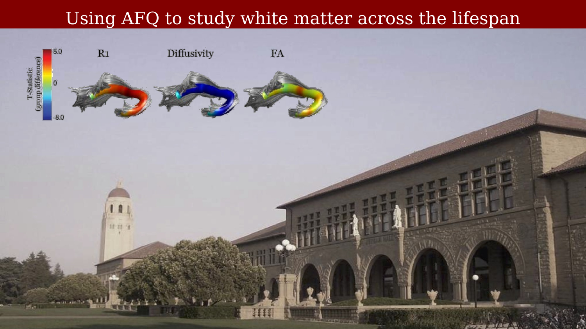{#fig-ch60-lifespan-using-afq-to-study-white-matter-across-the-lifespa}

### AFQ automates the identification of the fascicles

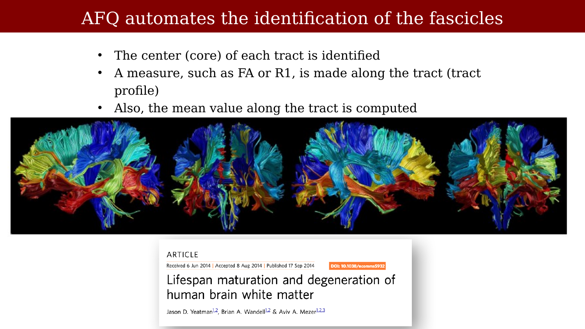{#fig-ch60-lifespan-afq-automates-the-identification-of-the-fascicles}

### Cross-sectional measurements of R1 across the lifespan

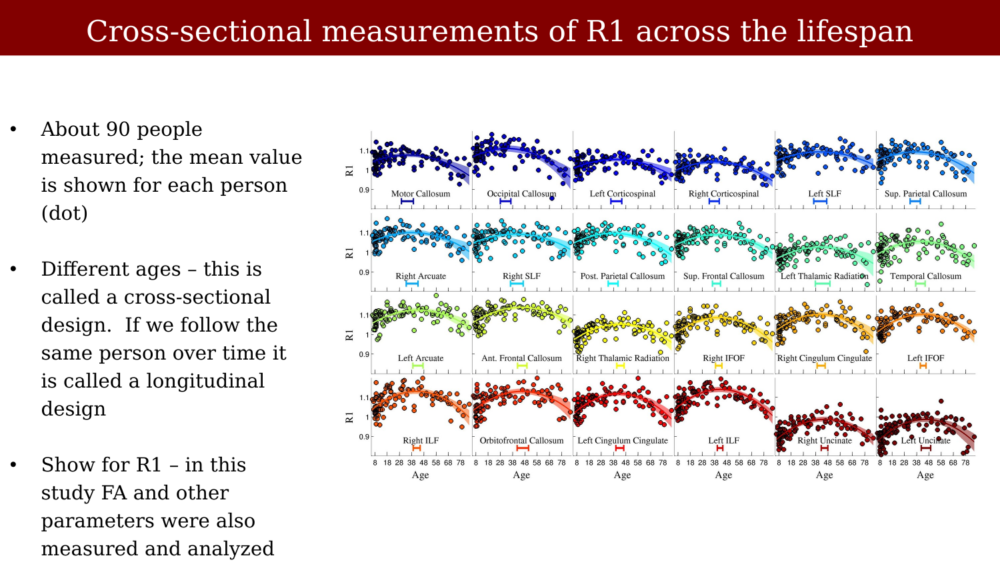{#fig-ch60-lifespan-cross-sectional-measurements-of-r1-across-the-life}

Figure 2 | R1 lifespan curves demonstrating each fascicle’s pattern of maturation and degeneration. R1 lifespan curves are shown for each of the 24 fascicles, ordered based on the amount of change in R1 over the lifespan. The width of the line denotes the 95% confidence interval around the second order polynomial model fit. There is a highly significant developmental increase and aging decline in R1 values for all fascicles. The age of peak R1 (±95% confidence interval) is shown by a bar at the bottom of each plot. The R1 values for each individual do not depend on the specific dMRI acquisition used to define the tracts: R1 values are highly consistent when an individual’s tracts are defined using a low b-value (1,000ms2) or high b-value (2,000ms2) acquision (R21/40.93). Post, posterior; Sup, superior.

### Cross-sectional measurements of FA across the lifespan

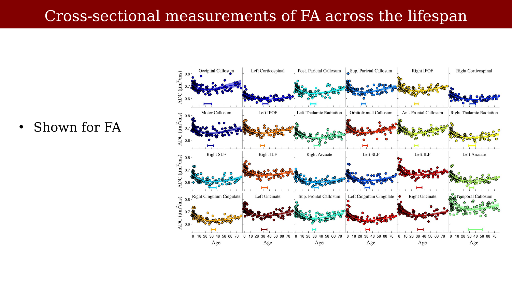{#fig-ch60-lifespan-cross-sectional-measurements-of-fa-across-the-life}

### What AFQ-like tools enable

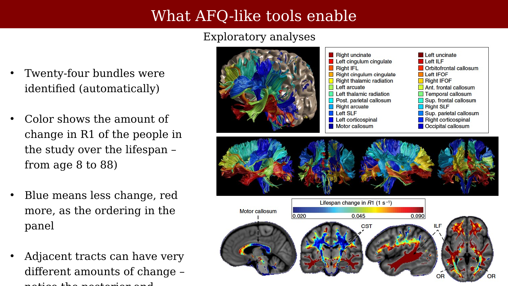{#fig-ch60-lifespan-what-afq-like-tools-enable}

Figure 1 | Fascicles vary in the amount of lifespan R1 change. Twenty-four fascicles identified with the Automated Fibre Quantification software (AFQ) are shown for a 37-year-old male. In the top panel, the lateral aspect of the left hemisphere has been removed to view the white matter within the brain volume. In the middle panel, the white-matter fascicles are shown without the cortical surface. Each fascicle is coloured based on the amount of change in R1 (R1 at peak minus R1 at age 8) over the lifespan (cross-sectional); blue corresponds to less change and red to more change. The same fascicle colours are used throughout the manuscript. The bottom panel shows the magnitude of R1 change for each voxel in the brain (computed by registering each participant’s R1 map to a custom R1 template). The sharp differences between the development rates of adjacent tracts are clearly apparent in the corpus callosum (anterior versus posterior) and temporo-occipito white matter (ILF/IFOF versus optic radiations (OR)). Ant, anterior; Post, posterior; Sup, superior.

### Does R1 predict mean diffusion?

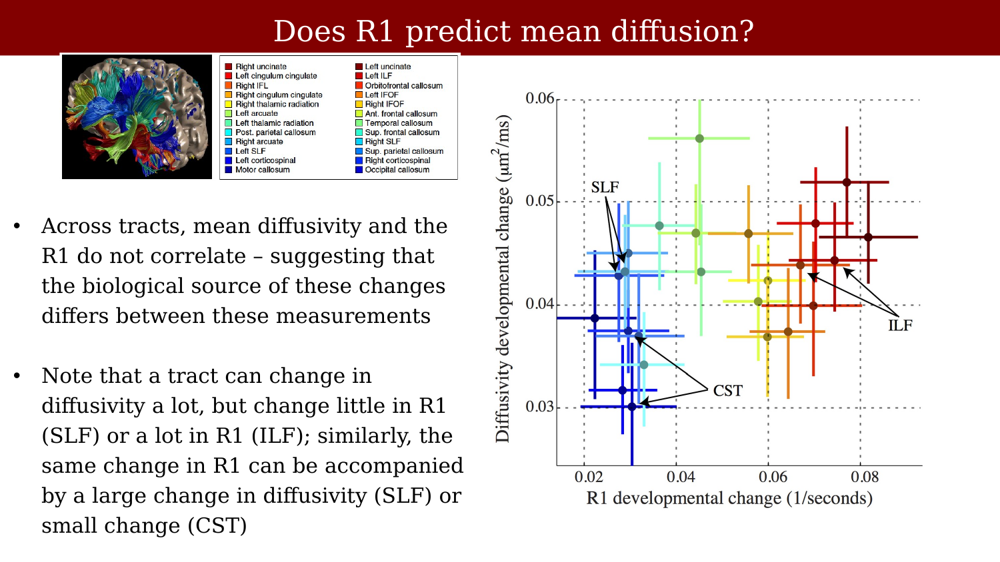{#fig-ch60-lifespan-does-r1-predict-mean-diffusion}

Figure 4 | Developmental processes driving R1 and diffusivity development are independent. (a) Each point shows the magnitude of R1 and diffusivity change during development. The R1 changes are not well-predicted by the diffusivity change. For example, the inferior ILF shows significantly more R1 change than the SLF (Po0.01) but they show the same amount of diffusivity change.

### Average R1 and Diffusivity across the lifespan

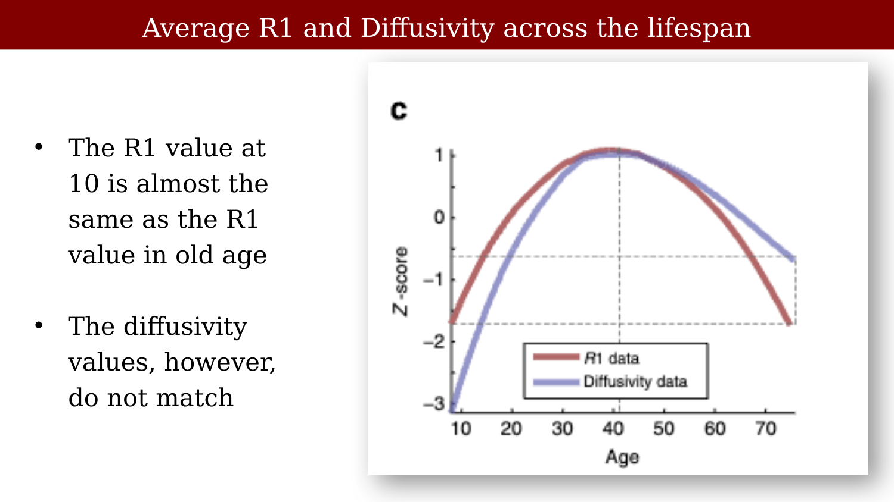{#fig-ch60-lifespan-average-r1-and-diffusivity-across-the-lifespan}

### Predicting across the life span:  Shown for individuals

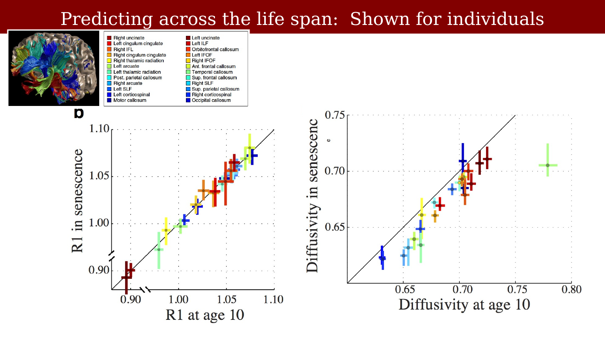{#fig-ch60-lifespan-predicting-across-the-life-span-shown-for-individu}

Figure 5 | R1 maturation and degeneration have symmetric slopes. (a) Mean lifespan R1 curve (red) combining the data from all tracts is superimposed on the prediction of the second order polynomial model (black). The mean curve was calculated by fitting a local regression model to the data for all the tracts; the width of the coloured line corresponds to the s.e. of the model. For R1, there is no systematic difference between the data and the prediction of the symmetric parabola. For every age, the model prediction is within 1 s.e. of the measurement (diffusivity shown in Supplementary Fig. 4). (b) The symmetry of change in R1 over the lifespan can be appreciated by plotting the R1 value in childhood and senescence for each individual tract. The age of peak R1 was calculated and values are plotted at age 10 and at a symmetric number of years past the peak (senescence). In senescence, R1 values return to the same level they were in childhood. For diffusivity, the values do not return to their childhood level (Supplementary Fig. 4b). (c) R1 changes over the lifespan are symmetric for most voxels in the brain. Each participant’s R1 map was aligned to a custom, R1 template and the voxel R1 value was calculated at age 10 and a symmetric number of years past that voxel’s peak. The childhood and old-age R1 values are closely matched for each white-matter voxel (R2 ¼ 0.70).

### Hypothesis

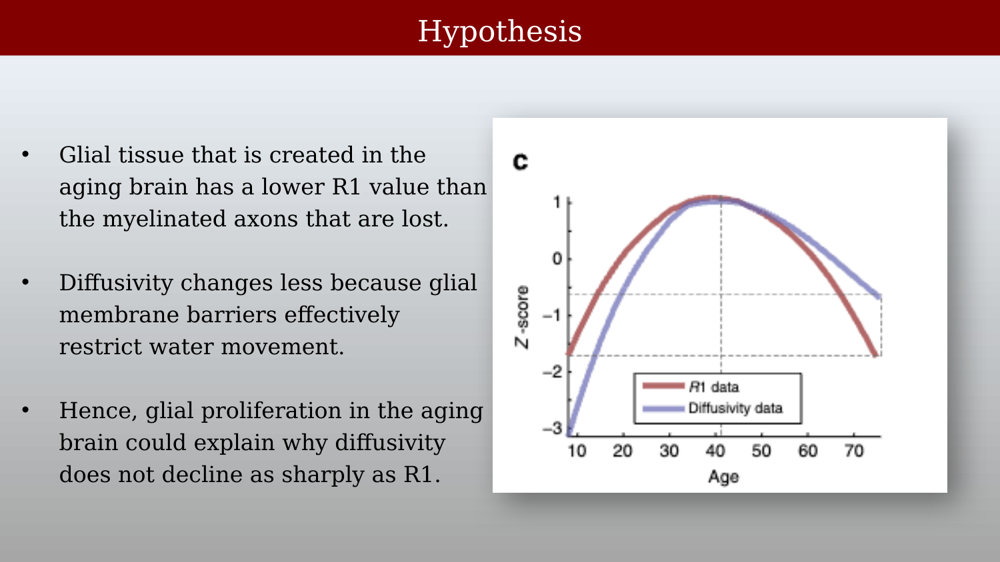{#fig-ch60-lifespan-hypothesis}

### The value of population measures

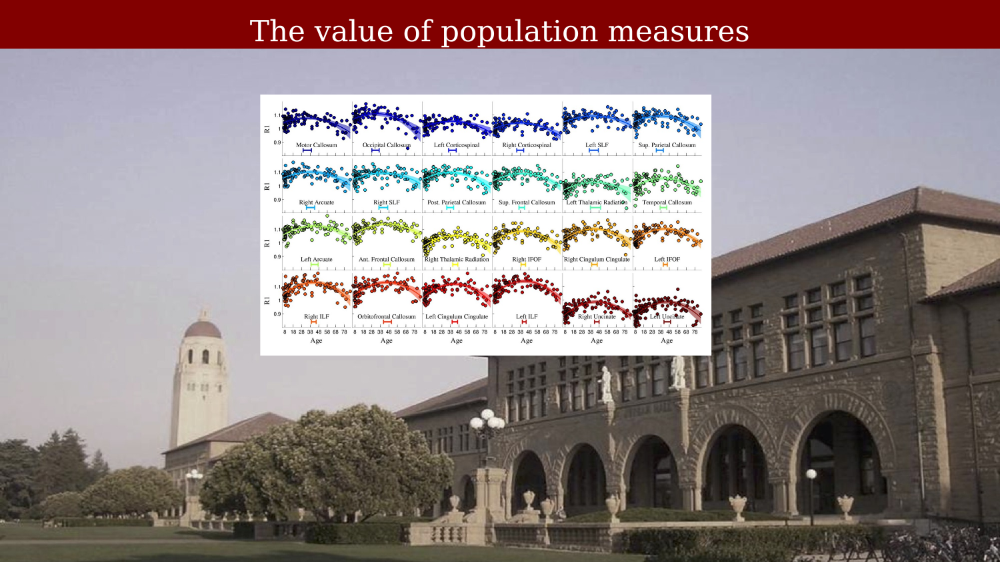{#fig-ch60-lifespan-the-value-of-population-measures}

### Data from four patients with multiple sclerosis

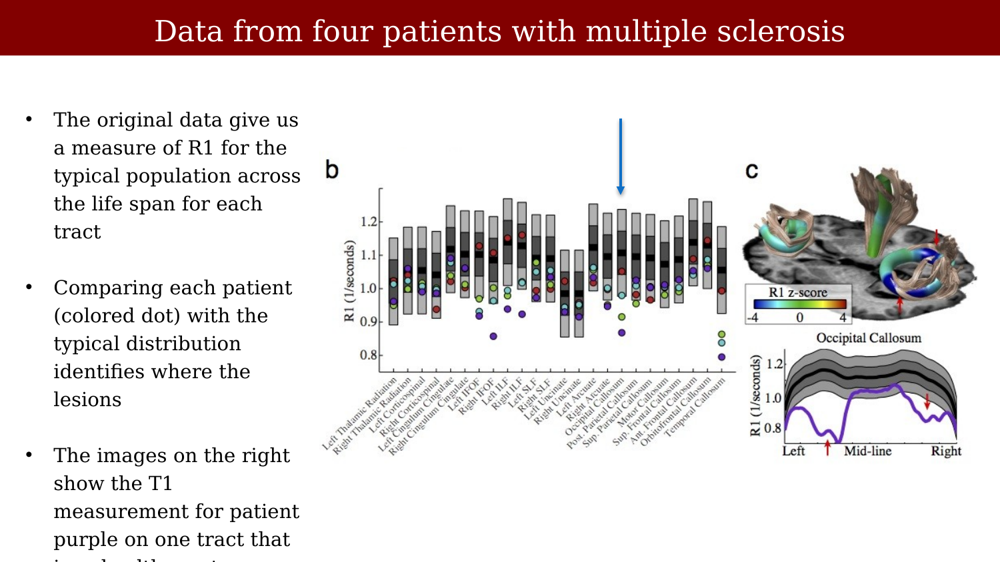{#fig-ch60-lifespan-data-from-four-patients-with-multiple-sclerosis}

Figure 8 | Automated diagnosis and quantification of white-matter lesions based on R1 lifespan curves. (a) Four patients with multiple sclerosis (43–45 years of age) are compared with age-matched norms based on the model of R1 development (See Fig. 2). The grey bands show 1 and 2 s.d. intervals around the mean for 44-year-olds on each tract. The mean R1 values for tracts with demyelinating MS lesions are substantially below the healthy R1 values (43 s.d.) but even the normal appearing white matter has slightly lower R1 values than the average. (b) Comparing individual patient data with a group localizes lesions and quantifies tissue loss. The tracts are shown for one patient (purple), who has large lesions in occipital callosal fibres in both hemispheres. (c) A simple threshold identifies locations with substantial tissue loss. Ten age-matched, control subjects were left out of the curvefitting procedure and for each location on the tracts we compared the R1 value with the norm for the relevant position (black line). For the healthy controls, very few locations on any tract exceed a 3-s.d. threshold, highlighting the specificity of the R1 comparison. The same analysis was applied to the MS patients (N1/410, light blue histogram). These patients have many locations, where R1 values are more than 3 s.d. below the age-matched norms. Each patient’s median R1 white-matter value (blue tick marks) is also below the norms.
