# Tractography: Analyzing White Matter Tracts



---

## Segmentation of the corpus callosum:  Simple methods

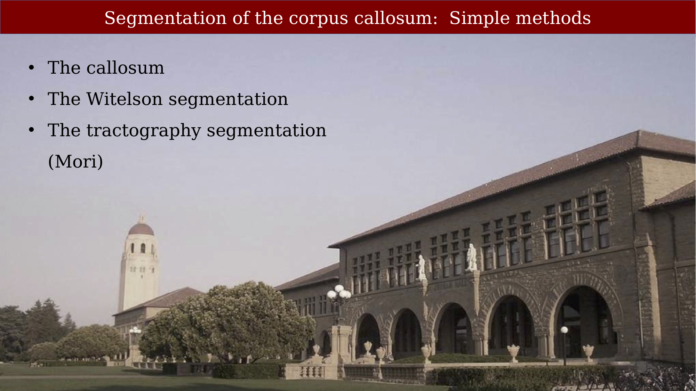{#fig-ch60-segmentation-of-the-corpus-callosum-simple-methods}

## Axons tend to travel together in bundles that are called fascicles

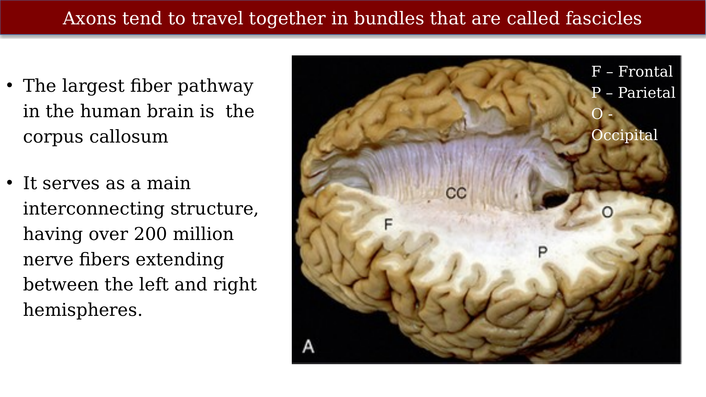{#fig-ch60-axons-tend-to-travel-together-in-bundles-that-are}

IGURE 12-1 Gross dissection of the human brain by the Klingler technique (Dr. Nicklaus Krayenbühl). A, View from above and the left side. Axial section through the frontal (F), parietal (P), and occipital (O) lobes of the left hemisphere discloses the white matter within the centrum semiovale (F-P-O) and the upper border of the corpus callosum. Klingler dissection of the medial surface of the right hemisphere exposes the multiple, superiorly arching commissural fibers (CC) that extend through the corpus callosum into the medial portion of the opposite hemisphere. B, Further dissection of the left hemisphere exposes projection fibers (uncinate fasciculus [Un], internal capsule [I]), short association U fibers (U), and long association fibers (inferior fronto-occipital fasciculus [IFOF]) within the white matter. The uncinate fasciculus (Un) arches over the sylvian fissure (S) to interconnect the temporal lobe (T) with the frontal lobe (F). The inferior fronto-occipital fasciculus extends the length of the hemisphere to interconnect the occipital lobe with the ipsilateral frontal lobe. Its fibers characteristically compact into a narrow bundle (white arrow) where the tract traverses the floor of the external capsule just inferolateral to the putamen (Pu). In this position, it courses immediately superior to the fibers of the uncinate fasciculus. The vertical fibers of the corona radiata (CR) converge to form the compact internal capsule (I) that passes medial to the putamen.

## Visibility of fascicles by eye

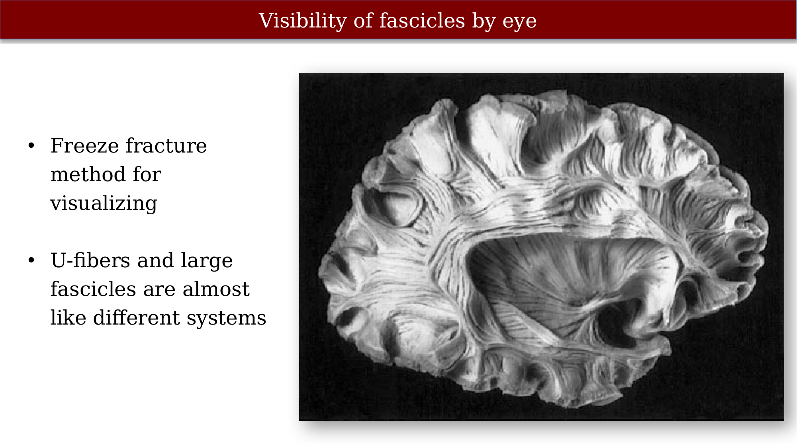{#fig-ch60-visibility-of-fascicles-by-eye}

## Groups of axons (fascicles) can be identified by eye

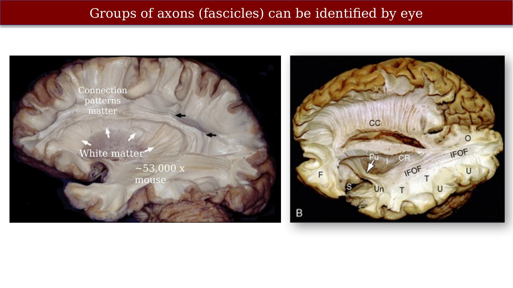{#fig-ch60-groups-of-axons-fascicles-can-be-identified-by-eye}

IGURE 12-1 Gross dissection of the human brain by the Klingler technique (Dr. Nicklaus Krayenbühl). A, View from above and the left side. Axial section through the frontal (F), parietal (P), and occipital (O) lobes of the left hemisphere discloses the white matter within the centrum semiovale (F-P-O) and the upper border of the corpus callosum. Klingler dissection of the medial surface of the right hemisphere exposes the multiple, superiorly arching commissural fibers (CC) that extend through the corpus callosum into the medial portion of the opposite hemisphere. B, Further dissection of the left hemisphere exposes projection fibers (uncinate fasciculus [Un], internal capsule [I]), short association U fibers (U), and long association fibers (inferior fronto-occipital fasciculus [IFOF]) within the white matter. The uncinate fasciculus (Un) arches over the sylvian fissure (S) to interconnect the temporal lobe (T) with the frontal lobe (F). The inferior fronto-occipital fasciculus extends the length of the hemisphere to interconnect the occipital lobe with the ipsilateral frontal lobe. Its fibers characteristically compact into a narrow bundle (white arrow) where the tract traverses the floor of the external capsule just inferolateral to the putamen (Pu). In this position, it courses immediately superior to the fibers of the uncinate fasciculus. The vertical fibers of the corona radiata (CR) converge to form the compact internal capsule (I) that passes medial to the putamen.

## The corpus callosum – the largest tract in the brain

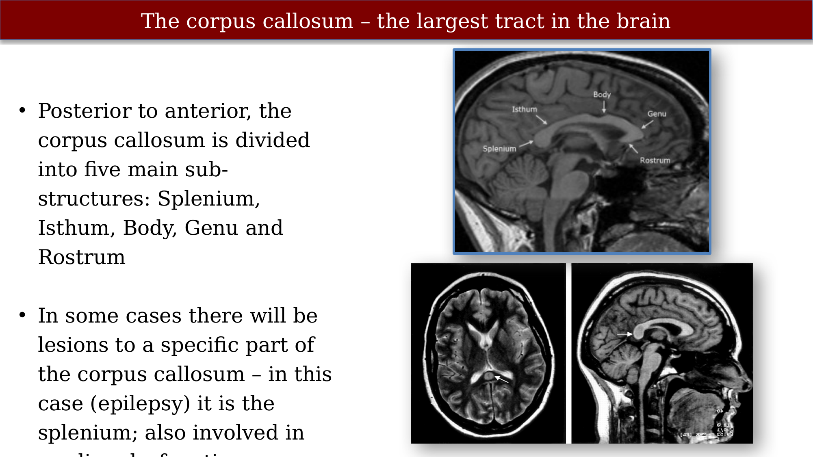{#fig-ch60-the-corpus-callosum-the-largest-tract-in-the-brain}

Text and labeled image Damaged splenium Review Transient lesion in the splenium of the corpus callosum: three further cases in epileptic patients and a pathophysiological hypothesis FREE T Polster, M Hoppe, A Ebner

## Classic partitioning of callosum (S. Witelson, Brain, 1989)

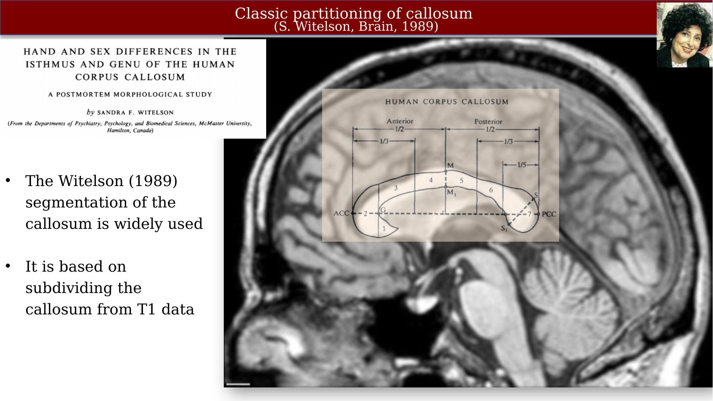{#fig-ch60-classic-partitioning-of-callosum-s-witelson-brain}

## Tract identification

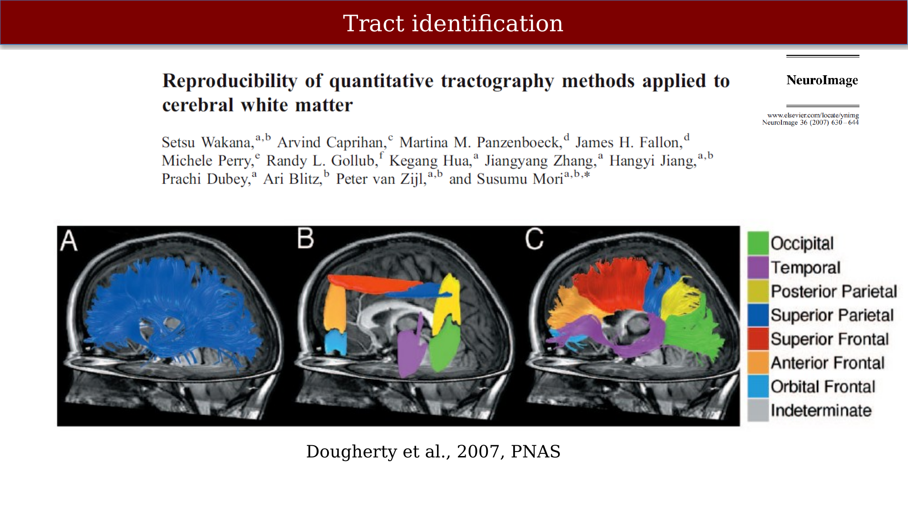{#fig-ch60-tract-identification}

## Callosal segmentation by fiber projection

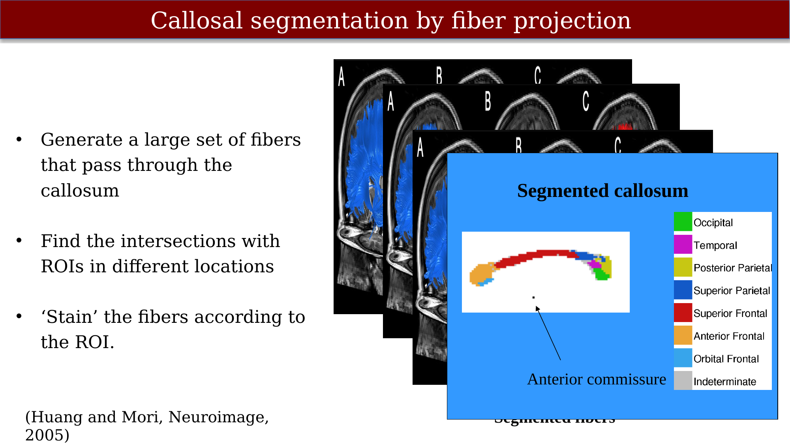{#fig-ch60-callosal-segmentation-by-fiber-projection}

## Callosal shapes differSegmentation makes comparison effective

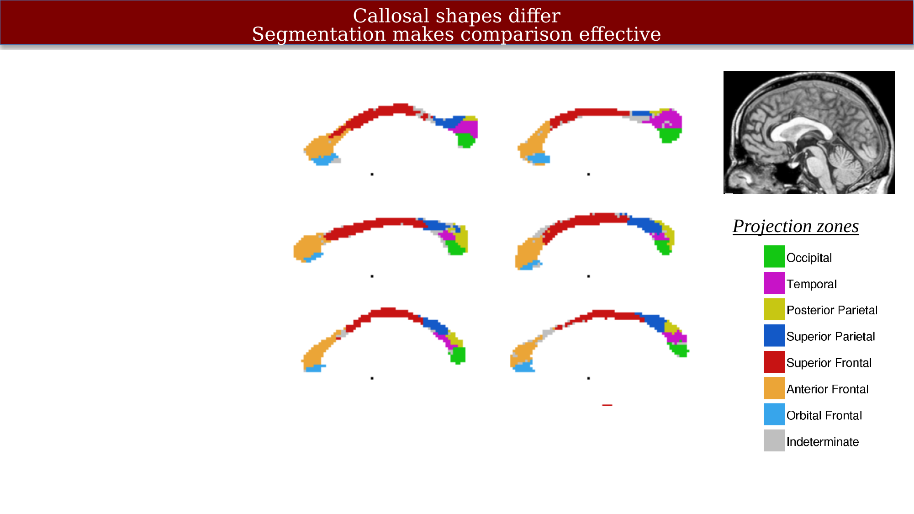{#fig-ch60-callosal-shapes-differsegmentation-makes-compariso}

## Callosal shapes differ significantly – projection based segmentation

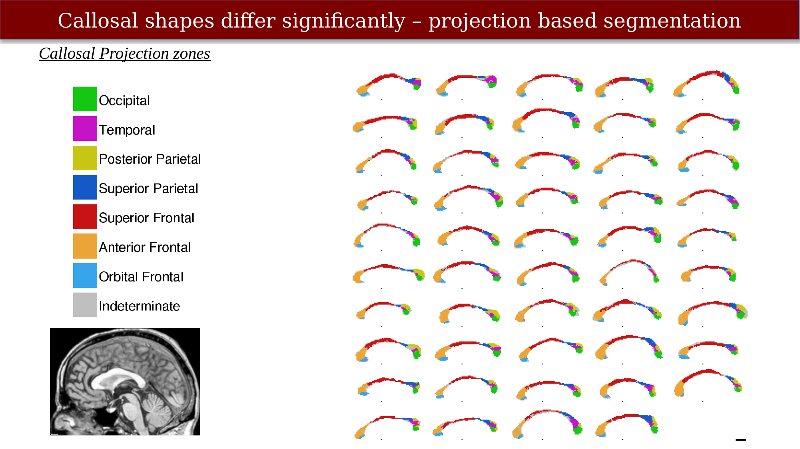{#fig-ch60-callosal-shapes-differ-significantly-projection-ba}

## Grouping fibers:  Occipital Fibers

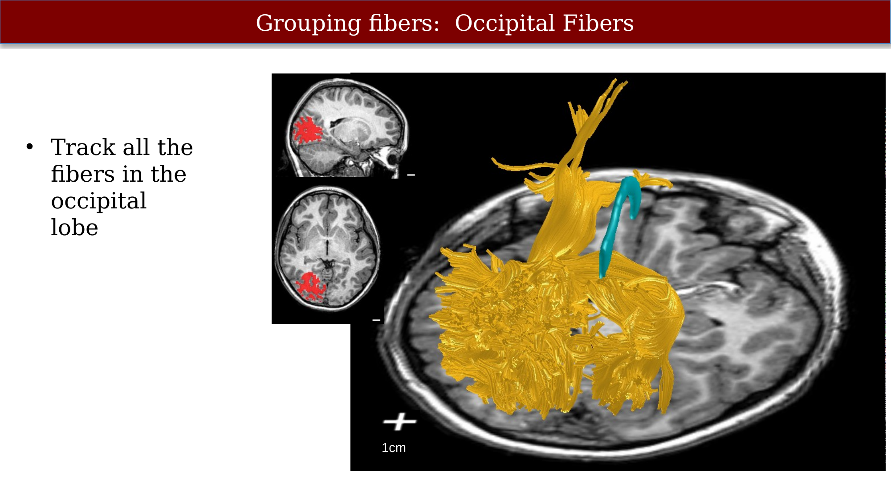{#fig-ch60-grouping-fibers-occipital-fibers}

## Occipital Callosal Fibers

::: {.panel-tabset}
## Step 1

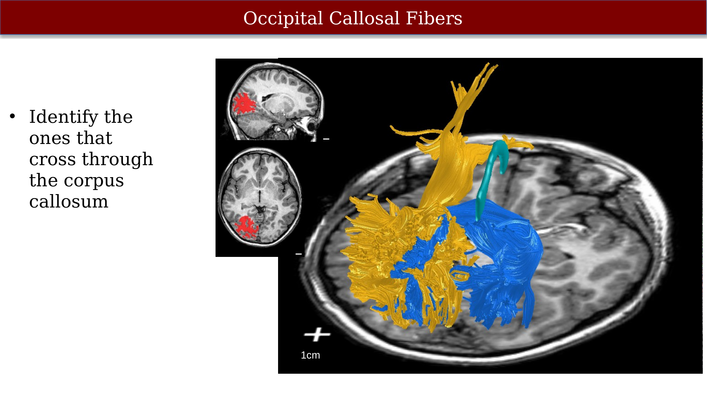{#fig-ch60-occipital-callosal-fibers-1}

## Step 2

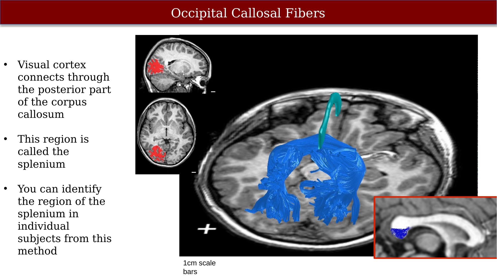{#fig-ch60-occipital-callosal-fibers-2}

:::

## Segmenting the Corpus Callosum

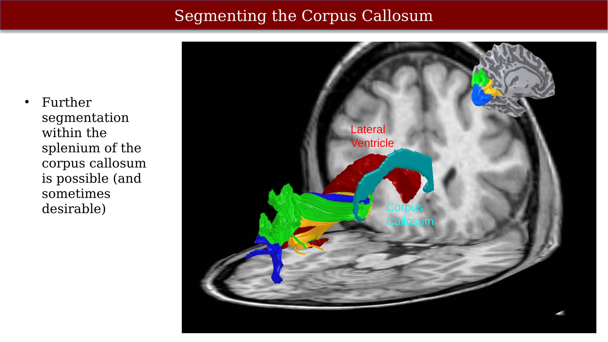{#fig-ch60-segmenting-the-corpus-callosum}

## Callosal Segments in 49 Children

{#fig-ch60-callosal-segments-in-49-children}
