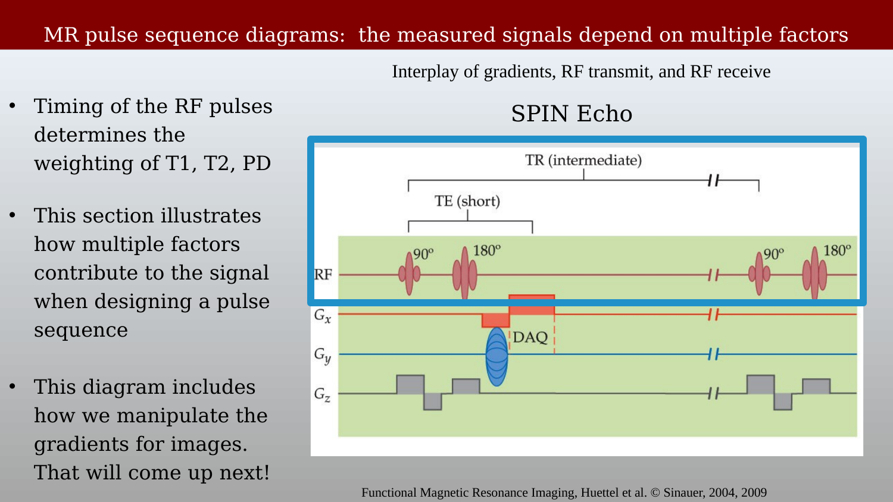
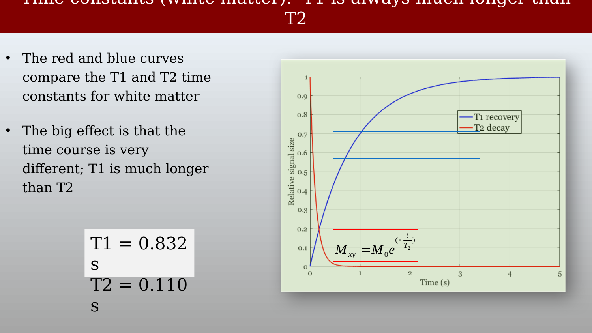
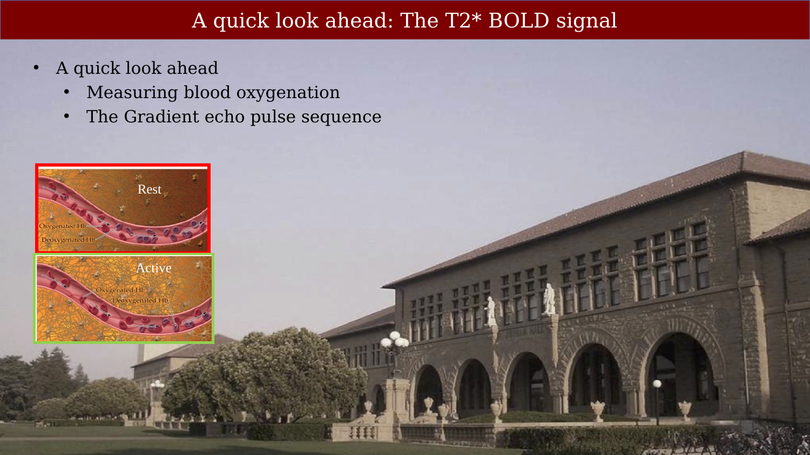
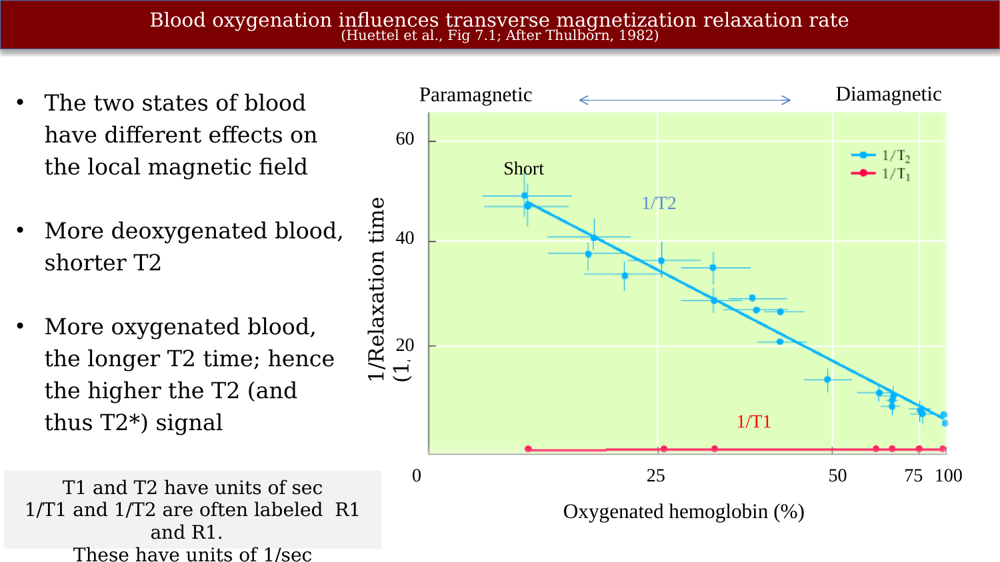
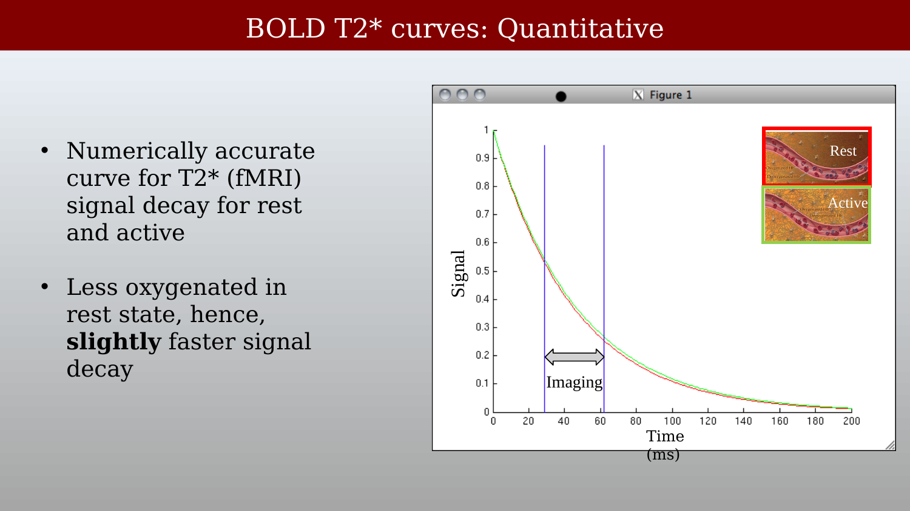
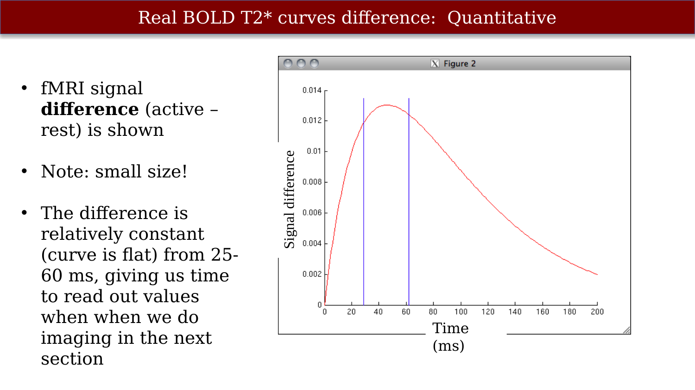

<!-- TEMP FILENAME: this chapter is inserted mid-part2 (after T2 Relaxation, before the MRI Summary/Spin Echo chapter). Once the full ch09-ch30 renumbering pass happens (see TODO.md), rename this file to chNN-pulse-sequences-t2-quantification.qmd and update its fig/vid labels from the `pulseseqt2-` prefix to the matching `chNN-` prefix, matching the project convention. -->

# Pulse Sequences, T2 Quantification, and a Look Ahead to BOLD



---

## Pulse sequence diagrams

A pulse sequence diagram lays out the timing of the RF pulses and gradients that produce an MR signal. The three building blocks we have covered so far — precession, recovery, and de-phasing — are the elements those diagrams combine.

{#fig-pulseseqt2-diagrams-overview fig-alt="Three small 3D vector diagrams labeled Precession, Recovery, and Dephasing, shown over a background photo."}

The timing of the RF pulses determines the weighting of a pulse sequence: T1, T2, or proton density (PD). A spin-echo diagram shows the interplay of gradients, RF transmit, and RF receive: the 90°/180° RF pulses set TE (the time to echo), the pulses repeat with period TR (the repetition time), and the gradients ($G_x$, $G_y$, $G_z$) control spatial encoding, covered in the next part of the book.

{#fig-pulseseqt2-spin-echo-diagram fig-alt="Spin-echo pulse sequence diagram showing RF pulses at 90 and 180 degrees, TE and TR intervals, and three gradient channels Gx, Gy, Gz with a data-acquisition window."}

## Choosing TE and TR to control contrast

T1 and T2 differ enormously in scale — for white matter, T1 is roughly 8 times longer than T2 (about 0.83 s versus 0.11 s). Because of this difference, the same pulse-timing choices that control T2 contrast have very little effect on T1, and vice versa.

{#fig-pulseseqt2-t1-t2-time-constants fig-alt="Plot comparing T1 recovery (blue) and T2 decay (red) curves for white matter over 5 seconds, with T1=0.832s and T2=0.110s labeled."}

Choosing the echo time (TE) controls how much T2 contrast appears between two tissues with different T2 values: the signal difference between them (green curve) peaks at a particular TE, which sets the best time to read out the signal.

{#fig-pulseseqt2-te-selection fig-alt="Transverse magnetization decay curves for two tissues with a T2-contrast difference curve peaking near TE, plotted against time since excitation."}

Choosing the repetition time (TR) similarly controls how much residual T1 contrast leaks into a T2-weighted image. There is no T1 difference between two tissues at short times (around 25 ms), but to make sure the T1 recovery doesn't contribute additional contrast, we wait roughly 2 seconds before acquiring the next repetition. A TE of about 25 ms and a TR of about 2 s together provide mostly a T2 contrast — a T2-weighted image.

{#fig-pulseseqt2-tr-selection fig-alt="Longitudinal magnetization recovery curves for two tissues with a T1-contrast difference curve, and a vertical dashed line marking TR near 2 seconds."}

Spin-echo images acquired with a short TE (10 ms) produce a T2 signal, but the size of that signal still depends on TR: the TR timing brings back some T1 contrast, and the gray/white matter contrast is larger at short TR. So a "T2 image" always carries a bit of T1 weighting as well — the two are never perfectly separable.

{#fig-pulseseqt2-trte-summary fig-alt="Plot of signal intensity versus TR for fat, white matter, gray matter, and CSF, alongside two brain images acquired at TR=250 and TR=1500 showing different gray/white contrast."}

## Why is the T2 measurement not quantitative?

A raw T2-weighted signal is not, by itself, a quantitative measurement of T2. The measured transverse magnetization follows $M_{xy} = M_0 e^{-t/T_2}$, and when we measure across different positions in the brain, the absolute starting level $M_0$ differs from place to place — mainly because of proton density (PD) and coil inhomogeneities (in both excitation and reception). In the example below, the signal level at 32 ms differs between three locations with different $M_0$, even though the T2 time constant is the same at all three.

{#fig-pulseseqt2-why-not-quantitative fig-alt="Three T2 decay curves for small, medium, and large proton density, all decaying at the same rate but starting from different levels, with the T2 signal equation shown."}

Multiple spin echoes make the problem concrete: repeating the 180° refocusing pulse produces a train of echoes whose peak amplitudes decay with the true T2 time constant, but the absolute height of that decay curve — its intercept — still depends on the position-dependent $M_0$.

::: {.content-visible when-format="html"}
{#vid-pulseseqt2-multiple-echoes width="70%" loop="true" autoplay="true" muted="true"}
:::

::: {.content-visible when-format="pdf"}
{#vid-pulseseqt2-multiple-echoes width="70%"}
:::

Measuring T2 *quantitatively* therefore requires separating out the $M_0$ term — for example by fitting the decay across several echo times and reporting the fitted time constant, rather than reading off a single-TE signal level.

## A quick look ahead: the T2*/BOLD signal

Two topics extend this discussion beyond T2 itself: measuring blood oxygenation, and the gradient-echo pulse sequence used to do so. Both are covered in depth later in the book; this is a preview of why they matter.

{#fig-pulseseqt2-bold-preview-intro fig-alt="Two schematic blood vessels labeled Rest and Active, showing oxygenated and deoxygenated hemoglobin, over a background photo."}

Blood oxygenation influences the transverse magnetization relaxation rate. Deoxygenated blood is paramagnetic, giving it a shorter T2 (higher 1/T2); oxygenated blood is diamagnetic and closer to the surrounding tissue, giving it a longer T2. T1 is essentially unaffected by oxygenation. Spins near deoxygenated blood lose transverse magnetization faster than spins near oxygenated blood — equivalently, the magnetic susceptibility of deoxygenated blood is higher (Huettel et al., Fig. 7.1; after Thulborn et al., 1982).

::: {.panel-tabset}
## Measured relaxation rate

{#fig-pulseseqt2-oxygenation-relaxation-rate fig-alt="Scatter plot of 1/relaxation time versus percent oxygenated hemoglobin, showing 1/T2 decreasing with oxygenation while 1/T1 stays flat, with paramagnetic and diamagnetic ends labeled."}

## Schematic decay curves

{#fig-pulseseqt2-oxygenated-deoxygenated-schematic fig-alt="Schematic Mxy decay curves for deoxygenated blood decaying quickly and oxygenated blood decaying slowly, plotted against time."}
:::

Putting numbers to this effect: the T2*(fMRI) signal decays slightly faster during rest than during activity, since resting tissue is relatively less oxygenated. The difference between the active and rest curves is small in absolute terms, but it is relatively constant over a window of roughly 25-60 ms after excitation — which is precisely the window used for image readout in a gradient-echo acquisition.

::: {.panel-tabset}
## Signal decay (rest vs. active)

{#fig-pulseseqt2-bold-curves-quantitative fig-alt="Plot of simulated signal decay for rest (red) and active (green) states over 200 ms, nearly overlapping, with an imaging window marked between about 30 and 65 ms."}

```{.matlab filename="bold_t2star_signal_decay.m"}
% some constants
te = 29;       % te for spiral-out
readout = 33;  % duration of readout

% time in milliseconds
x = 0:200;

% te_rest is the rest-state T2*; te_active is the active-state T2*; (at 3 T)
te_rest = [44.9 46.1 43.9 46.1];
te_active = [46.4 48.7 45.4 46.1+.93];

% let's just take the mean
te_rest = mean(te_rest);
te_active = mean(te_active);

% look at signal decay
figure; hold on;
plot(x,exp(-x./te_rest),'r-');
plot(x,exp(-x./te_active),'g-');
straightline([te te+readout],'v','b-');
xlabel('time (ms)');
ylabel('signal');
legend({'rest' 'active'});
title('signal decay');
```

## Signal difference (active − rest)

{#fig-pulseseqt2-bold-curves-difference fig-alt="Plot of the active-minus-rest signal difference over 200 ms, rising then falling, relatively flat between about 30 and 65 ms."}

```{.matlab filename="bold_t2star_signal_difference.m"}
% look at difference between active and rest
figure; hold on;
plot(x,exp(-x./te_active)-exp(-x./te_rest),'r-');
straightline([te te+readout],'v','b-');
xlabel('time (ms)');
ylabel('signal difference');
title('difference in signal between active and rest');

% look at the percent change relative to rest
figure; hold on;
plot(x,(exp(-x./te_active)./exp(-x./te_rest) - 1) * 100,'r-');
straightline([te te+readout],'v','b-');
xlabel('time (ms)');
ylabel('percent change');
title('percent change relative to rest');
```
:::

This T2*-based contrast between active and resting tissue — small, but consistent over a usable readout window — is the physical basis of the BOLD (blood-oxygenation-level-dependent) signal used in fMRI, which is developed fully in a later part of the book.
