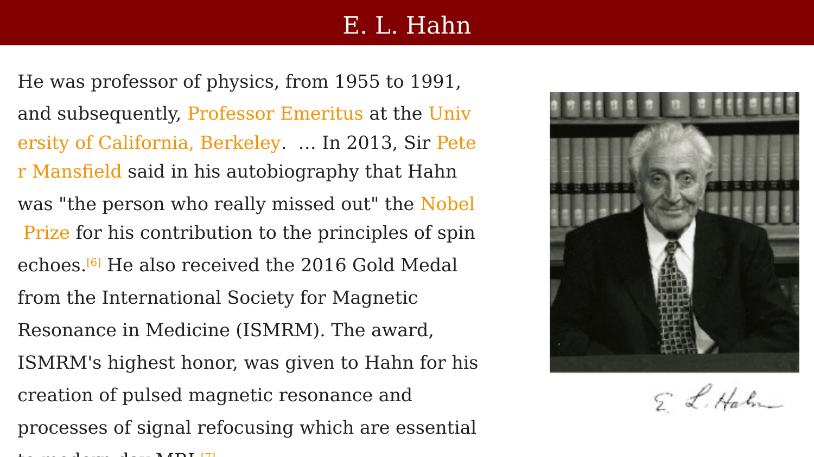
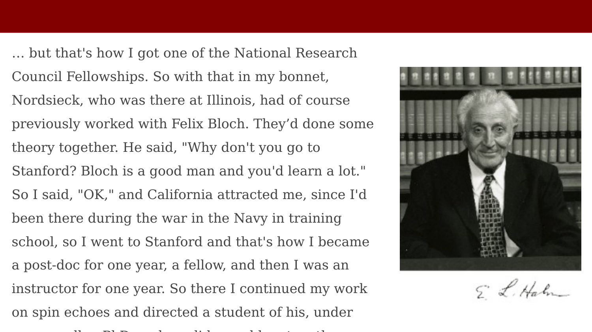
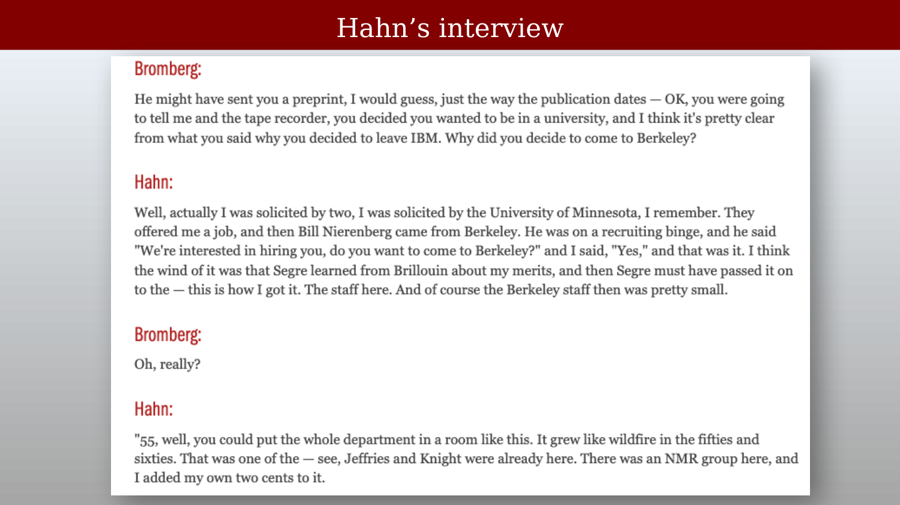

# Erwin L. Hahn and the Spin Echo {.unnumbered}



Erwin L. Hahn introduced the spin echo, a central experimental idea in magnetic resonance. This resource emphasizes the people and papers behind the method; the physics of spin-echo pulse sequences is covered in the main text.

## The Spin-Echo Idea

{#fig-hahn-free-nuclear-induction}

In a Hahn spin echo, a $90^\circ$ RF pulse creates transverse magnetization. A $180^\circ$ pulse at time $\tau$ reverses phase offsets caused by static field inhomogeneity, producing an echo at approximately $2\tau$. The pulse refocuses reversible dephasing, but it does not reverse irreversible $T_2$ relaxation.

## The Original Spin-Echo Paper

::: {.panel-tabset}

## Step 1

{#fig-hahn-spin-echoes-paper-1}

## Step 2

{#fig-hahn-spin-echoes-paper-2}

:::

Hahn's paper, *Spin Echoes*, appeared in *Physical Review* in 1950. It showed how timed RF pulses can create an observable echo and use its decay to measure relaxation.

## Hahn at Berkeley

{#fig-hahn-portrait}

The biographical slide records Hahn's long career at the University of California, Berkeley and his recognition for the development of pulsed magnetic resonance and signal refocusing.

## Hahn's Stanford Connection

{#fig-hahn-stanford-recollection}

Hahn recalled that a National Research Council fellowship brought him to Stanford, where he worked with Felix Bloch and continued his work on spin echoes. The connection links the history of the spin echo to the development of the Bloch equations.

## Hahn's Interview

{#fig-hahn-interview}
