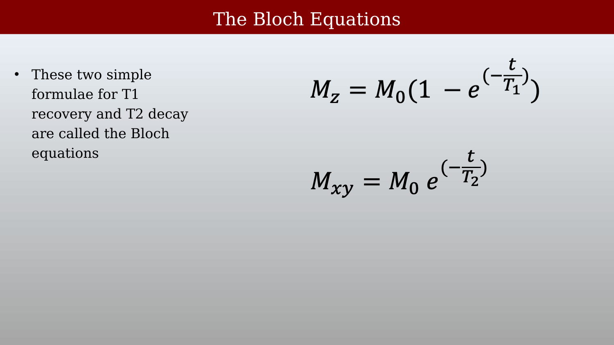

# Felix Bloch and the Bloch Equations {.unnumbered}



This resource collects a short account of Felix Bloch and the relaxation equations that bear his name. The equations provide a compact description of longitudinal recovery and transverse decay after RF excitation.

## The Bloch Equations

<!--
{#fig-bloch-the-bloch-equations}
-->

For the longitudinal component and the magnitude of transverse magnetization, the relaxation part of the Bloch equations describes recovery and decay after RF excitation:

$$
M_z(t) = M_0\left(1 - e^{-t/T_1}\right)
$$

$$
M_{xy}(t) = M_{xy}(0)e^{-t/T_2}
$$

Here, $M_0$ is the equilibrium magnetization, $T_1$ is the longitudinal relaxation time, and $T_2$ is the transverse relaxation time. For an ideal $90^\circ$ pulse, $M_{xy}(0) = M_0$.

## Differential Equation Form

<!--
{#fig-bloch-differential-equation-form}
-->

The same relaxation processes can be written as ordinary differential equations:

$$
\frac{dM_z}{dt} = \frac{M_0 - M_z}{T_1}
$$

$$
\frac{dM_{xy}}{dt} = -\frac{M_{xy}}{T_2}
$$

The first equation returns $M_z$ toward its equilibrium value; the second causes $M_{xy}$ to decay toward zero. They are ordinary differential equations because they describe changes with time at one location. Spatially varying fields and diffusion add further terms later in the course.

{#fig-bloch-slide-068}

{#fig-bloch-slide-069}

{#fig-bloch-slide-070}

## Felix Bloch at Stanford

{#fig-bloch-felix-bloch-at-stanford}
