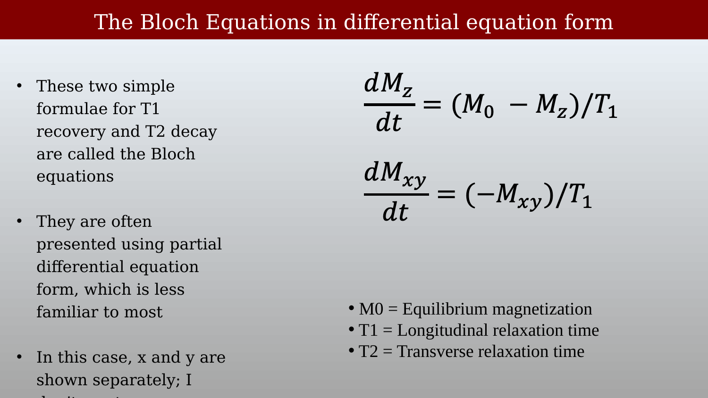
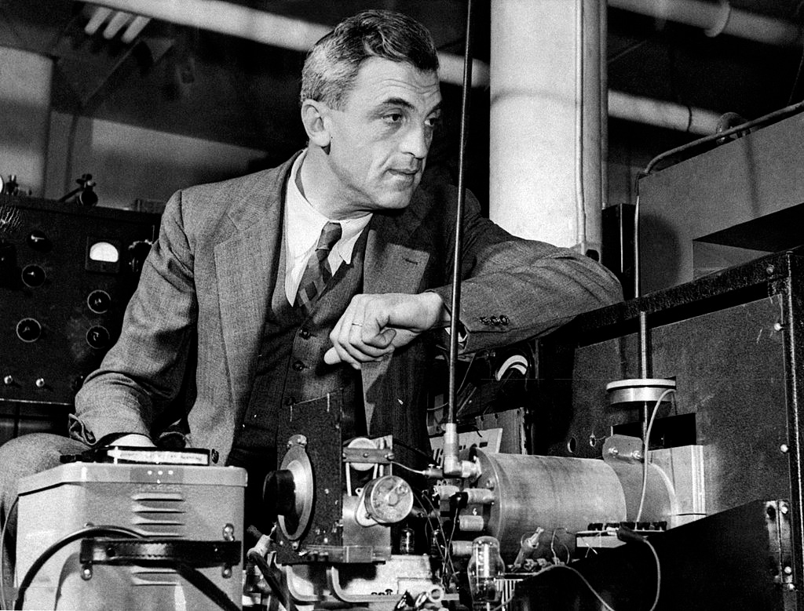
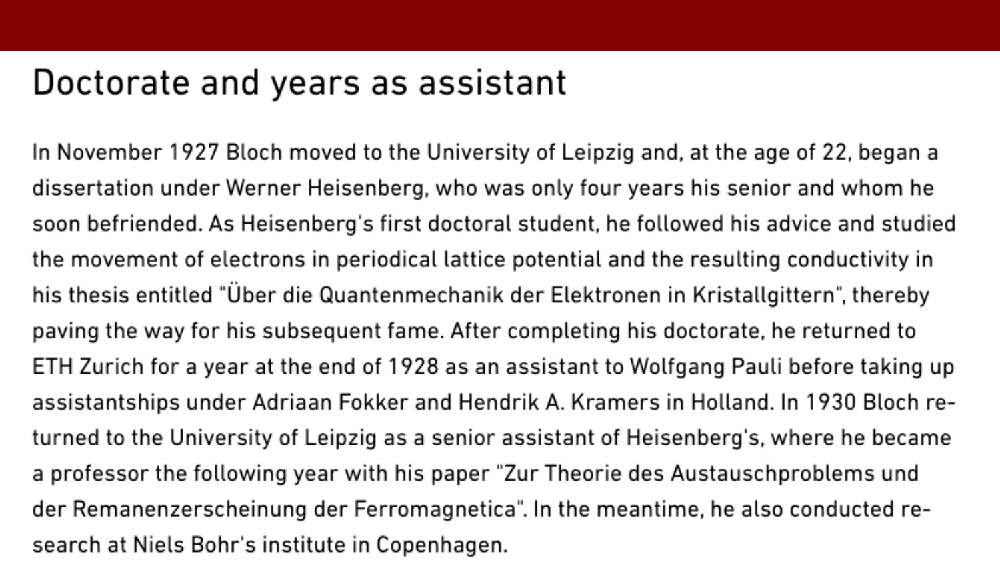
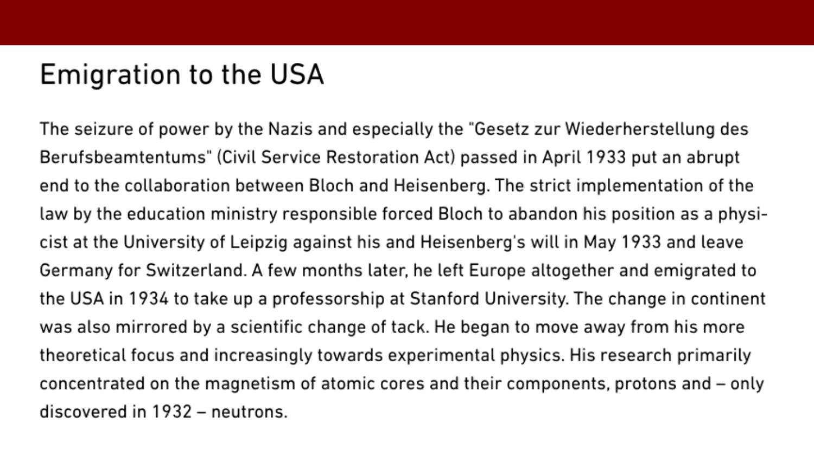

# Felix Bloch and the Bloch Equations {.unnumbered}



This resource the relaxation equations that bear Felix Bloch's name. The equations provide a compact description of longitudinal recovery and transverse decay after RF excitation.  It is then followed by a brief description of Bloch as a physicist and his connection to Stanford.

## The Bloch Equations

<!--
{#fig-bloch-the-bloch-equations}
-->

For the longitudinal component and the magnitude of transverse magnetization, the relaxation part of the Bloch equations describes recovery and decay after RF excitation:

$$
M_z(t) = M_0\left(1 - e^{-t/T_1}\right)
$$

$$
M_{xy}(t) = M_{xy}(0)e^{-t/T_2}
$$

Here, $M_0$ is the equilibrium magnetization, $T_1$ is the longitudinal relaxation time, and $T_2$ is the transverse relaxation time. For an ideal $90^\circ$ pulse, $M_{xy}(0) = M_0$.

## Differential Equation Form

<!--
{#fig-bloch-differential-equation-form}
-->

The same relaxation processes can be written as ordinary differential equations:

$$
\frac{dM_z}{dt} = \frac{M_0 - M_z}{T_1}
$$

$$
\frac{dM_{xy}}{dt} = -\frac{M_{xy}}{T_2}
$$

The first equation returns $M_z$ toward its equilibrium value; the second causes $M_{xy}$ to decay toward zero. They are ordinary differential equations because they describe changes with time at one location. Spatially varying fields and diffusion add further terms later in the course.

## About Felix Bloch

{#felix-bloch width=80%}

Felix Bloch was born in Zurich on 23 October 1905 to the Jewish businessman Gustav Bloch and his wife Agnes.  

After leaving school, he embarked on a degree in engineering at ETH Zurich in 1924 before switching to the Department of Mathematics and Physics one year later. At a time of his degree, important groundwork was being laid for quantum physics in Zurich. As a student, he attended lectures by Peter Debye, Paul Scherrer and Hermann Weyl, and seminars by Erwin Schrödinger, who was researching wave mechanics at the University of Zurich's Physics Institute and showcased his famous wave equation for the hydrogen atom for the first time in 1926.

<!--
{#fig-bloch-slide-068}

{#fig-bloch-slide-069}
-->

## Doctorate and years as assistant

In November 1927 Bloch moved to the University of Leipzig and, at the age of 22, began a dissertation under Werner Heisenberg, who was only four years his senior and whom he soon befriended. As Heisenberg's first doctoral student, he followed his advice and studied the movement of electrons in periodical lattice potential and the resulting conductivity in his thesis entitled "Über die Quantenmechanik der Elektronen in Kristallgittern", thereby paving the way for his subsequent fame. After completing his doctorate, he returned to ETH Zurich for a year at the end of 1928 as an assistant to Wolfgang Pauli before taking up assistantships under Adriaan Fokker and Hendrik A. Kramers in Holland. In 1930 Bloch returned to the University of Leipzig as a senior assistant of Heisenberg's, where he became a professor the following year with his paper "Zur Theorie des Austauschproblems und der Remanenzerscheinung der Ferromagnetica". In the meantime, he also conducted research at Niels Bohr's institute in Copenhagen.

<!--
{#fig-bloch-slide-070}
Here is the text extracted from the slide, ready to copy:
-->

## Emigration to the USA

The seizure of power by the Nazis and especially the "Gesetz zur Wiederherstellung des Berufsbeamtentums" (Civil Service Restoration Act) passed in April 1933 put an abrupt end to the collaboration between Bloch and Heisenberg. The strict implementation of the law by the education ministry responsible forced Bloch to abandon his position as a physicist at the University of Leipzig against his and Heisenberg's will in May 1933 and leave Germany for Switzerland. A few months later, he left Europe altogether and emigrated to the USA in 1934 to take up a professorship at Stanford University. The change in continent was also mirrored by a scientific change of tack. He began to move away from his more theoretical focus and increasingly towards experimental physics. His research primarily concentrated on the magnetism of atomic cores and their components, protons and – only discovered in 1932 – neutrons.

## Felix Bloch at Stanford

{#fig-bloch-felix-bloch-at-stanford}

It was not until the arrival of Swiss physicist Felix Bloch, however, in 1934, that physics research at Stanford truly caught fire. A refugee from the Nazis, Bloch was only 28 years old when he answered David Webster's invitation to join the Stanford faculty.  …

Soon after he arrived at Stanford, Bloch, together with Berkeley physicist Robert Oppenheimer, organized a joint seminar on theoretical physics that met alternately at Stanford and Berkeley. Many of the leading physicists of Europe and the United States traveled to the West Coast to speak at these seminars, and many came to Stanford as summer visitors. By the mid-1930s, Stanford was recognized as an important center for physics, despite the fact that geographically it was considered far removed from the center of "civilization!"
