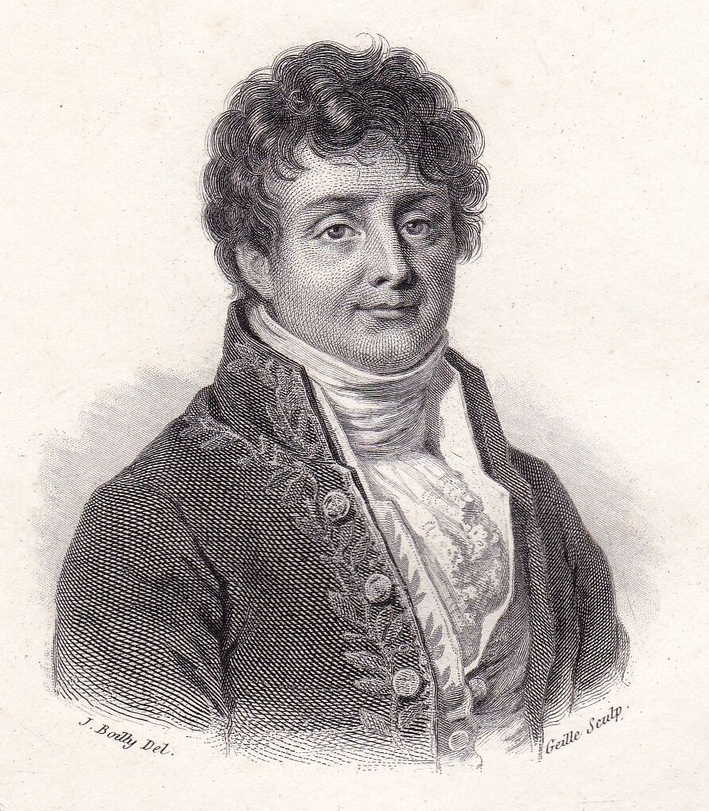
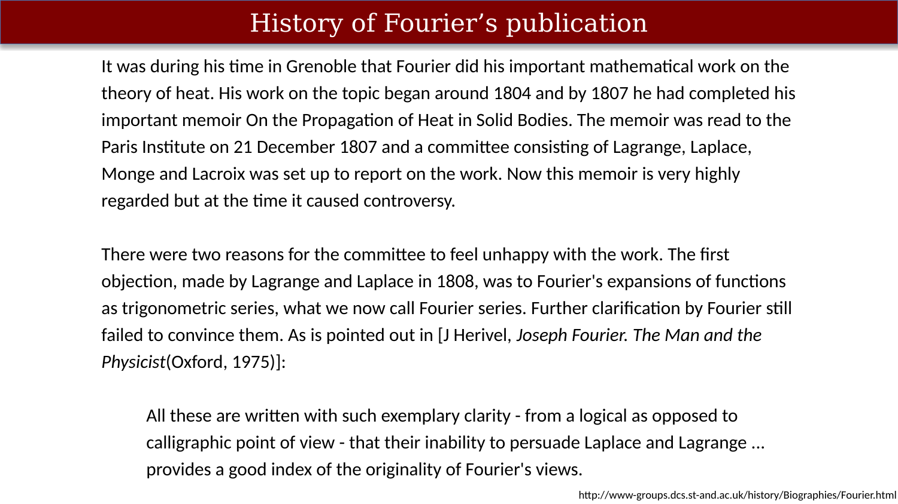

# History of Fourier’s publication {.unnumbered}

## About Fourier

{#fig-ch14-historical-note-fourier}

A link where you can read [more about Fourier.](https://mathshistory.st-andrews.ac.uk/Biographies/Fourier/)

## The importance of the Fourier Series

The Wikipedia page summarizes Fourier's contributions this way.  I think they might not be generous enough.

* **Fourier's Claim:** Joseph Fourier asserted that any function (continuous or discontinuous) can be written as an infinite sum of sine waves.
* **The Conceptual Breakthrough:** While his claim was overbroad without boundary conditions, recognizing that infinite series could represent discontinuous functions - like a step function or an impulse - was a major mathematical leap.
* **Lagrange vs. Dirichlet:** Lagrange had previously solved specific instances; he assumed the technique generalized, but never proved it. Dirichlet later provided the first rigorous proof of convergence under explicit, restrictive conditions.
* **The Legacy:** Resolving when these series converge drove fundamental developments in real analysis for over a century and laid the groundwork for the modern Fourier transform.

<!--
>There were three important contributions in this work, one purely mathematical, two essentially physical. In mathematics, Fourier claimed that any function of a variable, whether continuous or discontinuous, can be expanded in a series of sines of multiples of the variable. Though this result is not correct without additional conditions, Fourier's observation that some discontinuous functions are the sum of infinite series was a breakthrough. The question of determining when a Fourier series converges has been fundamental for centuries. Joseph-Louis Lagrange had given particular cases of this (false) theorem, and had implied that the method was general, but he had not pursued the subject. Peter Gustav Lejeune Dirichlet was the first to give a satisfactory demonstration of it with some restrictive conditions. This work provides the foundation for what is today known as the Fourier transform.
-->

## Early history

{#fig-ch14-history-of-fouriers-publication-1}

Historically, Fourier had difficult getting credit as well. He sought the recognition from the French Academy for his work, but was regularly denied.

## French academy

{#fig-ch14-history-of-fouriers-publication-2}

In the end, he was grudgingly conceded some recognition.

