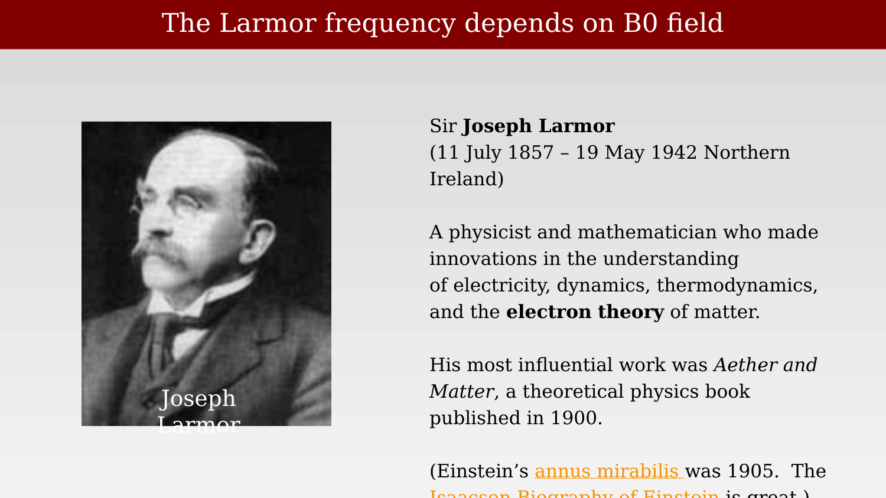
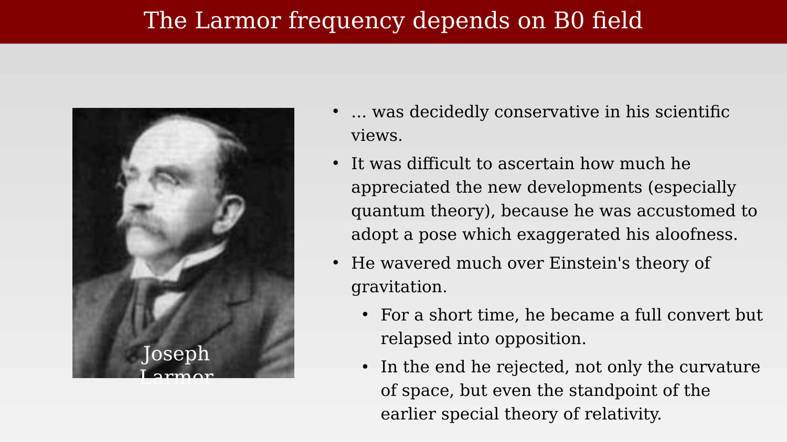

# Joseph Larmor and his frequency {.unnumbered}



Sir Joseph Larmor (11 July 1857–19 May 1942) was an Irish physicist and mathematician. His work ranged across electricity, dynamics, thermodynamics, and the electron theory of matter. Most important for MRI, he described the precession of a magnetic moment in an applied magnetic field: the relationship now known as the **Larmor frequency**. It is this relationship that determines the RF frequency required to excite hydrogen nuclei at a given $B_0$ field strength.

{#fig-ch07-the-larmor-frequency-depends-on-b0-field-2}

Larmor's most influential book, *Aether and Matter* (1900), set out his theoretical account of electricity and matter. It appeared five years before Einstein's 1905 *annus mirabilis* papers, at a time when physicists were reconsidering the nature of space, time, and electromagnetic phenomena.

{#fig-ch07-the-larmor-frequency-depends-on-b0-field-3}

Larmor remained attached to the older aether-based picture of physics and was cautious about later developments, especially quantum theory and relativity. His response to Einstein's theory of gravitation changed over time: he briefly accepted it, but later returned to a critical position. This historical context does not diminish the lasting importance of Larmor precession, which remains central to magnetic resonance.
