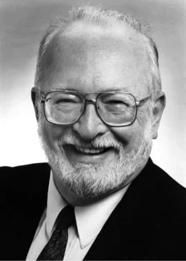
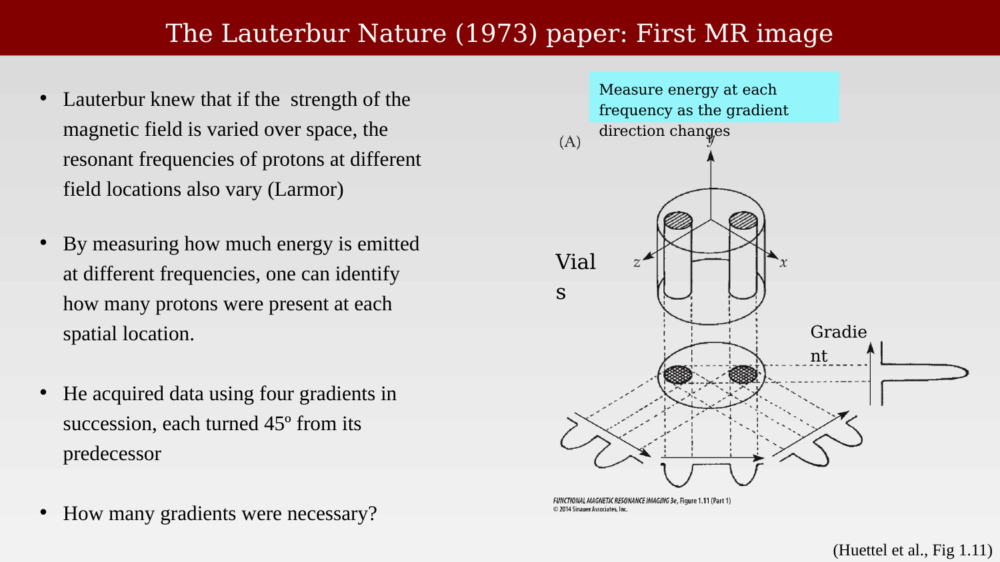
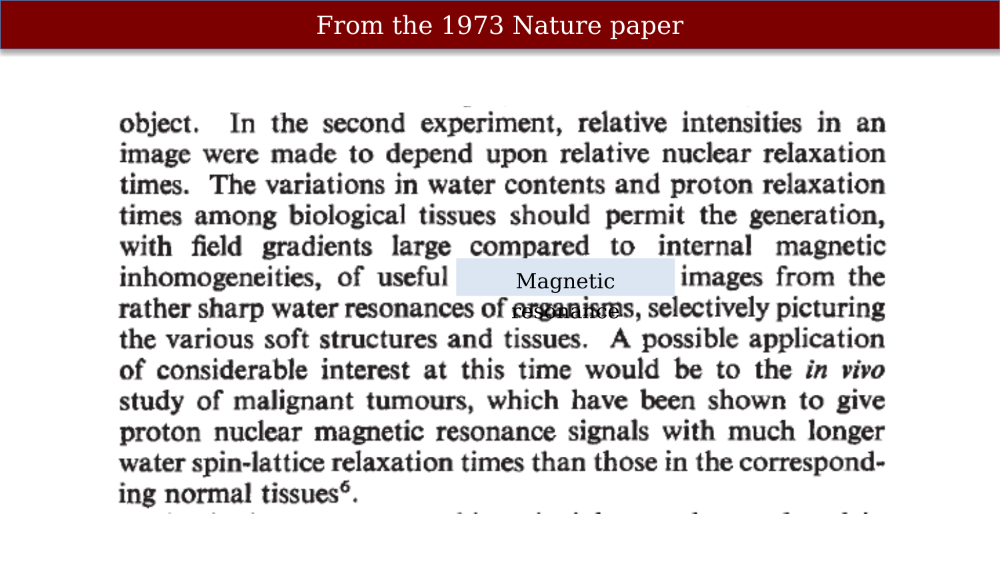

# Paul Lauterbur {.unnumbered}



Paul Lauterbur introduced the idea of using spatial gradients in the magnetic field to localize the MR signal, the insight that made magnetic resonance imaging possible. This resource collects the historical material on Lauterbur and his 1973 *Nature* paper; the principles of gradient encoding are developed in the main text.

{#fig-lauterbur-historical-note}

In 1972, Lauterbur had a novel idea: if the strength of the magnetic field were varied over space, the resonant frequencies of protons at different field locations would also vary. By measuring how much energy was emitted at different frequencies, one could identify how many protons were present at each spatial location. This idea, of inducing spatial gradients (often symbolized as G) in the magnetic field, proved to be the fundamental insight that led to the creation of MR images. Lauterbur also realized that a single gradient could only provide information about one spatial dimension; to recover two-dimensional structure, it would be necessary to use gradients at different orientations. By acquiring data using four gradients in succession, each turned 45º from its predecessor, Lauterbur created an image of a pair of water-filled test tubes. This picture, which was reported in Nature in 1973, was the very first MR image.

## The Lauterbur *Nature* (1973) paper: First MR image

{#fig-lauterbur-nature-1973-paper-1}

{#fig-lauterbur-nature-1973-paper-2}

## From the 1973 *Nature* paper

{#fig-lauterbur-from-1973-nature-paper}
