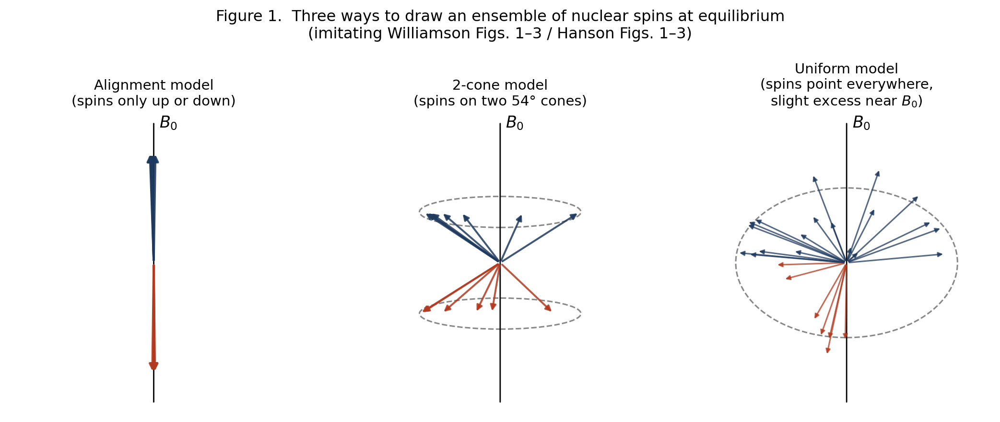
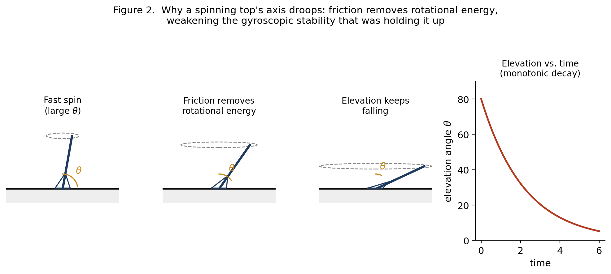
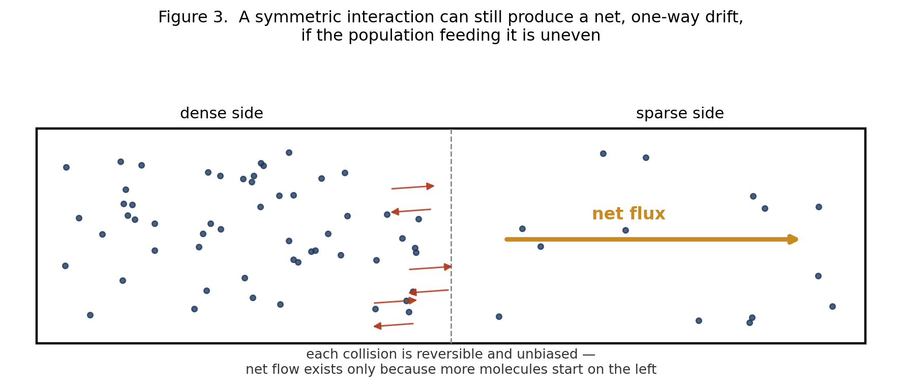
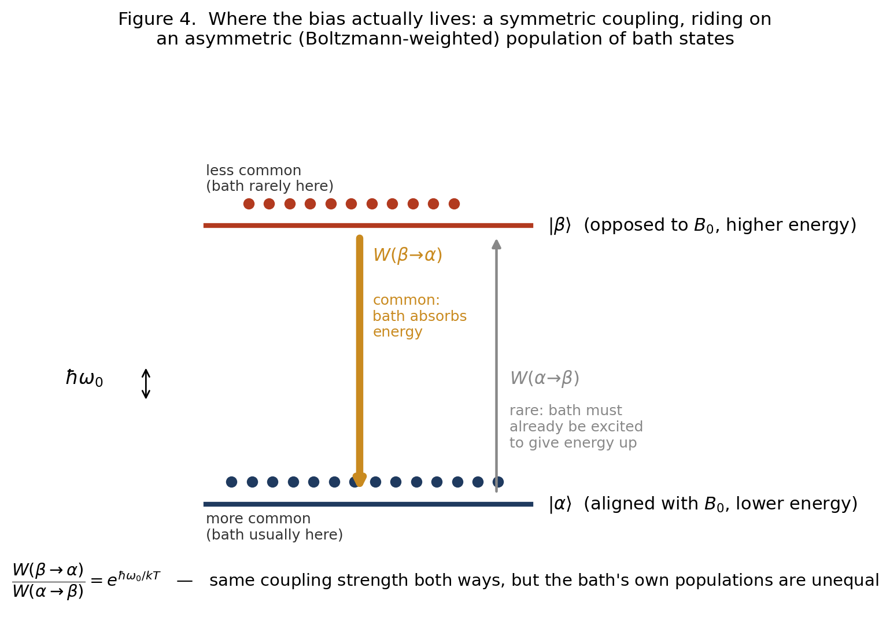
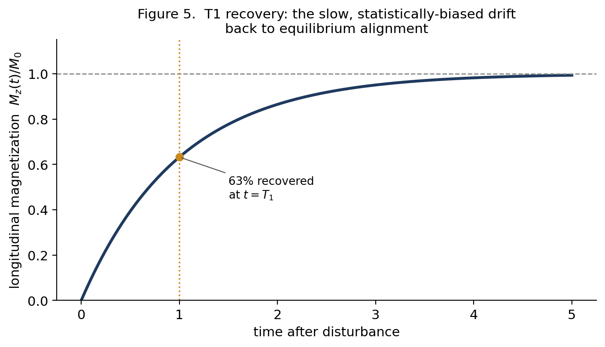

# Why Spins Relax {.unnumbered}

*Classical Pictures, Quantum Necessity, and T1*

*A summary of the classical/quantum divide in NMR, built from Williamson (2019) and Hanson (2008)*



## The question underneath this whole topic

Two papers on how to teach and think about NMR — Williamson (2019, “Drawing Single NMR Spins and Understanding Relaxation”) and Hanson (2008, “Is Quantum Mechanics Necessary for Understanding Magnetic Resonance?”) — both make a similar, somewhat provocative claim: most of what you need to understand about how nuclear spins behave in a magnetic field does not require quantum mechanics. Precession, resonance, the effect of RF pulses, even the shape of the equilibrium magnetization — all of this can be pictured with an ordinary classical vector, like a tiny bar magnet or a spinning top, and the classical picture is not just a simplification, it's *accurate*.

But there's one place both papers stop and say: here, you actually need quantum mechanics, and no classical picture gets it right. That place is relaxation — specifically the process called T1 relaxation, where a population of spins that starts out disturbed from equilibrium gradually settles back into a small net alignment with the magnetic field.

This summary walks through why the classical picture works as well as it does, and then pins down exactly where and why it breaks — because the “why” turns out to be genuinely interesting, and it's not the reason people usually assume.

## Three ways to draw a spin (Williamson)

Williamson's paper is about how NMR textbooks typically draw a single nuclear spin, and why two of the three standard pictures are actively misleading.

**The alignment model.** Spins point either straight along the field (+z) or straight against it (−z), like a two-state switch, with a slight statistical excess in the “with the field” state. This is the picture most people first learn, and it's wrong in an important way: it implies each spin sits permanently in one of exactly two orientations, full stop.

**The 2-cone model.** Spins point somewhere on the surface of one of two cones tilted at the “magic angle” (about 54°) from the field, precessing around it. This one is popular in advanced texts and explains precession and phase, but it has the same underlying flaw as the alignment model — it still assumes every spin sits in one of exactly two possible orbits — and it leads to real contradictions when you try to use it to explain what a pulse does (Williamson shows the picture has to “magically” reassemble itself in a way that doesn't correspond to any real physical process).

**The uniform model.** This is the one Williamson argues for. A spin can point in *any* direction on a sphere, with no restriction to two special cones. In the absence of a field, spin orientations are scattered uniformly over the whole sphere. Turn on the field, and nothing snaps into place — instead, each spin starts precessing around the field direction, and very gradually, the population of orientations becomes slightly denser near the “north pole” (aligned with the field) than near the south pole. That slight density skew, averaged over an enormous number of spins, is the macroscopic magnetization we measure. Nothing here requires quantum discreteness — it's exactly the picture of a swarm of tiny gyroscopes precessing around a field, with a slow drift toward alignment layered on top.

The payoff of the uniform model, according to Williamson, is that it's the only one of the three that gives a coherent, contradiction-free account of all three basic scenarios: equilibrium, the effect of a 90° pulse, and relaxation.

{#fig-nmr-relaxation-spin-models width="93%"}

## Hanson's classical MR — and the same picture, from a different door

Hanson's paper arrives at essentially the same destination — a “spins pointing everywhere, precessing, slightly skewed toward the field” picture — but he gets there by attacking three specific myths he thinks distort how MR is taught:

- **Myth 1**: that an MR measurement forces individual protons into the “spin up” or “spin down” eigenstate. He argues this conflates a single-particle Stern-Gerlach-style measurement (which really does force a collapse) with what an MR scanner actually does (measure the *bulk* magnetization of trillions of spins at once, a much gentler kind of measurement that doesn't collapse individual spins at all).

- **Myth 2**: that MR itself is “a quantum effect.” He agrees the proton's spin is a quantum property, but argues the *behavior of MR* — precession, resonance, pulses — is accurately described by classical mechanics, full stop, and doesn't need quantum reasoning to be understood.

- **Myth 3**: that an RF pulse works by “bringing spins into phase.” He shows this is inconsistent with the physics: a uniform RF field can only rotate the whole distribution of spins rigidly, it can never selectively rearrange spins relative to each other.

The physical picture Hanson lands on — spins scattered over a sphere, precessing, biased slightly toward the field by relaxation — is essentially identical to Williamson's uniform model, arrived at independently and for slightly different pedagogical reasons.

Hanson's strongest piece of support for “MR is classical” is a genuinely striking mathematical fact, due to Feynman, Vernon, and Hellwarth (1957): for an isolated two-level quantum system (like a single spin) sitting in an external field, the Schrödinger equation can be rewritten *exactly* as a classical vector precessing under a torque — the same equation that governs a classical bar magnet. This isn't an approximation or a loose analogy; for this specific problem (a closed system, no environment, no dissipation), quantum and classical descriptions are mathematically the same object viewed two ways.

## Where classical physics genuinely earns its keep

Putting the two papers together, classical mechanics correctly and exactly handles:

- **Precession**: a spin in a field behaves like a gyroscope, precessing at a fixed rate (the Larmor frequency) around the field axis. No quantum reasoning needed — this is the Feynman-Vernon-Hellwarth correspondence at work.

- **Pulses and resonance**: an RF pulse tilts the whole distribution of spins by a controllable angle, exactly like a classical torque applied on-resonance. Off-resonance behavior, flip angles, the rotating frame — all classical.

- **Coherence**: the “bunching up” of spin phases that produces a detectable transverse signal is just a statement about the spins' relative orientations after a pulse, not a mysterious quantum phenomenon.

- **The size of the equilibrium magnetization**, in the regime relevant to ordinary liquid-state NMR. Hanson shows that if you take a *classical* magnetic dipole, assume it's sitting in thermal equilibrium with a bath at temperature T, and apply ordinary classical statistical mechanics (the same theory Langevin used for paramagnetism in 1905, well before quantum mechanics existed), you get the exact same formula for the net magnetization as the full quantum calculation, in the weak-field/high-temperature limit relevant to real samples. The discreteness of the spin's energy levels turns out not to matter at all in this regime — both calculations are really just leaning on ordinary Boltzmann statistics.

So: a very large fraction of “how NMR works” is legitimately classical, not just classical-flavored. This is the genuinely useful contribution both papers make — they push back against the common but misleading habit of reaching for spooky quantum language (“the spin is in superposition,” “measurement collapses the wavefunction,” “spins flip between eigenstates”) to explain phenomena that don't need it and are actually *clarified* by dropping it.

## The one place this breaks: relaxation

Both papers flag relaxation — the process that brings a disturbed spin population back to equilibrium — as different. Hanson states it directly:

> *“Relaxation is consistent with classical mechanics, \[but\] the observed sizes of relaxation rates are not. Only if these are calculated based on quantum mechanics do they match experiment.” — Hanson (2008)*

Williamson's version of the mechanism (which is the one worth dwelling on, because it's a nice physical picture) is this: a spin doesn't relax through some abrupt “flip” from one orientation to another. Instead, a nearby atomic nucleus is also a tiny magnet, and because the surrounding molecule is constantly tumbling (ordinary thermal motion), that neighbor's magnetic field, as felt at the location of our spin, is constantly fluctuating. Whenever that fluctuation happens to contain a component rotating at exactly the right frequency (the Larmor frequency), it acts like a very weak, very brief pulse, nudging the spin's orientation by a tiny amount. Relaxation is the accumulation of an enormous number of these tiny, essentially random nudges.

Here's the natural question this raises, and it's the one that sparked the rest of this discussion: each individual nudge, considered on its own, has no reason to prefer pushing the spin toward the field over pushing it away — the neighbor's tumbling doesn't “know” or “care” which direction the field points. So where does the net, population-wide bias toward alignment actually come from?

## Why the bias isn't a matter of geometry

It's tempting to think the answer must be geometric — something about the shape of the dipole's magnetic field, or the specific angle of approach, that somehow favors one direction. It doesn't. If you actually simulate a classical bar-magnet-like spin, kicked only by isotropic, unbiased noise from a tumbling neighbor, with a perfectly reversible (non-dissipative) equation of motion, what you get is *diffusion*, not drift: the spin's orientation randomizes across the whole sphere, with zero net polarization at the end — not the small, real, field-aligned excess we actually observe.

This is the same lesson as a classical spinning top slowly toppling over on a tabletop, and it's worth spelling out because it clarifies what's really doing the work. A top doesn't fall because gravity somehow “wins an argument” against its spin — a frictionless top would precess forever at a fixed tilt. It falls because friction and air drag are draining its rotational energy, and friction is a special kind of force: by definition, it always opposes motion, so it can only ever remove energy, never add it. That directional bias is built into the force law itself, not into the geometry of the top.

{#fig-nmr-relaxation-spinning-top width="93%"}

The same structure shows up if you think about a gas that's denser on one side of a box than the other. Any individual molecular collision is completely reversible and undirected — nothing about physics says a collision has to send a molecule toward the sparse side. But there are simply more molecules launching from the dense side per second, purely because there are more of them there, so the net flow still runs from dense to sparse. The bias lives in the *populations* feeding the collisions, not in the collisions themselves.

{#fig-nmr-relaxation-asymmetric-populations width="86%"}

Nuclear spin relaxation turns out to work exactly like the gas example, not the top. The dipole-dipole “kick” connecting a spin to its neighbor is, in fact, symmetric — the same coupling strength operates whether the neighbor is about to give the spin energy or take energy away from it. What's *not* symmetric is how often the neighbor happens to be caught in the configuration needed to supply that kick in each direction. A thermally-equilibrated molecular motion, like anything else at a finite temperature, spends more of its time in its own low-energy configurations than its high-energy ones. So the “spin gains a little energy” kick, which requires the neighbor to already be sitting in an unusually excited state, draws from a rarer pool than the “spin loses a little energy” kick, which just requires the neighbor's ordinary, common low-energy motion. Multiply a symmetric coupling by an asymmetric population, and you get a net drift — toward lower energy, i.e., toward alignment with the field.

{#fig-nmr-relaxation-detailed-balance width="68%"}

## Why this specific asymmetry needs quantum mechanics

Here's the sting in the tail, and it's the part that genuinely can't be gotten around classically. The argument in Section 6 — “the bath's own populations are unevenly distributed across its energy levels, low more common than high” — sounds like ordinary classical thermodynamics, and in one sense it is. But if you try to build a fully classical model of it — literally treating the nuclear spin as a classical bar magnet, obeying the same reversible torque law that makes Feynman-Vernon-Hellwarth work so beautifully for precession, driven by a classical (real-valued) random field from the tumbling neighbor — the calculation shows that classical randomness alone cannot supply the needed asymmetry. A classical noise process, evaluated forward or backward in time, looks statistically identical; there's no way to distinguish “giving energy” from “taking energy” in its statistics. Run that kind of noise through a reversible classical equation of motion and you get pure, unbiased diffusion — exactly the “spreads out to zero polarization” result from Section 6, not the correct, observed, field-aligned equilibrium.

What breaks the tie is a genuinely quantum feature of thermal noise. Quantum mechanically, the fluctuating field from the bath is built out of mathematical objects (operators) that don't commute — loosely, “field now, then field later” isn't quite the same calculation as “field later, then field now,” in a way that has no classical counterpart. This asymmetry is precisely what makes a quantum thermal bath able to absorb a small packet of energy more readily than it can spontaneously supply one, and the size of that imbalance is set exactly by the Boltzmann factor — the same exponential that governs ordinary thermal populations, but now controlling the *rate* of transitions rather than just their eventual population ratio. It's this same feature, incidentally, that explains why a lightbulb filament's atoms spontaneously emit light more readily than they spontaneously absorb it from a cooler room — a closely related phenomenon (Einstein's A and B coefficients) with the same underlying cause.

The historical footnote here is almost too neat: the very paper Hanson cites for “quantum two-level dynamics equals classical MR” — Feynman, Vernon, and Hellwarth, 1957 — is about a spin with *no* environment at all: just the spin and an external field, a closed system. That's exactly the regime where the classical correspondence is exact. Feynman and Vernon (without Hellwarth) went on, in 1963, to write the paper that essentially founded the modern theory of how a quantum system exchanges energy with a dissipative environment — a completely different and much harder problem. It's in that second body of work, not the first, that the quantum/classical split over relaxation actually lives.

## Reconciling this with Hanson's equilibrium-magnetization calculation

At first glance, Hanson's own result — that a purely classical statistical-mechanics calculation gives the same equilibrium magnetization as the quantum one — can look like it contradicts everything in Section 7. It doesn't, once you notice what kind of calculation it is. Hanson's derivation *assumes* the spin has already reached thermal equilibrium with the bath, then asks what that equilibrium looks like. It's a statement about the destination, not the journey. It's true, and it's a nice result, but it deliberately sidesteps the dynamical question of whether the physical kicking-around process (dipole-dipole nudges from a tumbling neighbor) is actually what gets a spin to that destination, and at what rate, and in the right direction. That dynamical question is exactly where his own, separate remark applies: the qualitative mechanism is classical, but the actual rates — which encode the direction and speed of the approach to equilibrium — need quantum mechanics to come out right. Even his own tumble-dryer analogy for relaxation, if you look closely, quietly relies on real mechanical friction between the compasses and the dryer drum — genuine dissipation, not a purely conservative magnetic interaction — which is exactly the missing ingredient identified in Section 7.

## The takeaway

There's a clean division of labor buried in all of this, and it's a genuinely satisfying place to land:

Classical mechanics — ordinary vectors, torques, and even ordinary classical statistical mechanics — correctly handles anything that's either (a) reversible, closed-system dynamics (precession, pulses, coherence — the Feynman-Vernon-Hellwarth regime), or (b) a pure equilibrium calculation that doesn't ask how the system got there (the size of the net magnetization, in the classical limit). This covers the overwhelming majority of what a working understanding of NMR/MRI actually requires, and both Williamson and Hanson deserve credit for showing that clearly and for identifying exactly which textbook habits (forced eigenstates, “spin flips,” RF pulses “bringing spins into phase”) are artifacts of reaching for quantum language where it isn't earning its keep.

What classical mechanics cannot supply, no matter how you draw the geometry, is the actual *mechanism* that drives an out-of-equilibrium spin population toward the correct thermal equilibrium — the reason the drift exists at all, which direction it runs, and (quantitatively) how fast it happens. That's not a defect in the geometric picture; it's a real, specific, identifiable gap, and it comes from the fact that quantum thermal noise is subtly but fundamentally different from classical thermal noise. Relaxation — T1 — is where the “just draw a classical vector” strategy runs out of road, and it runs out for a genuinely interesting reason rather than an arbitrary one.

{#fig-nmr-relaxation-t1-recovery width="80%"}

*For what it's worth: this is also exactly why T1 is useful in MRI. It's a real physical property that differs between tissues — how efficiently a given tissue's molecular environment can accept energy back from the spins — and that difference in relaxation rate, not the coherent precession physics, is what produces T1-weighted contrast between gray matter, white matter, and CSF.*

## Seeing it run: the Spins2Bulk repository

Everything above has a working implementation close at hand: the `Spins2Bulk` MATLAB code, which simulates individual spins as vectors and shows the bulk magnetization emerge as their sum — the uniform model, built as running code rather than a static figure. It cites the same two papers this whole summary is built from, and its own teaching notes describe it as written for “an fMRI course aimed at early stage PhD students in cognitive neuroscience with limited physics background” — close enough to this document's audience that it seemed worth actually running it rather than just describing it. Base MATLAB isn't available here, but the code turned out to run without modification under GNU Octave, so the three figures below are genuine output from the repository's own functions, not recreations.

**The uniform model itself.** `boltzmannDistribution.m` builds the elevation density directly from the physics in Section 2: its probability density is proportional to exp(k·sin θ)·\|cos θ\|, which is exactly exp(−E/kT) with the spin's energy E = −μB₀sin θ, times a geometric factor for how much of the sphere's surface sits at each elevation. `k` bundles together μB₀/kT and is deliberately exaggerated — real k at 3 T and body temperature is about 3×10⁻⁵, some 100,000 times smaller than the k = 3 used for display — for exactly the reason Williamson's own numbers illustrate in Section 2: the true bias is far too small to draw. Running the function directly reproduces the repository's own tutorial figure:

{#fig-nmr-relaxation-boltzmann-distribution width="86%"}

The code's own tutorial then computes that real bias explicitly, independent of anything in this document: at 3 T and 310 K it gets a polarization of about 9.9×10⁻⁶, or roughly 1 spin in 101,000 — the same order of magnitude as Williamson's own worked example (about 1 in 12,000, at his higher field of 11.4 T), computed a completely different way. Seeing two independent calculations land in the same regime is a reasonable check that Section 2's account of the bias is right.

**T1 as detailed balance, made literal.** `relaxationLongitudinal.m` is the most direct connection to Sections 6–7. At each time step, a spin's elevation is nudged up or down by a small fixed amount, and the *probability* of nudging up rather than down is set to B.pdf(θ+dx) / (B.pdf(θ+dx) + B.pdf(θ−dx)) — literally the ratio of the target equilibrium density at the two candidate elevations. That is a textbook Metropolis/Glauber sampler: a symmetric-looking local step whose acceptance probabilities are weighted by the target distribution, which is mathematically guaranteed to converge to that distribution regardless of where the population starts. It is, in other words, an executable version of Figure 4 — a step that looks even-handed, riding on an asymmetric weighting that forces a net drift toward equilibrium.

It's worth being precise about what this does and doesn't demonstrate, in the spirit of Section 7. The code doesn't simulate a physical dipole-dipole interaction or an explicit bath — it starts from the known target distribution and builds a sampler engineered to reach it. That's a faithful and honest picture of what detailed balance accomplishes once you have it (Section 6), but it doesn't, by construction, show where nature's own asymmetry between “up” and “down” actually comes from (Section 7's quantum argument) — that ingredient is supplied here by design, not derived. Running `simulateSpins.m` with the repository's own defaults (a 90° pulse applied to the equilibrium distribution, T1 = 0.8 s) and fitting a single exponential to the recovery gives a measured T1 of 0.80 s — matching the requested value, and matching the accuracy the README itself claims for this exact preparation:

{#fig-nmr-relaxation-longitudinal-recovery width="86%"}

**Reversible versus irreversible dephasing.** The repository also includes a spin echo demonstration, which is a T2 analogue of the same reversible/irreversible distinction that separates Feynman-Vernon-Hellwarth's closed, coherent dynamics (Section 3) from genuine relaxation (Sections 6–7) — worth showing even though it's T2, not T1. A spread of static field offsets across spins causes fast, but *reversible*, dephasing (T2∗): a 180° pulse flips the fan of phases over and it re-converges into an echo. The random-walk dephasing underneath it, true T2, is not reversible, so the echo is capped at exp(−TE/T2) rather than exp(−TE/T2∗):

{#fig-nmr-relaxation-spin-echo width="93%"}

For anyone who wants to go further than these three figures, the repository's `tutorials/tutorial1_equilibrium.m` walks through exactly the Section 2/4 material as a runnable MATLAB Live Script, and `s_SpinsToBulkM.m` has worked cells for precession, pulses, T1, T2, T2∗, the spin echo, and a BOLD-contrast demonstration that extends the T1-weighting point in the footnote above to T2∗-weighting — directly relevant groundwork for an fMRI course.

*Sources: Williamson, M.P. “Drawing Single NMR Spins and Understanding Relaxation,” Natural Product Communications, May 2019 (DOI: 10.1177/1934578X19849790). Hanson, L.G. “Is Quantum Mechanics Necessary for Understanding Magnetic Resonance?” Concepts in Magnetic Resonance Part A, 2008. Spins2Bulk (MATLAB code), subroutines boltzmannDistribution.m, relaxationLongitudinal.m, relaxationTransverse.m and simulateSpins.m. Figures 1-5 are original schematic illustrations created to convey the same concepts as figures in the two papers above; they are not reproductions. Figures 6-8 are genuine output of the Spins2Bulk code, run unmodified under GNU Octave.*
