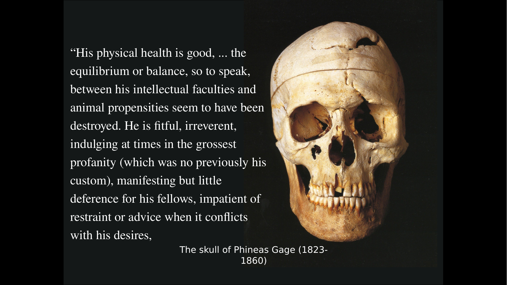
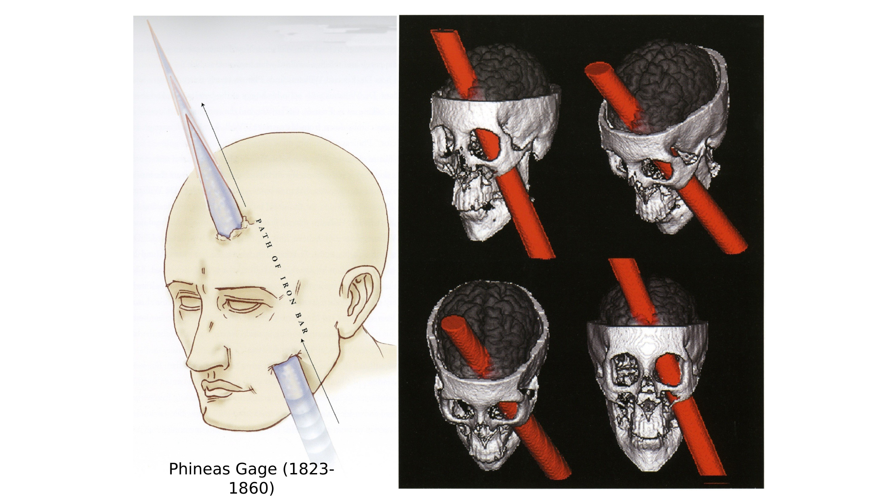
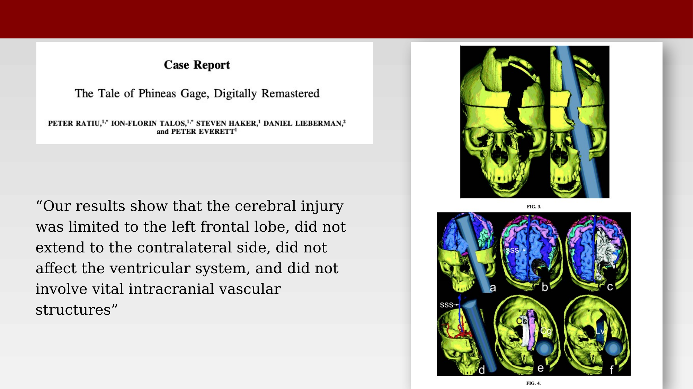

# Phineas Gage {.unnumbered}



Phineas Gage (1823–1860) is the most cited case in the history of frontal lobe research. In 1848, while working as a railroad construction foreman in Vermont, a tamping iron was driven through the front of his skull in a gunpowder accident. He survived, but those who knew him said he was no longer the same man. Gage's case became one of the earliest and most durable pieces of evidence that damage to specific brain regions can change personality, not just movement or sensation.

{#fig-gage-portrait}

## The Accident and Its Aftermath

Gage was 25 years old, tamping gunpowder into a hole drilled in rock, when the charge detonated prematurely and drove the iron rod through his left cheek, behind his eye, and out through the top of his skull. He was not killed, and remarkably his sight and speech were largely spared. His skull, and the tamping iron itself, are preserved at the Warren Anatomical Museum at Harvard Medical School.

{#fig-gage-skull-photo}

The account of Gage's altered personality comes primarily from his attending physician, John Martyn Harlow, who described a dramatic change:

> "His physical health is good, ... the equilibrium or balance, so to speak, between his intellectual faculties and animal propensities seem to have been destroyed. He is fitful, irreverent, indulging at times in the grossest profanity (which was no previously his custom), manifesting but little deference for his fellows, impatient of restraint or advice when it conflicts with his desires..."

> "In this regard his mind was radically changed, so decidedly that his friends and acquaintances said that he was 'no longer Gage.'"

Gage's subsequent life was difficult. He was rejected by his former employers as unfit for work, and for a time he drifted around the United States and South America, exhibiting himself and the tamping iron that had deformed his skull.

## Locating the Lesion

Because no autopsy was performed when Gage died in 1861, later researchers have had to reconstruct the injury from the skull itself. Damasio and colleagues used measurements from the recovered skull together with modern neuroimaging techniques to estimate the trajectory of the rod and the likely extent of damage to the frontal lobes [@damasio1994-qd].

{#fig-gage-skull-reconstruction}

A later reanalysis by Ratiu and colleagues (2004, "The Tale of Phineas Gage, Digitally Remastered") used three-dimensional reconstruction from thin-slice CT scanning of the skull to refine this picture. Their conclusion was more conservative about the extent of injury:

> "Our results show that the cerebral injury was limited to the left frontal lobe, did not extend to the contralateral side, did not affect the ventricular system, and did not involve vital intracranial vascular structures."

{#fig-gage-3d-reconstruction}

## How Much of the Story Is Reliable?

Malcolm Macmillan, whose scholarship on Gage is the standard reference on the case, has argued that much of the well-known narrative is less certain than textbooks suggest. Writing on the 150th anniversary of the accident, he found that although Gage is mentioned in roughly 60% of introductory psychology textbooks, a great deal of what is written about him is inaccurate [@macmillan2000-cw].

Several of Macmillan's points are worth keeping in mind:

- The dramatic personality description comes largely from a single later report by Harlow, not from independent contemporaneous observers. Earlier accounts were less dramatic and less detailed.
- The exact trajectory of the tamping iron was never documented precisely enough to know which brain areas were destroyed. Modern reconstructions are educated estimates, not certainties.
- After his recovery, Gage worked for several years as a stagecoach driver in Chile — a job that required planning, reliability, and social interaction. His behavior likely changed, but probably not to the catastrophic degree often claimed.

Macmillan's conclusion is that Gage's case is consistent with frontal lobe involvement in personality and decision-making, but it does not provide a simple or decisive demonstration of that link. The take-home point is not that brain injury produces a dramatic moral collapse, but that it can alter personality in ways that are real, if less tidy than the popular story suggests.

## Modern Gage-Like Cases

Cases of severe frontal or penetrating head injury with unexpectedly preserved function continue to appear in the clinical literature, and they are often explicitly compared to Gage.

Luo and Fei describe a 47-year-old man who fell from a 4-meter construction scaffold with a twisted steel bar penetrating his head [@luo2015-sk]. Despite the severity of the injury, and aside from the loss of vision in one eye, he recovered without major neurological sequelae.

![A modern penetrating head injury case, compared explicitly to Phineas Gage: a twisted steel bar and the resulting CT imaging [@luo2015-sk].](images/gage-modern-steel-bar-injury.png){#fig-gage-modern-case}

A separate case reported in the *Lancet*, "Brain of a White-Collar Worker," describes a 44-year-old civil servant found on neuropsychological testing to have below-average IQ and massive ventricular enlargement dating back to a childhood shunt for hydrocephalus — yet with an entirely normal work and family life [@feuillet2007-jd].

![Massive ventricular enlargement in a patient with normal social functioning: CT and T1/T2-weighted MRI [@feuillet2007-jd].](images/gage-white-collar-worker-mri.png){#fig-gage-white-collar-worker}

Taken together, these cases echo the broader lesson of Gage: the relationship between brain structure and behavior is real, but the brain's capacity for adaptation means that structural damage alone is a poor predictor of the outcome for any one individual.
