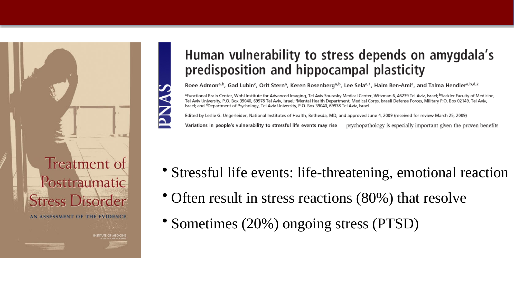
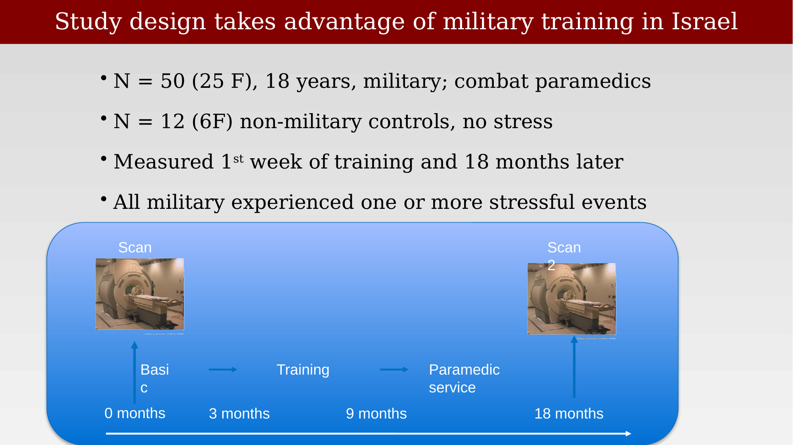
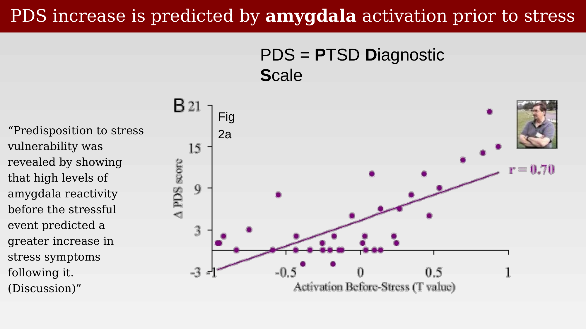
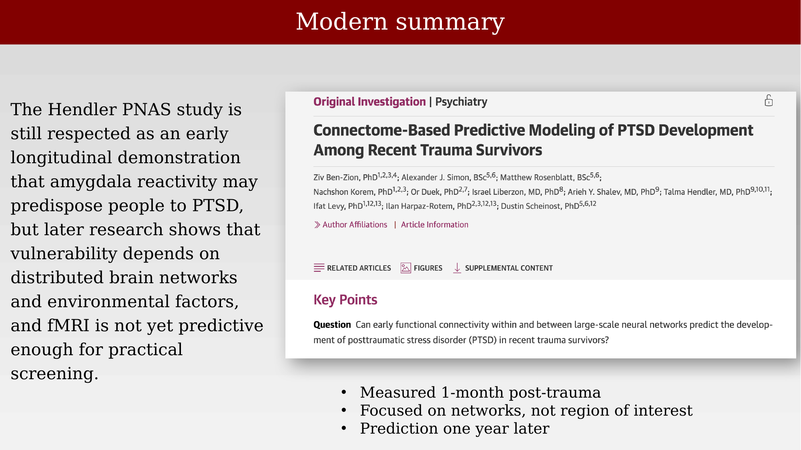
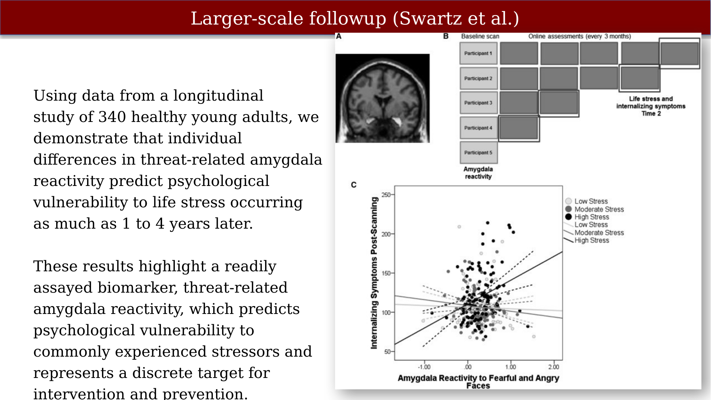

# Predicting Vulnerability to PTSD from Brain Activity {.unnumbered}



Stressful life events involving a life-threatening or otherwise severe emotional reaction often produce acute stress reactions that resolve on their own — in roughly 80% of cases. In the remaining 20%, however, symptoms persist as posttraumatic stress disorder (PTSD). A long-standing question is whether individual differences in brain function, measured *before* a traumatic event, can predict who will fall into that second group.

{#fig-ptsd-iom-review}

At the request of the Department of Veterans Affairs, the Institute of Medicine's Committee on Treatment of Posttraumatic Stress Disorder undertook a systematic review of the PTSD treatment literature, screening nearly 2,800 abstracts down to 90 randomized clinical trials (37 pharmacotherapy studies and 53 psychotherapy studies). The committee's central finding was sobering: the evidence for PTSD treatment does not reach the level of certainty one would want for such a common and serious condition, in large part because of methodological limitations across the literature, and additional high-quality research is needed for every treatment modality under study.

That treatment-focused conclusion motivates the prediction question addressed by the studies below: if we cannot yet treat PTSD reliably, can we at least identify who is most at risk before trauma occurs?

## An Early Longitudinal Study: Amygdala Reactivity Before Stress

An elegant natural experiment is available in Israeli military training, where combat paramedic trainees are known in advance to be headed for stressful, sometimes traumatic, experiences.

{#fig-ptsd-study-design}

The study included 50 trainees (25 female, roughly 18 years old) beginning military service as combat paramedics, along with 12 non-military controls (6 female) who experienced no comparable stress. Participants were measured in the first week of training and again 18 months later. All of the military participants experienced one or more genuinely stressful events during that period — such as witnessing severe casualties or having to manage an injured patient — and self-reported stress increased significantly as a result.

{#fig-ptsd-behavioral-scores}

The behavioral result raises an obvious question: given the wide variance in how much individual paramedics' symptoms increased, can that variability be predicted in advance? The study's answer was that it could, from amygdala activation measured *before* the stressful events occurred:

> "Predisposition to stress vulnerability was revealed by showing that high levels of amygdala reactivity before the stressful event predicted a greater increase in stress symptoms following it."

{#fig-ptsd-hendler-scatter}

This scatter plot is worth examining critically. It is exactly the kind of correlational figure — a handful of points anchoring a wide range on one axis, with a linear fit drawn through them — that deserves a skeptical look at how much the fit is being driven by a few extreme points versus a genuinely graded relationship across the whole sample.

## A Modern Reassessment

A later summary judgment on this line of work is that the original amygdala-reactivity study is still respected as an early longitudinal demonstration that amygdala reactivity may predispose people to PTSD, but that subsequent research shows the picture is more complicated: vulnerability appears to depend on distributed brain networks and environmental factors rather than any single region, and fMRI measures are not yet predictive enough for practical clinical screening.

{#fig-ptsd-cpm-summary}

That study measured trauma survivors approximately 1 month post-trauma and used connectome-based predictive modeling (CPM), focused on whole-brain functional networks rather than a single region of interest, to predict PTSD severity as far out as 14 months later. Among 162 recent trauma survivors, CPM significantly predicted PTSD severity at 1 month and at 14 months post-trauma, but not at 6 months — and the networks that were most predictive differed somewhat between the 1-month and 14-month predictions, with the anterior default mode, motor-sensory, and salience networks most implicated early on, joined later by central executive and visual networks.

## Replication After the Boston Marathon Bombing

McLaughlin and colleagues had a rare opportunity to test the amygdala-reactivity hypothesis prospectively: they had already scanned a cohort of young adults before the 2013 Boston Marathon bombing and the manhunt and shelter-in-place order that followed it, and were able to examine whether neural function measured *before* the attack predicted PTSD symptom onset afterward [@mcLaughlin2014-od].

::: {.panel-tabset}

## Amygdala

![Amygdala activation to negative vs. neutral faces (measured before the attack) plotted against later PTSD symptoms [@mcLaughlin2014-od].](images/ptsd-mclaughlin-amygdala.png){#fig-ptsd-mclaughlin-amygdala}

## Hippocampus

![The corresponding relationship for hippocampal activation [@mcLaughlin2014-od].](images/ptsd-mclaughlin-hippocampus.png){#fig-ptsd-mclaughlin-hippocampus}

:::

The conclusion: heightened amygdala reactivity to negative emotional information was associated with the future onset of posttraumatic symptoms following the attack, independent of participants' prior internalizing symptoms (including prior PTSD symptoms) and prior violence exposure. This independence from prior symptoms is what makes the finding a genuine prospective biomarker candidate rather than simply a restatement of prior vulnerability.

## A Larger-Scale Follow-Up

At the time, only two studies with relatively small samples had examined this prospective association — the Israeli paramedic study above (warzone-adjacent combat training) and the McLaughlin et al. Boston Marathon study (a terrorist attack) — both finding that relatively increased amygdala reactivity measured before a major traumatic event predicted greater subsequent PTSD symptoms.

Swartz, Williamson, and Hariri addressed this with a substantially larger sample: 340 healthy young adults followed longitudinally, with amygdala reactivity to fearful and angry faces measured at baseline and internalizing symptoms tracked at regular intervals afterward (published in *Neuron*, 2015).

{#fig-ptsd-swartz-scatter}

Individuals with relatively heightened amygdala reactivity at baseline who also went on to report greater life stress after scanning showed significantly greater symptoms at follow-up — demonstrating that amygdala reactivity predicts psychological vulnerability to life stress occurring as much as one to four years later, in a sample far larger than the earlier combat and terrorist-attack studies.

## Prefrontal Cortex as a Resilience Factor

Most of the studies above focus on the amygdala as a vulnerability marker. A complementary line of work asks whether *prefrontal* activity — associated with regulating, rather than generating, emotional responses — instead predicts resilience.

Kaldewaij and colleagues followed 185 police recruits who experienced their core trauma in the line of duty, in a prospective longitudinal study [@kaldewaij2021-jz]. Before and after trauma exposure, recruits performed a well-established fMRI approach–avoidance task that maps impulsive versus controlled emotional actions.

::: {.panel-tabset}

## Design and behavior

![Study design and behavioral results: recruits varied widely in how much their trauma symptoms changed from baseline to follow-up [@kaldewaij2021-jz].](images/ptsd-kaldewaij-design-behavior.png){#fig-ptsd-kaldewaij-design}

## Prefrontal cortex

![Anterior prefrontal cortex (aPFC) activity during emotion control, and its relationship to later symptom change [@kaldewaij2021-jz].](images/ptsd-kaldewaij-prefrontal.png){#fig-ptsd-kaldewaij-prefrontal}

## Amygdala

![Amygdala activation in the same cohort, shown for comparison with the prefrontal results [@kaldewaij2021-jz].](images/ptsd-kaldewaij-amygdala.png){#fig-ptsd-kaldewaij-amygdala}

:::

Higher baseline activity in the anterior prefrontal cortex — dorsal and medial frontal pole regions in particular — was related to *lower* PTSD symptoms after trauma exposure, and aPFC activity predicted symptom development over and above self-reported and behavioral measures. Trauma exposure itself, but not the resulting trauma symptoms, predicted amygdala activation at follow-up. The authors interpret this as evidence that prefrontal emotion-regulation capacity, rather than amygdala reactivity alone, may be an important predictor of resilience against developing PTSD symptoms.

The source slides also raise a methodological caution worth preserving here explicitly: some of the reported prefrontal associations were, in the authors' own framing, only weakly ("very slightly") related to symptom change, and the slides flag a concern about "double-dipping" — the risk of selecting a region of interest based on the same data used to test the association, which can inflate apparent effect sizes. This is a useful point to raise with students alongside the results themselves.

::: {.callout-note}
## For human review

This file covers slides 32–46 of the source deck. The originally requested range was slides 32–49, but the deck itself contains only 46 slides in total — the last slide (46, "Amygdala") is the final slide of the presentation. Please confirm this is expected, or point to the correct source file if additional slides were intended.
:::
