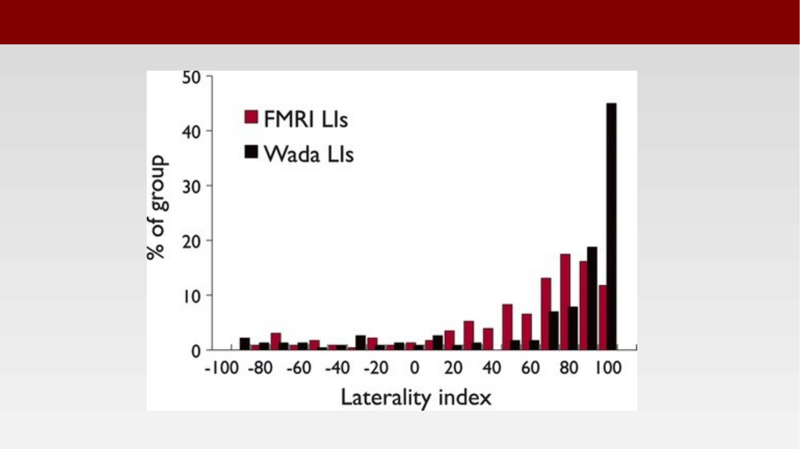

# The Wada Test and Its Replacement by fMRI {.unnumbered}



The Wada test, also known as the intracarotid amobarbital procedure (IAP), assesses the lateralization of language and memory functions in patients undergoing neurosurgery, particularly for epilepsy treatment. The test involves injecting a short-acting anesthetic, typically amobarbital, into one of the internal carotid arteries, temporarily sedating one hemisphere of the brain. By observing the patient's ability to speak, understand language, and recall information during the procedure, neurologists can determine which hemisphere is dominant for language and assess memory function on each side of the brain.

The Wada test is used primarily in pre-surgical evaluation of epilepsy patients being considered for procedures such as temporal lobectomy, which can involve removing brain tissue that would otherwise control seizures. Assessing memory function this way helps predict whether removing a portion of the temporal lobe is likely to cause significant cognitive impairment.

## An Invasive, Historically Important Test

The source slide embeds a video of Juhn Wada himself describing the procedure he developed:



Because it requires arterial catheterization and a brief pharmacological hemispherectomy, the Wada test is invasive, resource-intensive, and not without risk. As noninvasive functional imaging matured, it became a natural candidate to replace or supplement the Wada test for language lateralization.

## fMRI as a Replacement

Multiple studies comparing fMRI with the classic Wada test — including work by Binder (1996) and Woermann (2003), and a large comparison by Janecek and colleagues (2013) in *Epilepsia* — show that language lateralization measured with fMRI agrees with the Wada test in roughly 85–95% of patients. As a result, many epilepsy centers now use fMRI first and reserve the Wada test for ambiguous cases, including centers such as the UCLA Seizure Disorder Center, the Cleveland Clinic Epilepsy Program, the Mayo Clinic Epilepsy Program, the University of California San Francisco Epilepsy Center, and Johns Hopkins.

{#fig-wada-fmri-agreement}

## fMRI Predicting Post-Surgical Naming Outcome

A more direct test of whether fMRI can substitute for the Wada test is whether it predicts the actual clinical outcome patients care about — in this case, naming ability after left anterior temporal lobectomy (L-ATL), which can be complicated by confrontation naming deficits.

Sabsevitz and colleagues studied twenty-four patients undergoing L-ATL, each of whom received preoperative language mapping with fMRI, preoperative Wada testing for language dominance, and pre- and postoperative neuropsychological testing [@sabsevitz2003-epilepsy]. fMRI laterality indices, reflecting the interhemispheric difference in activated volume between left and right homologous regions of interest, were calculated for each patient and related to Wada language dominance and naming outcome.

::: {.panel-tabset}

## Result

![Preoperative fMRI temporal-lobe laterality index plotted against Boston Naming Test change score in patients undergoing left anterior temporal lobectomy [@sabsevitz2003-epilepsy].](images/wada-bookheimer-scatter.png){#fig-wada-scatter-1}

## Result, annotated

![The same relationship, with the two outcome clusters (small vs. large naming decline) highlighted [@sabsevitz2003-epilepsy].](images/wada-bookheimer-scatter-annotated.png){#fig-wada-scatter-2}

:::

Both the fMRI laterality index ($p < 0.001$) and the Wada test ($p < 0.05$) were predictive of naming outcome. fMRI showed 100% sensitivity and 73% specificity for predicting significant naming decline, and both fMRI and the Wada test were more predictive of outcome than age at seizure onset or preoperative naming performance.

::: {.callout-note}
## For human review

The source slides label this study "Bookheimer: fMRI applied to pre-surgical planning," but the quoted methods, results, and journal URL (`n.neurology.org/content/60/11/1788`) all match Sabsevitz et al. (2003, *Neurology*), which is cited above. Please confirm whether a separate Bookheimer study was intended here, or whether the slide title should simply be corrected.
:::
