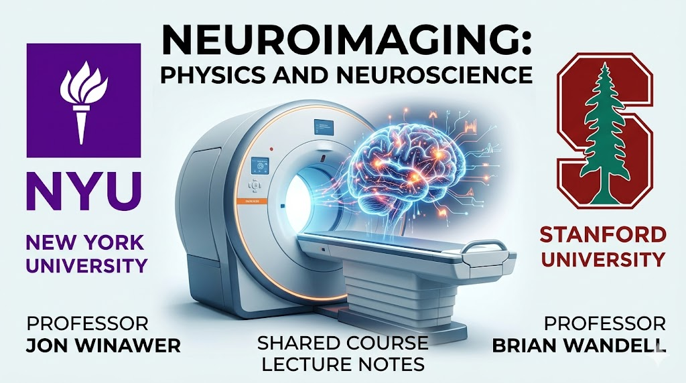

{fig-align="center" width="80%"}

# Course Overview {.unnumbered}
Magnetic resonance imaging (MRI) is a primary scientific tool for measuring living human brain structure and function. This course bridges the gap between physics and application, teaching students how to generate anatomical images (sMRI and dMRI), measure quantitative tissue properties (qMRI), and assess brain activity (fMRI).

## Who Should Take This Course?
We welcome students from engineering, neuroscience, and psychology backgrounds. The material is designed to help you transition into using MRI for your own research or to provide the technical literacy needed to critically evaluate scientific literature and collaborate effectively.

## Instructional Approach
This course is designed around active, live interaction. While we provide Panopto recordings for occasional, unavoidable absences, the core value of the course lies in our synchronous discussions of research papers and collaborative homework reviews. We expect regular attendance to ensure a high-level dialogue that benefits the entire cohort.

## Course topics
Review the menu at the left for an overview of the topics covered in the course.  The different parts are collapsible, so you should be able to leaf through the coverage.

